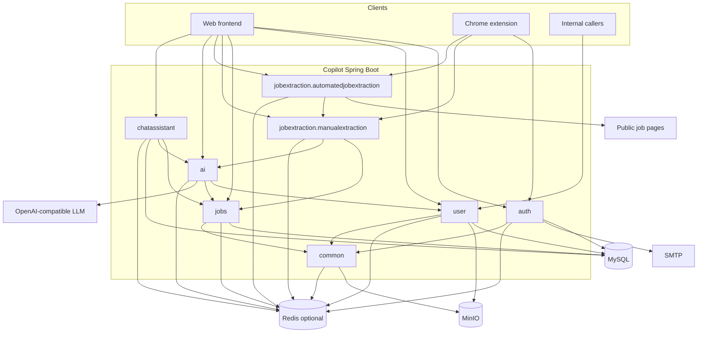
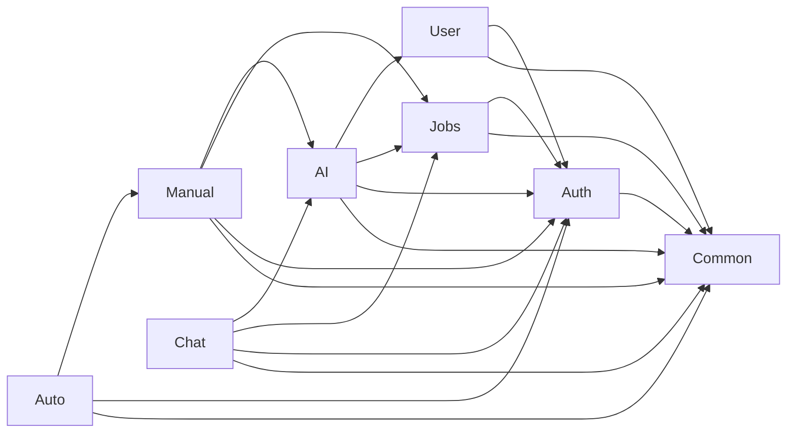

# System architecture

One Spring Boot 4 application (`com.developer.copilot`), Java 17, servlet stack plus WebFlux types for SSE. Packages are **modules by convention**, not separate deployables.

## System diagram



## Module responsibilities and boundaries

### auth

Owns identity and the **application-wide** security filter chain (`SecurityConfig`). Issues HS256 access JWTs and stores hashed refresh/OTP/reset tokens. Does not own profiles, jobs, or AI.

### user

Owns career profile and resumes. Reads `User` from auth via `CurrentUserService`. Uses common `FileStorageService` for PDFs. Exposes parsed resume **only** on `/api/v1/internal/resumes/**`.

### jobs

Owns the personal job notebook. Other modules may **read** jobs (duplicate checks, AI grounding, chat ownership) but must not replace this API for writes.

### jobextraction.manualextraction

Preview-only: canonicalize URL, reject duplicates against **this user’s** jobs, call `AiService.extractJobInfo`, return clipped fields. No JPA writes.

### jobextraction.automatedjobextraction

Outbound HTTP fetch with SSRF protection, ATS/HTML strategies, then **reuses** manual extraction (same preview DTO). No JPA writes.

### ai

LLM orchestration. HTTP under `/api/v1/ai`. In-process APIs used by extraction (`extractJobInfo`) and chat assistant (`continueJobChat`). Does not persist chat history or job rows.

### chatassistant

Job-keyed sessions and append-only turns. Calls AI **outside** a DB transaction. Does not create jobs.

### common

No user-facing business controllers. Owns `ApiResponse`, `GlobalExceptionHandler`, JPA auditing, internal key + hallway rate limit, MinIO client, `UrlNormalizationUtil`, `CurrentUserService`.

## Dependency direction

Feature modules depend **inward** on `common` and **on `auth` entities/security helpers**, not the other way around.



Constraints observed in code:

- **No circular HTTP:** AI does not call chat-assistant HTTP; chat calls `AiService` in-process.
- **Extraction does not persist jobs.** Save is always `JobService`.
- **Internal API is not a second identity.** The JWT user is the owner; the key only identifies the calling service.
- **Extension tokens cannot reach** user, jobs, AI, chat, or internal APIs (`webFrontendOnly()`).

## Layering inside a module

Typical request path:

```text
Controller (DTO + Bean Validation)
  → Rate-limit filter (module-owned)
  → Service (CurrentUserService, business rules)
  → Repository / FileStorage / ChatClient / other module service
```

Auth is the exception: rate limit and JWT filters run **before** the controller, and some auth limits (per-email) run inside `AuthServiceImpl` after the body is read.

## Shared infrastructure

| Component | Owner | Used by |
| --- | --- | --- |
| `SecurityFilterChain` | auth | Entire app |
| `GlobalExceptionHandler` | common | Entire app (chat has a small extra `@RestControllerAdvice`) |
| `UrlNormalizationUtil` | common | jobs, both extraction modules |
| `FileStorageService` | common | user |
| `CurrentUserService` | common | feature services |
| Per-module Redis | each module’s `*RedisConfig` | that module’s rate limits / caches |

## External systems

| System | Role |
| --- | --- |
| MySQL | System of record |
| SMTP | OTP and password-reset email |
| MinIO / S3-compatible | Resume objects |
| OpenAI-compatible HTTP API | Completions and structured extraction |
| Public HTTPS job pages | Automated extraction fetch only |
| Chrome extension origin | CORS allow-list only; **authorization is the JWT `cid` claim** |

## Architectural constraints

- Stateless HTTP: `SessionCreationPolicy.STATELESS`, CSRF disabled.
- Access JWT is short-lived (`app.auth.access-expiry-ms`, default 15 minutes). `app.jwt.expiration` in properties is **not** read by `JwtService`.
- Redis failure falls back to **in-memory** counters/caches on that instance; it does not fail the business request open (rate limiting still applies locally).
- AI provider calls for chat/job-chat and for extraction are wrapped in **in-process** circuit + bulkhead (`AiChatGuard`, `JobExtractionAiGuard`, `JobPageFetchGuard`) — not Resilience4j.
- Hibernate `ddl-auto=update` is the configured schema strategy; there is no Flyway/Liquibase in this project.
