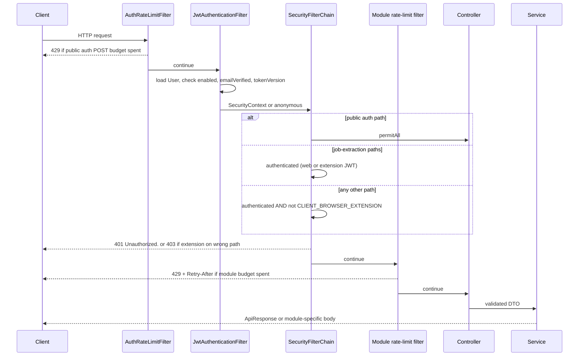
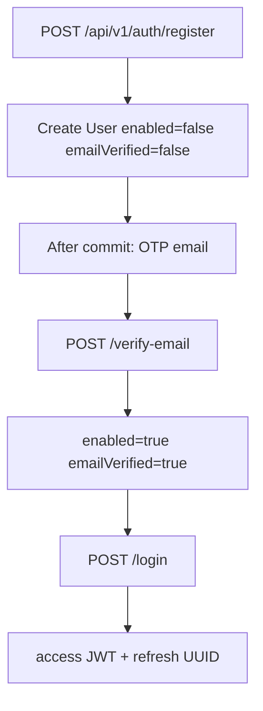
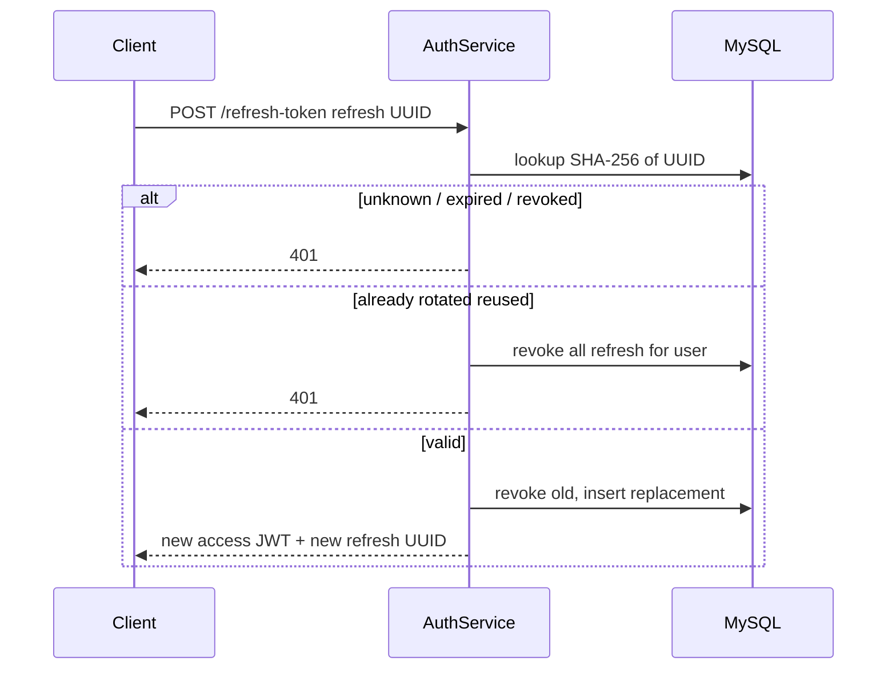
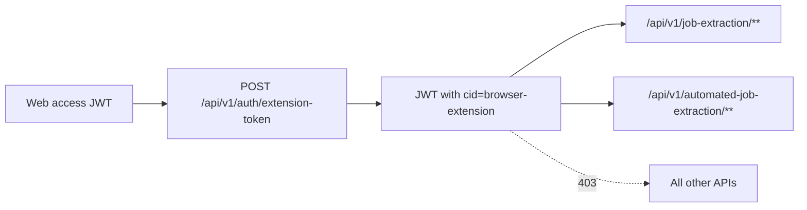
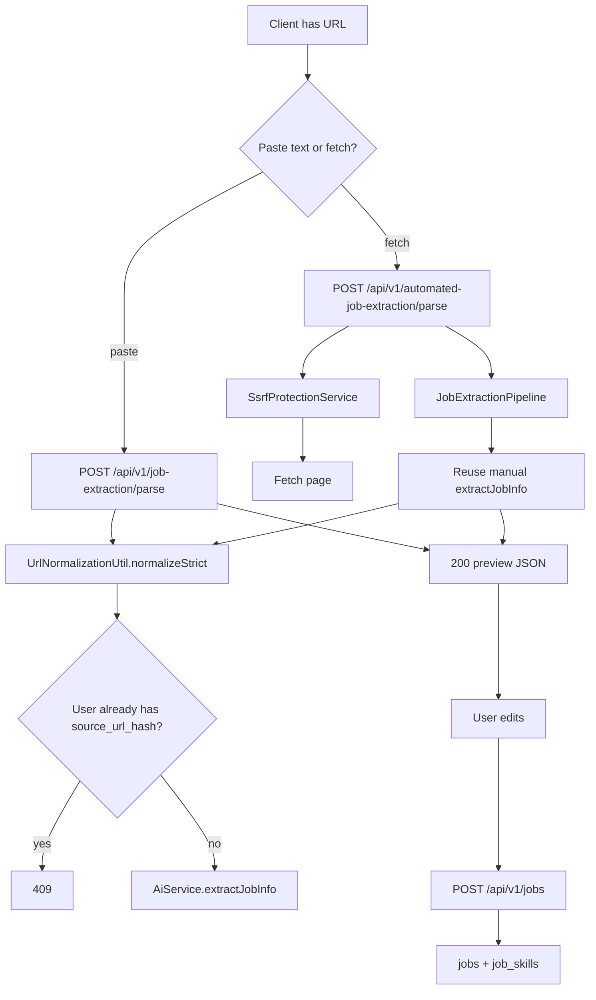

# System workflows

Only workflows that exist in the implementation.

## Authenticated request lifecycle



Internal paths insert `InternalApiKeyFilter` (after JWT) then `InternalApiRateLimitFilter` before the user controller.

## Registration, verification, login



- Duplicate username/email still returns **201** with the same success message (existence is not leaked).
- Login failures (unknown user, bad password, unverified, disabled, lockout) all return **401** `"Invalid email or password."`
- OTP is HMAC-stored; never returned in JSON.

## Refresh, logout, reuse detection



- `POST /logout` (JWT + refresh UUID): revokes **that** refresh only. Access JWT lives until expiry.
- `POST /logout-all` and successful `POST /reset-password`: increment `tokenVersion`, revoke all refresh tokens. Existing access JWTs fail on the next request.

## Browser-extension token



No refresh UUID is issued for the extension client. Minting is rate-limited. `app.extension.enabled=false` refuses minting.

## Password reset

1. `POST /forgot-password` always **200** with a generic message.
2. Mail is sent only if the account exists (after commit).
3. `POST /reset-password` sets a new BCrypt hash, bumps `tokenVersion`, revokes refresh tokens.

## Profile, resume upload, and parse

```mermaid
sequenceDiagram
    participant C as Client
    participant UC as UserController
    participant US as UserService
    participant FS as FileStorageService
    participant DB as MySQL
    participant Ex as resumeParsingExecutor

    C->>UC: POST /api/v1/users/resumes multipart file
    UC->>US: upload
    US->>US: require profile, PDF, size, count, checksum unique
    US->>FS: store under users/{userId}/resumes
    US->>DB: Resume row; first file is high-priority
    US->>Ex: async parse PDFBox
    US-->>C: 201 without parse status
    Ex->>DB: ResumeParsedData PENDING then COMPLETED or FAILED
```

Internal `GET /api/v1/internal/resumes/parsed` (JWT + internal key) returns completed parse for the high-priority resume, or 422 if PENDING/FAILED. Cache miss with no PENDING row may parse on demand (timeout from `resume.parsing.timeout-seconds`).

## Extract then save a job



Preview caches (TTL 3 minutes) are keyed by user + URL hash, **not** by pasted text. Duplicate check runs even on cache hits.

## General AI chat vs job chat

```mermaid
flowchart LR
    subgraph General
        AC[POST /api/v1/ai/chat or /chat/stream]
        AC --> Ctx[Optional resumeId / jobId / inline text]
        Ctx --> LLM1[ChatClient]
    end
    subgraph JobScoped
        CA[POST /api/v1/chat-assistant/jobs/{jobId}/messages]
        CA --> Own[Must own job]
        CA --> Sess[Lazy ChatSession unique on job_id]
        CA --> LLM2[AiService.continueJobChat]
        LLM2 --> Turn[Insert ChatMessage]
    end
```

- General chat does **not** persist turns. Stream clients must treat SSE `error` / `finishReason=ERROR` as failure even if HTTP 200.
- Job chat sends the last **16** persisted turns to the model. History GET pages the rest (max page size 50).
- Pending resume parse: **409**. Failed/empty parse when a resume is required by the call: **422**.

## Rate limiting (system view)

| Layer | When |
| --- | --- |
| Auth filter | Selected public POSTs + extension-token, per IP |
| Auth service | Per-email / per-user buckets, mail cooldown, failed-login window |
| Module filters | Jobs, user resumes, AI, chat send, both extraction parses, internal hallway |
| Redis or memory | Same counters; Redis when that module’s `app.*.redis.enabled=true` |

Exceeded limits: HTTP **429**, `Retry-After` seconds, `ApiResponse.success=false`.

## Resilience around paid / outbound I/O

| Guard | Protects | Behavior |
| --- | --- | --- |
| `AiChatGuard` | Chat, stream, job-chat provider calls | 3 consecutive failures open circuit ~30s; max 5 concurrent; **503** |
| `JobExtractionAiGuard` | Extraction model call | Same pattern; **503** |
| `JobPageFetchGuard` | Automated page fetch | Circuit/bulkhead; **503** as `AutomatedJobExtractionUnavailableException` |

Provider/protocol failures map to **502** (`AiServiceException`, `AutomatedJobPageFetchException`).

## Background / scheduled work

| Job | Schedule / trigger | Effect |
| --- | --- | --- |
| `AuthTokenCleanupJob` | Hourly cron `0 0 * * * *` | Deletes expired/revoked refresh, used/expired reset tokens, expired/verified OTPs |
| Resume parse | `@Async` `resumeParsingExecutor` after upload | PDFBox extract; status on `resume_parsed_data` |

There is no other `@Scheduled` method in `src/main`.

## Email

OTP and reset mail use Thymeleaf HTML templates and `JavaMailSender`. Send happens **after** the DB transaction commits. SMTP failure: **503** `"Unable to send email. Please try again later."` (no raw JavaMail messages).
