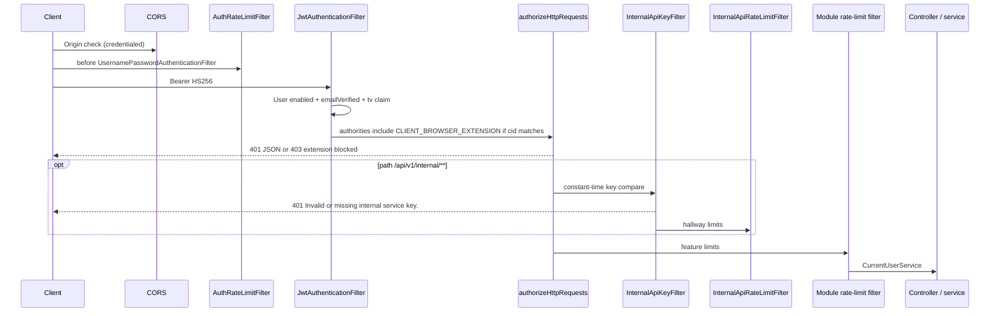

# Global security architecture

Implemented behavior only. Recommendations are labeled as such.

## Request security lifecycle

Unauthenticated protected routes: `JsonAuthenticationEntryPoint` → **401** `"Unauthorized."`  
Extension JWT on a non-extraction path: `JsonAccessDeniedHandler` → **403** `"This client is not authorized to access this resource."`

## Authentication

- **Passwords:** BCrypt.
- **Access token:** HS256 JWT. `sub` = user id, plus `email`, `role`, `tv` (token version). Web tokens omit `cid`. Signing secret: `app.jwt.secret` (min 32 chars; placeholder values rejected at startup). Lifetime: `app.auth.access-expiry-ms` (default 900_000 ms). **`JwtService` does not bind `app.jwt.expiration`.**
- **Refresh token:** opaque UUID. SHA-256 stored in MySQL. Default 30 days (`app.auth.refresh-expiry-days`). Rotation + reuse detection (replay revokes **all** sessions for that user). Cap on active refresh tokens (default 5).
- **OTP / reset:** HMAC-SHA256 (OTP keyed with JWT secret) / SHA-256 (reset UUID). Not returned in API bodies.
- **JWT filter** does not authenticate disabled or unverified users even if the signature is valid.

Login does not distinguish failure reasons (anti-enumeration). Register and resend/forgot use generic success messages for the same reason.

## Authorization

- `Role` (`USER` / `ADMIN`) is stored and placed on the JWT. **Business endpoints do not branch on ADMIN.**
- Real authorization axis is **client channel**:
  - Web JWT: `anyRequest` authenticated **and not** `CLIENT_BROWSER_EXTENSION`.
  - Extension JWT: authenticated on `/api/v1/job-extraction/**` and `/api/v1/automated-job-extraction/**` only.
- Resource ownership: jobs, resumes, profile children, chats are scoped to `CurrentUserService.getCurrentUser()`. Cross-user ids return the same **404** as missing (jobs/chat).
- Internal APIs still resolve data from the **JWT user**, not from the service key.

## Public vs protected

**Permit all:** register, login, verify-email, resend-otp, forgot-password, reset-password, refresh-token, `/error`.  
**Swagger paths:** permit all only if active profile is not `prod` or `production`. `SwaggerConfig` is `@Profile("!prod & !production")`. `application-production.properties` also sets `springdoc.*.enabled=false`.  
**Everything else:** authenticated as above.

## CORS

- `allowCredentials=true`.
- Allowed origins from `cors.allowed-origins` (defaults include localhost Vite/React ports). A configured `*` is **dropped**.
- Chrome extension origin `chrome-extension://<app.extension.id>` is appended when `app.extension.id` is a bare ID.
- Methods: GET, POST, PUT, PATCH, DELETE, OPTIONS. Headers `*`. Exposed: `Authorization`, `Content-Type`, `Retry-After`.

CORS is **not** an authorization control. Extension access is the signed `cid` claim.

## Filters (order that matters)

| Filter | Role |
| --- | --- |
| `AuthRateLimitFilter` | Per-IP on selected auth POSTs |
| `JwtAuthenticationFilter` | Parse Bearer, load user, set `SecurityContext` |
| Spring Security authorization | Public / extraction / webFrontendOnly |
| `InternalApiKeyFilter` (order -90) | `/api/v1/internal/**` shared secret |
| `InternalApiRateLimitFilter` | Hallway 429 |
| Per-module `*RateLimitFilter` | Feature budgets |

## Rate limiting and abuse prevention

- Auth: IP filter + per-email counters + mail cooldown + failed-login window (default 10 failures / 15 minutes, still generic 401).
- Each feature module: per **IP** and per **user id** sliding windows (see [ENDPOINTS.md](ENDPOINTS.md) for defaults).
- Automated extraction: SSRF guard (no private/loopback/metadata hosts, no literal IPs, generic `INVALID JOB URL`).
- Storage: PDF magic bytes, path-traversal / ownership prefix checks on MinIO keys.
- Production: `AuthSecretsGuard` requires `APP_JWT_SECRET` in the environment (see auth configuration docs).

**Not implemented:** IP denylist, CAPTCHA, WAF, refresh-token cookies, device binding, request signing for the SPA.

## Credential and secret handling

Documented as **names only**:

- `app.jwt.secret` / `APP_JWT_SECRET`
- SMTP username/password
- `internal.api.key` / optional `internal.api.previous-key` (rotation)
- `storage.access-key` / `storage.secret-key`
- `spring.ai.openai.api-key`
- Redis passwords if set

Never log these. Internal key comparison is constant-time. Failed internal key always uses the same 401 message.

`internal.api.enabled=false` skips the key **only** on `local`/`dev`. Any other profile **fail-closes** (still 401).

## Unauthorized / forbidden vs validation

| Situation | Typical status | Message pattern |
| --- | --- | --- |
| Missing/invalid JWT on protected route | 401 | `Unauthorized.` |
| Login failure | 401 | `Invalid email or password.` |
| Bad refresh | 401 | Token-specific auth exceptions |
| Extension on wrong route | 403 | `This client is not authorized to access this resource.` |
| Email not verified on extraction service path | 403 | `Please verify your email before using this feature.` |
| Missing internal key | 401 | `Invalid or missing internal service key.` |
| Bean Validation | 400 | `field: message` joined |

## Sensitive data

- Resume parse payloads and `GET /api/v1/ai/resume-context` contain PII. Internal parse is dual-gated.
- Job original descriptions and chat prompts/replies are stored in MySQL as TEXT.
- Error handlers hide SMTP, SQL, and MinIO internals (`Something went wrong.` / generic storage and email messages).

## Redis and security

Redis is **not** a session store. Optional counters for rate limits, auth mail/login-fail, and extraction caches. Compromising Redis can weaken rate limits and leak cached preview JSON; it does not mint JWTs.

## Further reading

- Auth: `src/main/java/com/developer/copilot/auth/docs/SECURITY.md` and `AUTH-SERVICE-SPECIFIC-DOCS/`
- Common internal API: `src/main/java/com/developer/copilot/common/docs/SECURITY.md`
