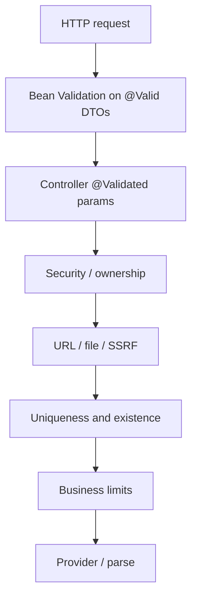

# Global validation architecture

Validation is layered. DTO annotations are **not** the only gate.

## Layers

## Request and DTO validation

- Controllers use `@Valid` on bodies. Failures → **400** with `field: defaultMessage` joined (`MethodArgumentNotValidException`).
- Missing/malformed JSON → **400** `"Request body is missing or malformed JSON."`
- Query/path constraints (`ConstraintViolationException`) → **400**.
- Chat assistant overrides type mismatch on `jobId` to `"Invalid job id."` Global handler uses that same message when the parameter name is `jobId`.

DTO `@Size` / `@NotBlank` / `@Email` rules live in module VALIDATION.md files. Do not copy every field here.

## Custom validators

- User profile links: `HttpOrHttpsUrlValidator` (http/https only).
- Jobs and extraction: `UrlNormalizationUtil` — **absolute http/https**, tracking params stripped. Strict mode used for save/parse. `javascript:` can pass a loose `@Pattern` and still fail in code with 400.

## URL and SSRF (automated extraction)

After canonicalization, `SsrfProtectionService` rejects private/loopback/link-local/metadata hosts, literal IPs, credentials in URLs, and blocked suffixes. Failures become **400** `"INVALID JOB URL"` — no internal reason is exposed.

## Resource existence and ownership

- Jobs, chat, resumes, profile children: lookup by **current user**. Missing and foreign ids share not-found messaging where documented (jobs/chat: `"Job not found."`).
- AI `resumeId` / `jobId`: must belong to the caller or 404.
- Profile must exist before resume upload.

## Uniqueness

| Rule | Where |
| --- | --- |
| Username, email | DB unique on `users`. Register still returns 201 |
| Refresh / reset token hashes | Unique columns |
| One profile per user | Unique `user_id` |
| Resume checksum per profile | Unique constraint; 409 `DuplicateResumeException` |
| Job URL per user | Unique `(user_id, source_url_hash)` |
| One chat per job | Unique `job_id` on `chat_sessions` |
| Turn numbers | Unique `(chat_session_id, turn_number)` |

Race on uniqueness → often `DataIntegrityViolationException` → **409** generic conflict message.

## Business and limit validation

| Limit | Default / source |
| --- | --- |
| Resume count / file size | `resume.max-resume-count`, `resume.max-file-size-mb` |
| PDF pages / text length / parse attempts | `resume.parsing.*` |
| Profile child collections | `user.profile.max-child-items` (20) |
| Job page size / search length / description | `JobLimits` |
| Chat page size / prior turns | `ChatAssistantLimits` (50 / 16) |
| AI prior turns inbound vs sent | DTO may allow more; `app.ai.max-prior-turns-sent` default 16 actually sent |
| Extraction preview clipping | Matches `JobRequest` `@Size` so save does not surprise-400 |

## Security validation

- JWT signature, expiry, `tv`, enabled, emailVerified (filter).
- Extension `cid` vs path (filter chain).
- Internal key presence and constant-time compare.
- Storage path must stay under the authenticated user’s prefix.
- Auth password complexity and OTP format: auth VALIDATION.md.

## AI / parse validation (downstream)

- Pending parse → 409; failed/empty → 422 when that resume is required.
- Extraction `requiresManualReview` is computed in extraction code (blank/truncated title/company), not trusted from the model as a security control.
- Chat sanitizes HTML in stored/returned AI text (`ChatAssistantHtmlSanitizer`).

## Cross-module pattern

Extraction validates URL and duplicates **before** paying for the model. Jobs validate again on save (URL + uniqueness + `@NotBlank` title/company). Clients should treat extraction as advisory and jobs as authoritative.

Details: module `VALIDATION.md` files and common `VALIDATION.md` (URL + storage + internal key).
