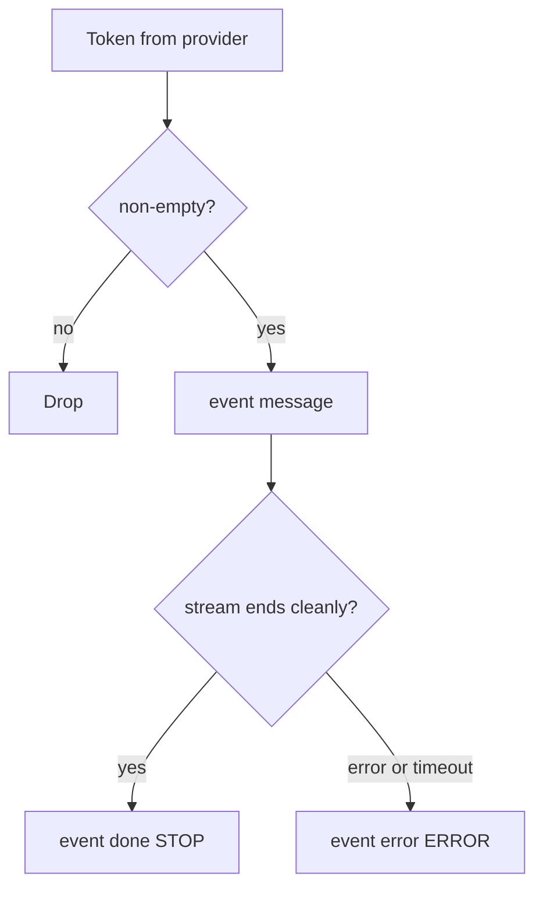

# Chat and streaming

Public career chat is two HTTP shapes of the same grounding pipeline: one JSON completion, and a Server-Sent Events stream of tokens.

## When to use which

| Endpoint | Use |
|---|---|
| `POST /api/v1/ai/chat` | Client wants a finished answer, token counts, and HTTP status that reflects provider failure (`502`) |
| `POST /api/v1/ai/chat/stream` | Client wants tokens as they arrive. Success/failure after the stream opens is in the **terminal SSE event**, not only in the HTTP status |

Both require JWT, share the **chat** rate-limit bucket, share `AiChatRequest`, and share resume/job precedence. See [ENDPOINTS.md](../ENDPOINTS.md) and [RESUME-AND-JOB-GROUNDING.md](./RESUME-AND-JOB-GROUNDING.md).

## Synchronous path

1. Validate body.
2. Resolve resume and job; `entityManager.clear()`.
3. Build system prompt (`PromptTemplateService.buildSystemPrompt`) and user message (`buildUserMessage`).
4. `AiChatGuard.call` → `ChatClient.prompt().system().user().options().call().chatResponse()` with `timeoutSeconds`.
5. Map text, finish reason, usage, mode, and `app.ai.default-model` into `AiChatResponse`.
6. `AiMetrics.recordChatSuccess`.

Provider failures become `AiServiceException` (`502`) with a sanitized message. Circuit/bulkhead become `503`.

## Streaming path

1. Same steps 1–3 as sync (failures here are JSON, not SSE).
2. `AiChatGuard.guardStream` holds a bulkhead permit until the flux finishes (`doFinally`).
3. `ChatClient...stream().content()` emits strings. Null/empty strings are dropped.
4. Each remaining string is an `AiStreamChunk` with `isCompleted=false` and `model=defaultModel`.
5. A final chunk is concatenated: empty `content`, `isCompleted=true`, `finishReason=STOP`.
6. The whole flux has `.timeout(Duration.ofSeconds(timeoutSeconds))`.
7. `.onErrorResume` turns failures into a single completed chunk: `content` starts with `AI Service Error: `, `finishReason=ERROR`.

`AiController` sets the SSE event name:

- not completed → `message`
- completed and `finishReason` equals `ERROR` (case-insensitive) → `error`
- completed otherwise → `done` (including null `finishReason`)

## Client contract that is easy to get wrong

- HTTP `200` on stream means the SSE connection opened (or MockMvc completed), **not** that the model succeeded.
- Watch for a final `done` vs `error`.
- `model` on chunks is the configured default model, not a separately probed upstream name.
- Stream chunks do not include token usage fields.
- Swagger UI often buffers SSE; use `curl -N` (as documented on the controller).

## Timeouts

The same `app.ai.timeout-seconds` (default 60, example property `app.ai.streaming-timeout-seconds`) applies to:

- Sync: `Mono.fromCallable(...).timeout(...).block()`
- Stream: `Flux.timeout(...)`

Sync timeout → `502` with the timeout-friendly message. Stream timeout → terminal `error` chunk (and timeout metric).

## Resilience interaction

`guardStream` refuses new streams when the circuit is open or all 5 permits are taken (`503` **before** SSE). Completed stream chunks with `ERROR` increment consecutive failures; `STOP` resets them. See [PROVIDER-RESILIENCE.md](./PROVIDER-RESILIENCE.md).

## What is not streamed

`extractJobInfo` and `continueJobChat` are synchronous `ChatClient.call` only. Job-history UI streaming is not implemented in this package.
