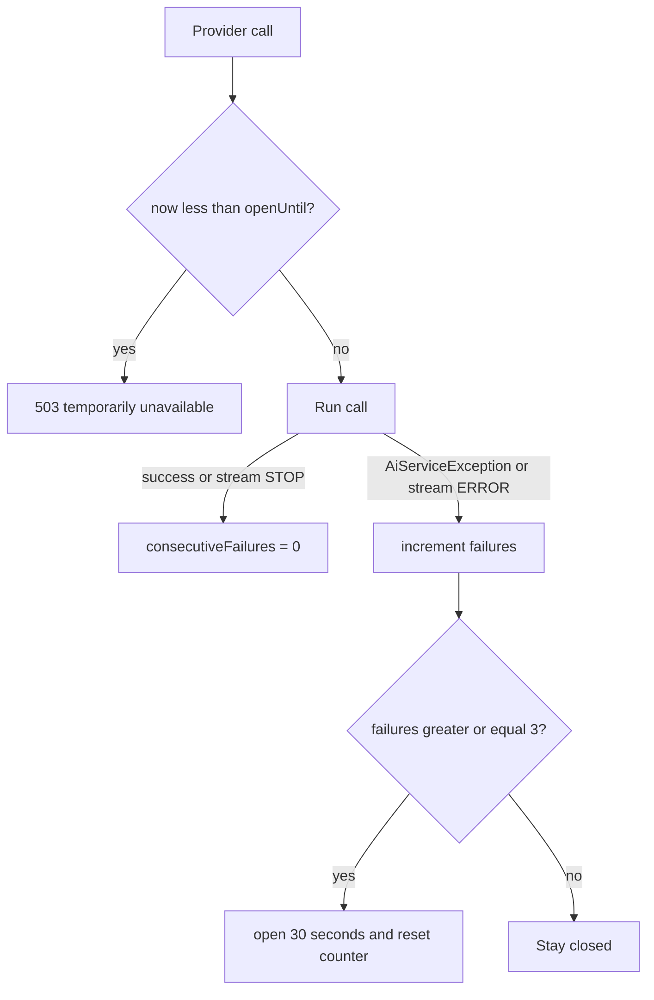

# Provider resilience

Paid model calls can hang, 429, or fail in bursts. The `ai` service layers **timeouts**, an **in-process circuit and bulkhead**, **sanitized errors**, and **log metrics**. None of this is Resilience4j or a shared cluster circuit — it is `AiChatGuard` plus `AiServiceImpl`.

## What is guarded

| Call | `AiChatGuard` | Timeout |
|---|---|---|
| `chat` | `call` | `timeoutSeconds` on `Mono` |
| `streamChat` | `guardStream` | `timeoutSeconds` on `Flux` |
| `continueJobChat` | `call` | same `Mono` timeout |
| `extractJobInfo` | **No** — `JobExtractionAiGuard` in job-extraction | same `Mono` timeout inside `extractJobInfo` |
| `getResumeContext` | No provider call | — |

## Bulkhead

`Semaphore` with **5** permits (`MAX_CONCURRENT`).

- Sync: `tryAcquire` at start, `release` in `finally`.
- Stream: acquire before `supplier.get()`, release in `doFinally` (or immediately if `supplier.get()` throws).

If no permit: `AiUnavailableException` — `The AI service is busy. Please try again shortly.` → HTTP `503`.

## Circuit

Constants: `FAILURES_TO_OPEN = 3`, `OPEN_MS = 30_000`.

- `AiUnavailableException` from an already-open circuit does **not** count as another failure.
- A successful `call()` resets the counter even after one or two failures (`AiChatGuardTest.successResetsFailureCount`).
- Stream: only **completed** chunks matter. `ERROR` → `onFailure()`; other completed → reset.

Open circuit: `The AI service is temporarily unavailable. Please try again shortly.` → `503`. Fail-fast; does not wait for the provider timeout.

This state is **per JVM**. Three replicas have three circuits.

## Timeouts

`AiProperties.timeoutSeconds` default `60`. Example config still sets `app.ai.streaming-timeout-seconds`, which updates the same field.

Timeouts record `AiMetrics.recordTimeout` when the friendly mapper sees timeout wording (sync path via `formatFriendlyErrorMessage`; stream also in `recordStreamProviderFailure`).

## Error sanitization

Raw provider exceptions are not returned. Mapping is in `AiServiceImpl.formatFriendlyErrorMessage` (quota, model 404, auth 401, high demand 503, timeout, else generic). Tests forbid `GEMINI_API_KEY`, `application.properties`, `app.ai.default-model`, and leaked project ids in the client message. Operators get extra `log.error` lines for auth and missing model.

Stream errors use the same mapper, prefixed with `AI Service Error: `.

## Metrics (`AiMetrics`)

Log lines of the form `ai metric=<name> count=...` (intended for CloudWatch / log drains; no Actuator required):

| Method | When |
|---|---|
| `recordChatSuccess` | Sync chat mapped a response (includes latency ms and totalTokens, 0 if null) |
| `recordStreamStop` | Completed chunk not ERROR |
| `recordStreamError` | Completed chunk ERROR |
| `recordProviderFailure` | Sync/job-chat catch, stream `onErrorResume`, stream init failure |
| `recordTimeout` | Timeout-like messages |
| `recordMissingResume` | Chat continued with empty resume because no stored resume/profile |
| `recordParseFailure` | Failed or empty parse in the resume adapter |

These counters are process-local `AtomicLong`s.

## Interaction with HTTP rate limits

Rate limits cut traffic **before** the controller. The bulkhead cuts **concurrent provider** work after grounding. A client can receive `429` (too many HTTP calls) or `503` (too many in-flight model calls / circuit open) for different reasons.

## Changing thresholds

`AiChatGuard` constants are hardcoded. Changing concurrency or failure count requires a code change and `AiChatGuardTest` updates. Timeouts and token caps are configuration (`CONFIGURATION.md`).
