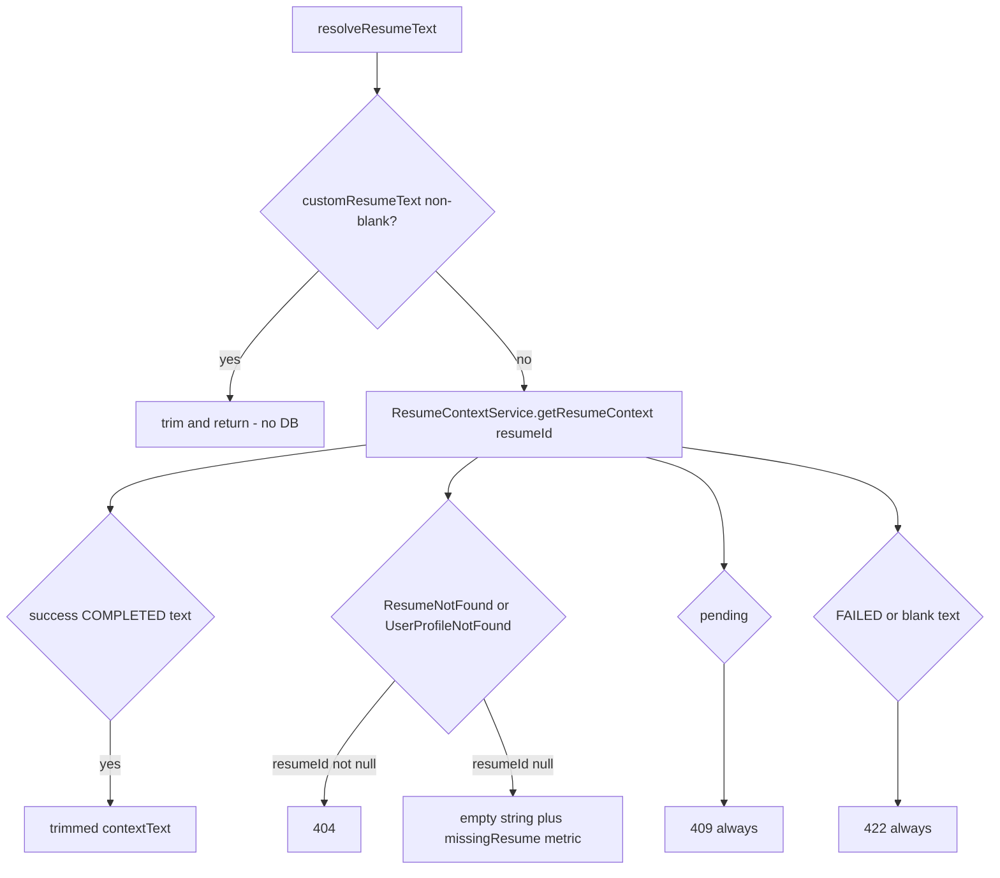
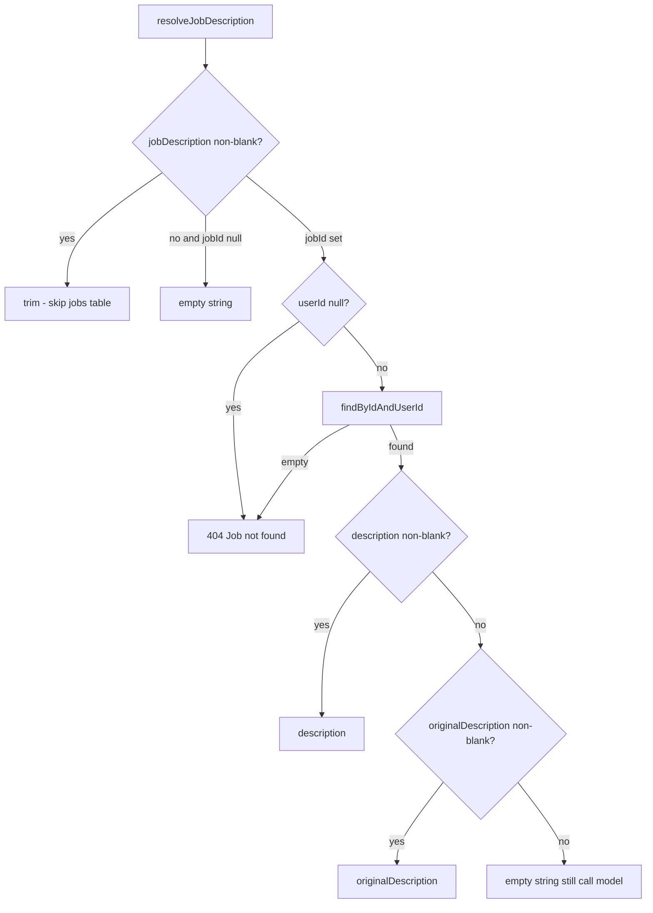

# Resume and job grounding

Chat quality depends on two optional context blobs: resume text and job description. This document is the resolution rules implemented in `AiServiceImpl` and `DefaultResumeContextServiceImpl`.

## Resume text

### Inline override

If `customResumeText` is non-blank after trim, `resumeId` is ignored and `ResumeParsingService` is not called.

### Stored resume

`ResumeParsingService.getParsedResume(resumeId)` (user module):

- `resumeId == null` — active **high-priority** resume on the current profile.
- Non-null — that id, **active**, belonging to the current profile. Otherwise `ResumeNotFoundException`.

No profile → `UserProfileNotFoundException`.

### Parse states the AI adapter understands

| Parsed status / exception | AI outcome |
|---|---|
| `COMPLETED` and non-blank `contextText` | That text |
| `COMPLETED` but blank/whitespace `contextText` | `ResumeParsingException` (“Resume text was empty…”) |
| `FAILED` | `ResumeParsingException` (“could not be parsed…”) — parser `lastError` is **not** returned |
| Any other status (e.g. `PENDING`) | `AiResumePendingException` |
| `ResumeParsingException` whose message contains “still in progress”, “still being processed”, or “retry shortly” | `AiResumePendingException` |
| Other `ResumeParsingException` | Propagated (`422`) |
| `null` parsed DTO | `ResumeNotFoundException` |

### Chat vs resume-context HTTP

| Situation | `POST /chat` without `resumeId` | `GET /resume-context` |
|---|---|---|
| No profile / no high-priority resume | Empty grounding, chat continues | `404` |
| Pending parse | `409` | `409` |
| Failed / empty parse | `422` | `422` |

Explicit `resumeId` on chat: missing resume is `404`, not empty context.

## Job description

HTTP chat/stream uses the JWT user’s id. `continueJobChat` uses `UserRepository.findByEmail` then the same `findByIdAndUserId`. Blank/unknown email → `Job not found.` without echoing the email.

Inline `jobDescription` wins over `jobId`. A saved job with no text still proceeds (empty JD section omitted in the chat user message when blank).

## Job chat extras

`continueJobChat` always requires a `jobId` (`@NotNull` on the DTO; lookup `required=true`). Resume overrides (`customResumeText` / `resumeId`) follow the same resume rules as HTTP chat.

## Persistence after grounding

`detachPersistenceContext()` runs after resume and job reads so the provider wait does not keep JPA entities managed.

## Ownership summary

Resume and job ids are never globally addressable. They are scoped to the authenticated user (HTTP) or to the email supplied by chat-assistant (in-process, which is the same logged-in user in production flow).
