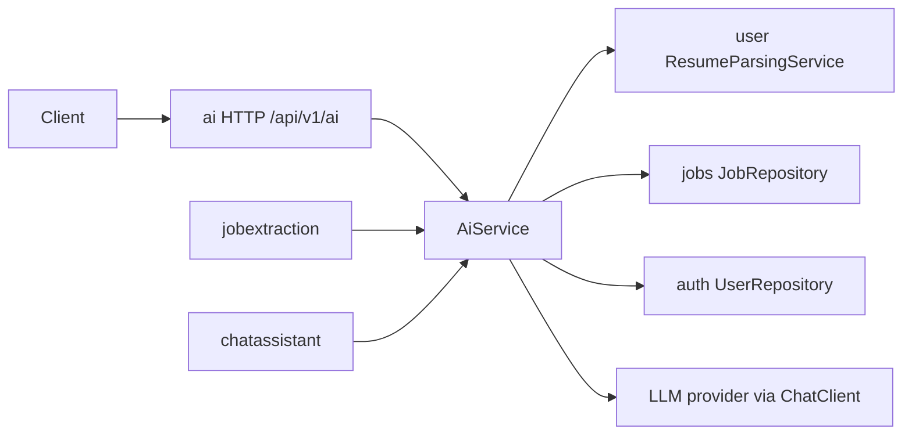

# AI Service

This is the starting point for the `ai` service. Read it first, then follow the links at the bottom for APIs, security, workflows, and service-specific behavior.

The `ai` service is Copilot’s career-assistance model layer. It turns an authenticated user’s prompt — optionally grounded in resume text and a job description — into a completion from the configured LLM provider. It also supplies two in-process contracts used by other modules: structured job-posting extraction, and job-scoped multi-turn chat.

It does **not** own login, resume storage, job CRUD, or persisted chat history. Those belong to the `auth`, `user`, `jobs`, and `chatassistant` modules.

## Purpose

Give candidates a career copilot that can:

- Answer career and software-engineering questions.
- Review a resume, score a job match, draft a cover letter or cold email, and prepare for interviews.
- Stream tokens as they are generated, or return one complete JSON answer.
- Extract structured fields from pasted job-posting text (called by the job-extraction module, not by this service’s HTTP API).
- Continue a job-grounded conversation (called by the chat-assistant module).

The service’s job is to assemble a safe prompt, call the provider, map a friendly result or error, and protect the paid provider path with rate limits and in-process resilience.

## Responsibilities

The `ai` service is responsible for:

- Public HTTP APIs under `/api/v1/ai`.
- Prompt construction (system identity, mode instructions, resume/job grounding, injection-resistant delimiters).
- Resolving resume text and job description for the authenticated user.
- Calling the Spring AI `ChatClient` (OpenAI-compatible API, configured for Google Gemini in the example config).
- Mapping provider results to `AiChatResponse`, SSE chunks, or `JobExtractionAiResponse`.
- Per-IP and per-user rate limits on chat and resume-context reads.
- An in-process circuit breaker and bulkhead around chat, stream, and job-chat provider calls.
- Sanitizing provider failures so clients do not see API keys, model config paths, or raw upstream dumps.

The `ai` service is **not** responsible for:

- Issuing JWTs or verifying email (that is `auth`).
- Storing or parsing resume PDFs (that is `user`; this service only requests parsed context).
- Creating or listing jobs (that is `jobs` / `jobextraction`).
- Persisting chat sessions and turns (that is `chatassistant`).
- Kubernetes readiness of Gemini — `GET /api/v1/ai/health` is configuration metadata only.

## Major capabilities

| Capability | How it is exposed |
|---|---|
| One-shot career chat | `POST /api/v1/ai/chat` |
| Token streaming (SSE) | `POST /api/v1/ai/chat/stream` |
| High-priority parsed resume as plain text | `GET /api/v1/ai/resume-context` |
| Configured model metadata | `GET /api/v1/ai/health` and `GET /api/v1/ai/config` (same payload) |
| Structured job extraction | In-process `AiService.extractJobInfo` (HTTP lives at job-extraction) |
| Job-scoped multi-turn chat | In-process `AiService.continueJobChat` (HTTP lives at chat-assistant) |

Chat works without a stored resume: missing high-priority resume or profile becomes empty grounding. Sending an explicit `resumeId` that is missing or not owned by the user is `404`. A resume that is still parsing is `409`. A failed or empty parse is `422`.

## Service boundary

**In scope:** prompt assembly, provider calls, chat/stream HTTP, resume-context HTTP, rate limiting those HTTP paths, resilience for chat/stream/job-chat.

**Out of scope except as a dependency:** user profiles, resume files, job rows, chat transcripts, job-extraction HTTP, authentication issuance.

## Main components

- **`AiController`** — JWT-required REST entry point. Resolves the current user, then delegates to `AiService`.
- **`AiServiceImpl`** — Orchestrates grounding, prompts, timeouts, provider calls, and error mapping.
- **`PromptTemplateService`** — Builds system and user messages for chat, job chat, and extraction.
- **`DefaultResumeContextServiceImpl`** — Loads parsed resume text from the user module and maps parse states to AI exceptions.
- **`AiChatGuard`** — Circuit (3 consecutive failures → 30s open) and bulkhead (max 5 concurrent provider calls) for chat, stream, and job chat. Extraction is guarded by job-extraction, not here.
- **`AiRateLimitFilter`** — After Spring Security; limits chat and resume-context by IP and user id.
- **`AiRedisService`** — Optional Redis counters for those limits; in-memory sliding window if Redis is off or unreachable.
- **`AiMetrics`** — Log-line counters for success, stream outcomes, timeouts, missing resumes, and parse failures.

## Major integrations

| Integration | Why the AI service uses it |
|---|---|
| Spring AI `ChatClient` / OpenAI-compatible API | Actual model invocation (example config points at Gemini’s OpenAI-compatible endpoint) |
| `CurrentUserService` | Authenticated `User` for HTTP chat and resume-context |
| `ResumeParsingService` (user) | High-priority or id-specific parsed `contextText` |
| `JobRepository` (jobs) | Job description owned by the current user (`findByIdAndUserId`) |
| `UserRepository` (auth) | Email → user id for in-process job chat |
| `GlobalExceptionHandler` (common) | HTTP status mapping for AI and domain exceptions |
| `JwtAuthenticationFilter` (auth) | Bearer JWT; user must be enabled and email-verified |

## Important request and business flows

1. **Synchronous chat** — Validate body → rate limit → load resume/job → build prompts → `AiChatGuard` → provider `call()` with timeout → JSON `ApiResponse<AiChatResponse>`.
2. **Streaming chat** — Same grounding as chat. Tokens become SSE `message` events; success ends with `done` (`finishReason=STOP`); provider failure after the stream opens is a terminal `error` event, often still HTTP `200`.
3. **Resume context** — High-priority completed parse only. Missing → `404`. Pending → `409`. Failed or empty text → `422`.
4. **Job extraction (internal)** — Dedicated extraction prompt, temperature `0.0`, structured `JobExtractionAiResponse`. Not wrapped by `AiChatGuard`.
5. **Job chat (internal)** — Resume + job embedded once in the system prompt; prior turns sent as messages; last `maxPriorTurnsSent` (default 16) kept; inbound cap 40.

Details: [FLOW.md](./FLOW.md).

## Security responsibilities

- Every `/api/v1/ai/**` route requires a valid JWT for an enabled, email-verified user. There is no `X-Internal-Api-Key` on these URLs.
- Chat and resume-context are rate-limited per IP and per user id (60-second window).
- Resume and job ids are ownership-checked (user module / `findByIdAndUserId`). Unknown email or foreign job is `Job not found.` without leaking the email.
- User-supplied resume, job, and prompt text are labeled untrusted in the prompt so they are not treated as system instructions.
- Provider error messages are mapped to generic client text; config keys and raw upstream payloads are not returned.
- Swagger for this service is registered only when the active profile is not `prod` or `production`.

Details: [SECURITY.md](./SECURITY.md).

## Infrastructure

- **MySQL / JPA** — No AI-owned tables. The service reads job rows and, for job chat, users. Resume bytes stay in the user/storage stack.
- **Redis (optional)** — Rate-limit counters when `app.ai.redis.enabled=true`. Otherwise in-memory limits (single instance only).
- **LLM provider** — Spring AI OpenAI starter; example config uses Gemini via an OpenAI-compatible base URL and `GEMINI_API_KEY`.

## Documentation map

| Document | Contents |
|---|---|
| [ARCHITECTURE.md](./ARCHITECTURE.md) | Layers, components, dependency direction |
| [FLOW.md](./FLOW.md) | Chat, stream, grounding, internal integrations, rate limit, resilience |
| [ENDPOINTS.md](./ENDPOINTS.md) | Public HTTP contracts |
| [SECURITY.md](./SECURITY.md) | JWT, ownership, rate limits, prompt isolation, secrets |
| [DATABASE.md](./DATABASE.md) | Read-only job/user access; no AI tables |
| [REDIS-INFRASTRUCTURE.md](./REDIS-INFRASTRUCTURE.md) | Rate-limit keys, TTL, fallback |
| [ERROR-HANDLING.md](./ERROR-HANDLING.md) | Exceptions → HTTP / SSE |
| [VALIDATION.md](./VALIDATION.md) | DTO, business, and security checks |
| [CONFIGURATION.md](./CONFIGURATION.md) | `app.ai.*` and Spring AI properties |
| [TESTING.md](./TESTING.md) | Test layout and what is covered |
| [DEPENDENCIES.md](./DEPENDENCIES.md) | Why each major dependency exists |
| [CHAT-AND-STREAMING.md](./AI-SERVICE-SPECIFIC-DOCS/CHAT-AND-STREAMING.md) | Sync vs SSE lifecycle |
| [PROMPT-AND-MODES.md](./AI-SERVICE-SPECIFIC-DOCS/PROMPT-AND-MODES.md) | Modes and prompt contracts |
| [RESUME-AND-JOB-GROUNDING.md](./AI-SERVICE-SPECIFIC-DOCS/RESUME-AND-JOB-GROUNDING.md) | Context precedence and parse states |
| [RATE-LIMITING.md](./AI-SERVICE-SPECIFIC-DOCS/RATE-LIMITING.md) | Chat and resume-context limits |
| [PROVIDER-RESILIENCE.md](./AI-SERVICE-SPECIFIC-DOCS/PROVIDER-RESILIENCE.md) | Circuit, bulkhead, timeout, metrics |
