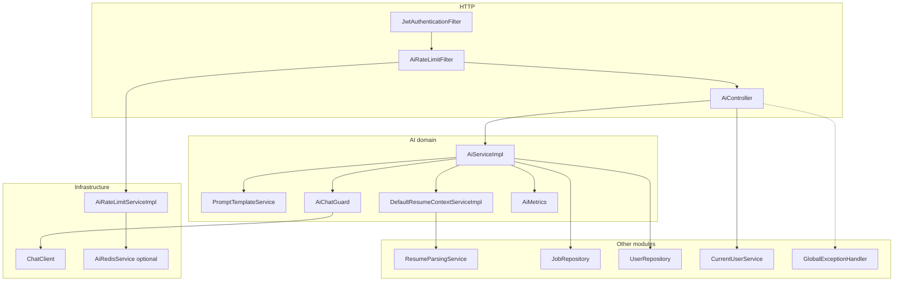

# Architecture

This document describes how the `ai` service is structured inside the Copilot application. The service is a package in the same Spring Boot process as `auth`, `user`, `jobs`, `jobextraction`, and `chatassistant`. There is no separate AI deployable.

## Architectural shape

HTTP traffic for career chat enters through `AiController`. In-process callers (`jobextraction`, `chatassistant`) skip the controller and call `AiService` directly.

Dependency direction is inward: the controller depends on the service; the service depends on prompt/resume helpers, repositories, `ChatClient`, and `AiChatGuard`. Other modules may depend on `AiService`. The AI package does not implement job CRUD, resume parsing, or chat persistence.

## Layers

### HTTP and security

| Component | Role |
|---|---|
| `AiController` | Maps `/api/v1/ai`. Uses `@Valid` on chat bodies. Resolves `User` via `CurrentUserService` for chat, stream, and resume-context. Health/config does not load the user in the controller; JWT is still required by the security chain. |
| `AiOpenApiConfig` | Swagger group `ai` for `/api/v1/ai/**`. Active only when the profile is not `prod` or `production`. |
| `JwtAuthenticationFilter` | Shared auth filter. Sets the principal only when the user is enabled, email-verified, and the token is valid. |
| `AiRateLimitFilter` | Servlet filter registered **after** the security chain (order `-80`) so a stolen JWT is keyed by user id. Not part of the Spring Security filter chain (avoids double counting). |

`SecurityConfig` authenticates every request that is not an auth public path. `/api/v1/ai/**` has no `permitAll` entry.

### Application service

`AiService` is the single facade:

| Method | Callers | Guarded by `AiChatGuard` |
|---|---|---|
| `chat` | `AiController` | Yes |
| `streamChat` | `AiController` | Yes (`guardStream`) |
| `getResumeContext` | `AiController` | No (no provider call) |
| `getActiveModel` | `AiController` health/config | No |
| `extractJobInfo` | `JobExtractionServiceImpl` | No (job-extraction has its own guard) |
| `continueJobChat` | `ChatAssistantServiceImpl` | Yes |

`AiServiceImpl` clears the JPA persistence context (`entityManager.clear()`) after loading resume/job data and before the provider call so a long LLM wait does not hold a dirty persistence context.

### Prompt and grounding

- **`PromptTemplateService`** — Stateless string assembly. Chat uses a personality + mode system prompt and a sectioned user message. Job chat embeds resume and job once in the system prompt. Extraction uses a non-conversational, zero-hallucination system prompt.
- **`ResumeContextService` / `DefaultResumeContextServiceImpl`** — Asks `ResumeParsingService.getParsedResume(resumeId)`. `null` id means the user’s active high-priority resume. Maps pending parse → `AiResumePendingException`, failed/empty → `ResumeParsingException`, missing → `ResumeNotFoundException` / `UserProfileNotFoundException`.

### Provider and resilience

- **`AiConfig`** — Builds the `ChatClient` bean with default `OpenAiChatOptions` (model and max tokens from `AiProperties`).
- **`AiProperties`** — `app.ai.*`: provider label, default model, timeouts, token caps, prior-turn trim.
- **`AiChatGuard`** — In-process only: semaphore bulkhead (5) and consecutive-failure circuit (3 failures, 30 seconds open). Throws `AiUnavailableException` (`503`) when open or busy.
- **`AiMetrics`** — Incrementing counters written as `ai metric=...` log lines (no Actuator requirement).

### Rate limiting and Redis

- **`AiRateLimitConfig`** — Wires `AiRateLimitServiceImpl`, the filter, and URL patterns `/api/v1/ai`, `/api/v1/ai/*`, `/api/v1/ai/chat/*`.
- **`AiRateLimitProperties`** — `app.ai.chat-per-minute` (default 8) and `app.ai.resume-context-per-minute` (default 20).
- **`AiRedisConfig`** — Connection factory, `StringRedisTemplate`, repository, and key builder **only** when `app.ai.redis.enabled=true`. Boot’s Data Redis auto-configuration is excluded at the application class, so localhost Redis is not required unless this flag is on.

## DTOs

Public HTTP uses `AiChatRequest` / `AiChatResponse` / `AiStreamChunk` and the shared `ApiResponse<T>` envelope.

Internal (Swagger-hidden) contracts:

- `JobExtractionAiRequest` / `JobExtractionAiResponse` — job-extraction module.
- `JobChatAiRequest` / `ChatTurnDto` — chat-assistant module.

`AiMode` selects extra system instructions and, for `COVER_LETTER`, a higher max-token cap.

## Exception handling

The AI package defines `AiServiceException`, `AiUnavailableException`, `AiResumePendingException`, and `RateLimitExceededException`. It does not define its own `@RestControllerAdvice`. `GlobalExceptionHandler` in `common` maps those types (and user/jobs domain exceptions) to HTTP. The rate-limit **filter** writes `429` itself; it does not throw.

Streaming provider failures are usually **not** exceptions to the client: they become a terminal SSE `error` chunk.

## What this architecture deliberately omits

- No AI-owned JPA entities or chat transcript tables.
- No Kubernetes-style live probe of Gemini (`healthCheckType=configuration`, `status` is always `UP` if Spring handled the request).
- No wrapping of `extractJobInfo` in `AiChatGuard`.
- No `X-Internal-Api-Key` on `/api/v1/ai/**`.
