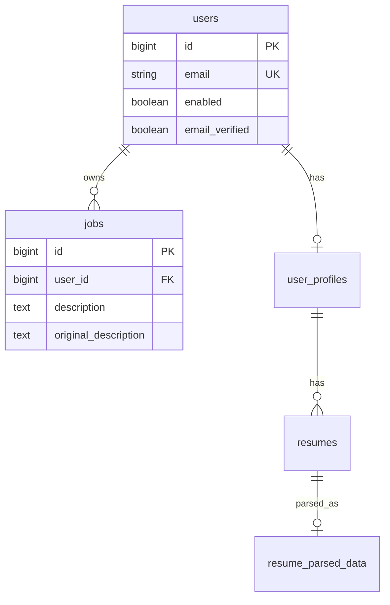

# Database

The `ai` service does **not** own tables, entities, or migrations. It does not persist chat history, prompts, or model output.

It only **reads** data that other modules persist, and only when a request needs grounding.

## What the AI service touches

Table and column names above describe the data the AI code actually reads. Schema ownership stays with `auth`, `jobs`, and `user`.

### Jobs (`JobRepository.findByIdAndUserId`)

Used when HTTP chat/stream sends `jobId` without inline `jobDescription`, and when `continueJobChat` resolves a job after looking up the user.

| Field used | Purpose |
|---|---|
| Ownership via `user_id` | Foreign or missing id → `JobNotFoundException("Job not found.")` |
| `description` | Preferred job text if non-blank |
| `originalDescription` | Fallback if `description` is null/blank |
| both blank | Prompt is built with empty job text; the provider is still called |

The AI service never inserts or updates `jobs`.

### Users (`UserRepository.findByEmail`)

Used only by `continueJobChat` (chat-assistant passes the current user’s email). HTTP chat passes `userId` from the JWT principal and does **not** look up by email.

Unknown or blank email → `Job not found.` (no email in the message).

HTTP authentication uses `UserRepository.findById` inside `JwtAuthenticationFilter` (auth module), not AI-owned code.

### Resume parse data (via `ResumeParsingService`)

The AI service does not query resume tables itself. `DefaultResumeContextServiceImpl` calls `ResumeParsingService.getParsedResume(resumeId)`:

- `resumeId == null` → the user module’s **active high-priority** resume.
- Non-null → that id, must be an **active** resume on the current user’s profile.

The AI layer uses `status` and `contextText` from `ResumeParsedDataResponse`. It does not persist parse rows.

## Persistence behavior inside AI calls

- `AiServiceImpl` is not `@Transactional`.
- After resume/job reads, `entityManager.clear()` detaches the persistence context before the (slow) provider call.
- No AI write to MySQL on success or failure of chat/stream/extraction.

Chat-assistant and job-extraction persist their own records **after** calling `AiService`.

## Implications for operators

MySQL must be reachable whenever the request looks up a stored resume or job:

- No `customResumeText` → resume parse lookup (missing resume/profile becomes empty chat context).
- `jobId` without inline `jobDescription` → `jobs` row lookup.
- `continueJobChat` → user-by-email plus job lookup.

Inline `customResumeText` and `jobDescription` skip those respective reads. The JWT filter still uses the user table for every authenticated AI request.
