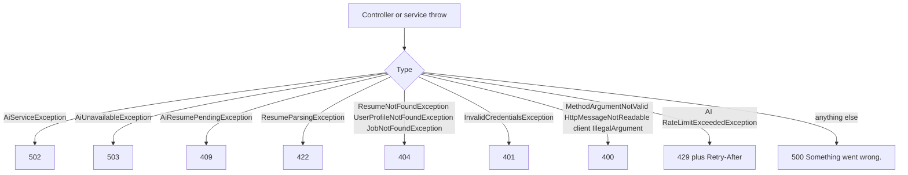

# Error handling

AI HTTP errors use the shared `ApiResponse` envelope (`success: false`, `message`, `timestamp`). The AI package does not define its own `@RestControllerAdvice`. `GlobalExceptionHandler` in `common` maps exceptions to status codes.

The rate-limit filter is an exception: it writes `429` JSON itself and does not throw.

## How an exception becomes a response



Streaming is different after the SSE connection opens: provider failures are emitted as an `error` event with `finishReason=ERROR`, often with HTTP `200`. See [CHAT-AND-STREAMING.md](./AI-SERVICE-SPECIFIC-DOCS/CHAT-AND-STREAMING.md).

## AI-defined exceptions

| Exception | Typical HTTP | Meaning |
|---|---|---|
| `AiServiceException` | `502 Bad Gateway` | Provider call failed, timed out, returned an unusable extraction payload, or another non-domain failure after sanitization |
| `AiUnavailableException` | `503 Service Unavailable` | Circuit open (“temporarily unavailable”) or bulkhead full (“busy”) |
| `AiResumePendingException` | `409 Conflict` | Resume parse not finished; client should retry |
| `RateLimitExceededException` (ai package) | `429` | Used if `consumeOrThrow` is called; the HTTP filter usually writes `429` without throwing |

Client messages for `AiServiceException` come from `formatFriendlyErrorMessage`:

| Upstream signal (substring match) | Client message |
|---|---|
| `429`, `RESOURCE_EXHAUSTED`, `quota`, `Quota exceeded` | Google Gemini API rate limit or quota exceeded… |
| `404`, `NOT_FOUND` | The configured AI model is unavailable. |
| `401`, `UNAUTHENTICATED`, `invalid authentication` | AI provider authentication failed. Please try again later. |
| `503`, `UNAVAILABLE`, `high demand` | The AI model is currently experiencing high demand… |
| `TimeoutException`, `timed out`, `Timeout` | The AI service response timed out. Please try a more specific or shorter prompt. |
| anything else / null | An unexpected error occurred while communicating with the AI model. Please try again. |

Extraction-specific: null structured entity → `AI did not return parsable job information. Please try again.`

## Domain exceptions from other modules

These are **propagated** (not wrapped) when they occur during grounding:

| Exception | HTTP | Typical AI trigger |
|---|---|---|
| `JobNotFoundException` | `404` | `jobId` not owned; job chat email unknown |
| `ResumeNotFoundException` | `404` | Explicit `resumeId` missing; resume-context with no high-priority resume |
| `UserProfileNotFoundException` | `404` | No profile when a resume must be resolved (and, for chat without `resumeId`, this is swallowed into empty context) |
| `ResumeParsingException` | `422` | Failed parse or empty `contextText`. In-progress messages matching “still in progress” / “still being processed” / “retry shortly” are converted to `AiResumePendingException` first. |

Default messages: `Resume not found.`, `User profile not found.`, `Job not found.`

## Validation and malformed JSON

| Cause | HTTP | Message pattern |
|---|---|---|
| `@Valid` field errors | `400` | `field: message` joined by commas |
| Missing/malformed JSON | `400` | `Request body is missing or malformed JSON.` |
| Invalid `mode` enum | `400` | malformed JSON handler |
| `IllegalArgumentException` whose message starts with `Prior turns cannot exceed` or `Each prior turn must include` | `400` | that message |
| Other `IllegalArgumentException` | `500` | `Something went wrong.` (treated as a server bug) |

Job-chat inbound cap (40 turns) and blank prior turns use those `IllegalArgumentException` prefixes.

## Security errors

| Cause | HTTP | Message |
|---|---|---|
| No/invalid JWT at the security chain | `401` | `Unauthorized.` |
| Controller without principal | `401` | `User is not authenticated.` |

There is no AI-specific `403`. Unverified email is `401` at the JWT filter (principal never set), not a distinct forbidden payload.

## Filter-level rate limit

```json
{
  "success": false,
  "message": "Too many requests. Please try again later."
}
```

Status `429`, header `Retry-After` (seconds).

## Unhandled errors

`Exception` → `500`, message `Something went wrong.` The original exception is logged, not returned.

## Example error body (provider)

```json
{
  "success": false,
  "message": "An unexpected error occurred while communicating with the AI model. Please try again.",
  "timestamp": "2026-01-01T12:00:00"
}
```
