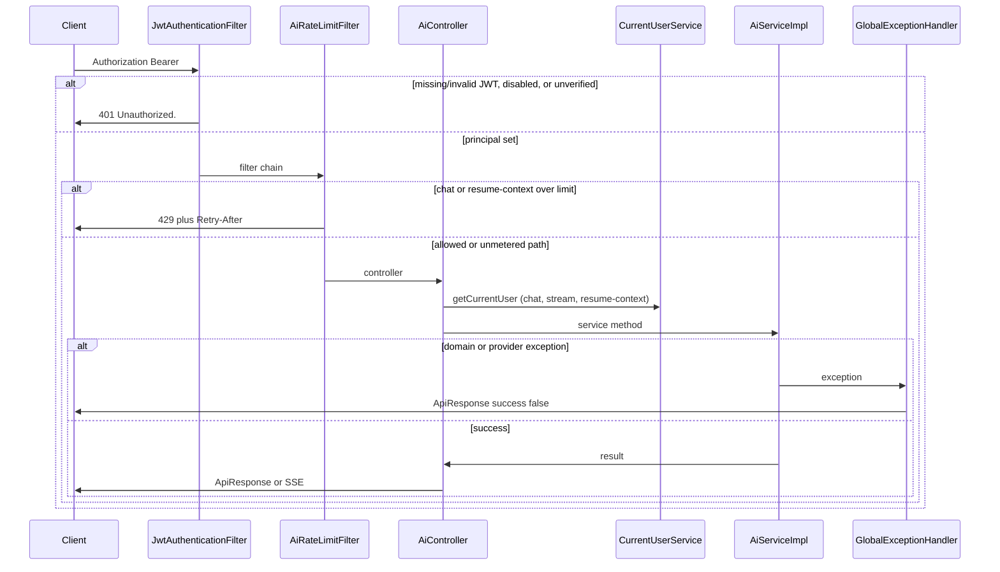
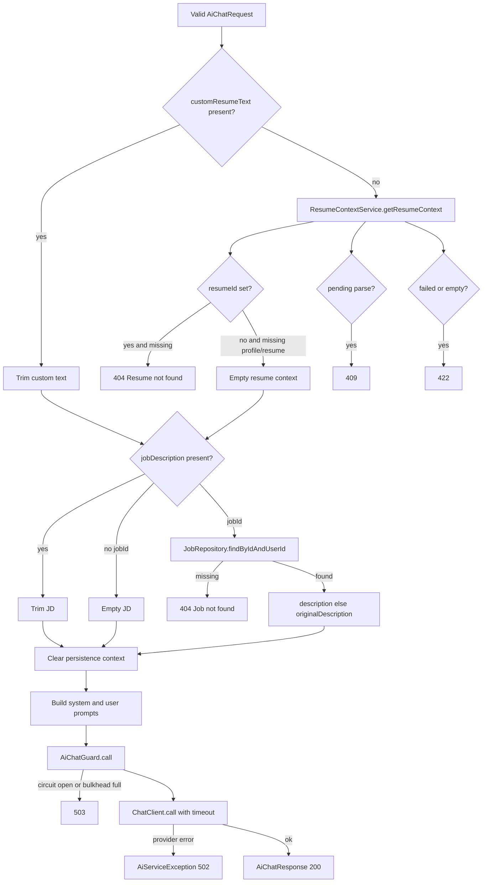
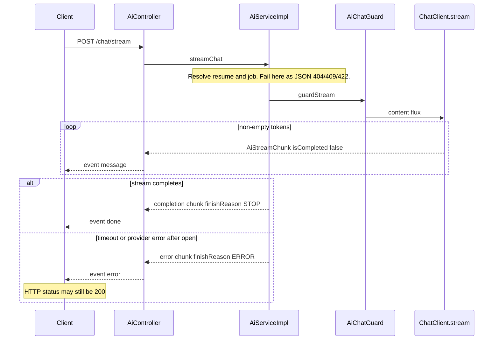
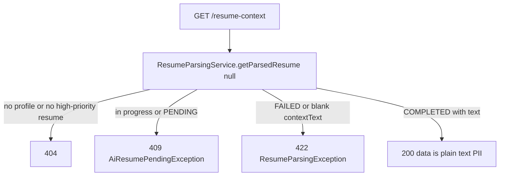
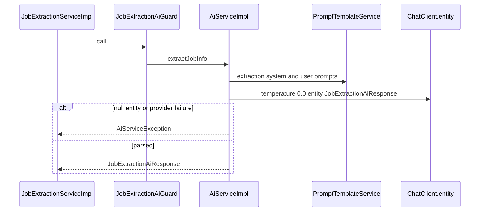
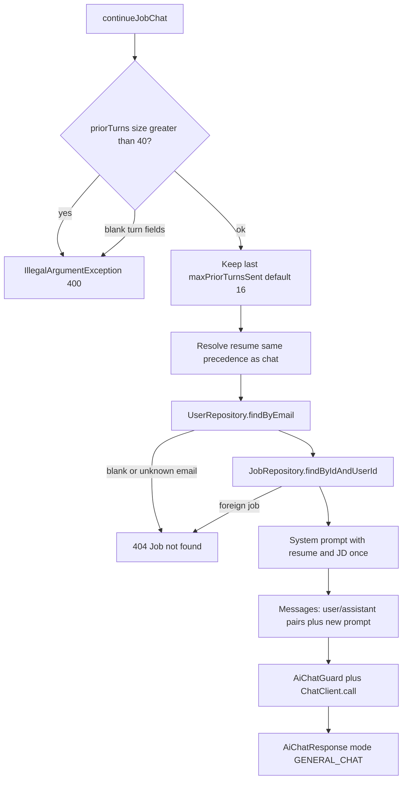
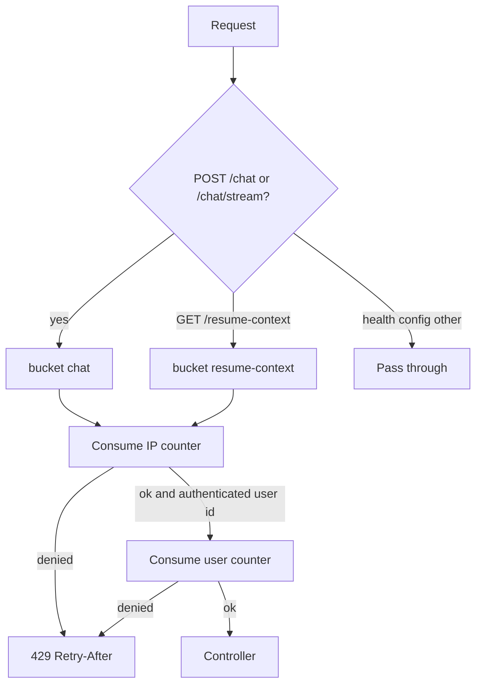

# Flows

This document covers the workflows the `ai` service actually implements. Every diagram is taken from the current code and tests.

## 1. Authenticated request lifecycle (HTTP)

All `/api/v1/ai/**` routes go through the shared JWT filter, then the AI rate-limit filter, then the controller.

`GET /health` and `GET /config` skip rate limiting and do not call `CurrentUserService`, but they still require JWT authentication.

## 2. Synchronous chat

`POST /api/v1/ai/chat` returns one complete answer.

Context precedence is fixed: inline `customResumeText` wins over `resumeId`; inline `jobDescription` wins over `jobId`. Ids must belong to the authenticated user. Chat without a stored resume continues with `[No resume context provided]` in the prompt.

After a successful call, `AiMetrics.recordChatSuccess` logs latency and token count (tokens may be null).

## 3. Streaming chat (SSE)

`POST /api/v1/ai/chat/stream` uses the same grounding rules as chat. The difference is after the provider stream starts.

Empty tokens are dropped. The controller maps chunks to SSE event names: incomplete → `message`; completed with `finishReason=ERROR` → `error`; otherwise `done`. Clients must treat terminal `error` as failure even when the HTTP status is `200`.

## 4. Resume context read

`GET /api/v1/ai/resume-context` always requests the high-priority resume (`getResumeContext(null)`). Unlike chat, a missing resume is **not** turned into empty text — it is `404`.

Parse-in-progress is detected both from status `PENDING` (or any non-`COMPLETED` / non-`FAILED` status) and from a `ResumeParsingException` whose message contains “still in progress”, “still being processed”, or “retry shortly”.

## 5. Job extraction (in-process)

HTTP for this feature is `POST /api/v1/job-extraction/parse`. The AI service only implements the model call.

`extractJobInfo` is **not** wrapped by `AiChatGuard`. Temperature is forced to `0.0`. `sourceUrl` and `originalDescription` are not model fields; the caller already knows them.

## 6. Job-scoped multi-turn chat (in-process)

HTTP for this feature is owned by chat-assistant. The AI service receives `JobChatAiRequest` plus the user’s email.

Resume and job text are **not** repeated on every user turn. Unknown email is mapped to `Job not found.` so the client never sees whether the email existed.

## 7. Rate-limit decision

Redis is preferred when enabled and reachable; otherwise an in-memory sliding window is used. See [RATE-LIMITING.md](./AI-SERVICE-SPECIFIC-DOCS/RATE-LIMITING.md).

## 8. Provider resilience

Chat, stream, and job chat acquire the bulkhead and check the circuit **before** calling the provider. Three consecutive `AiServiceException`s (or stream chunks with `finishReason=ERROR`) open the circuit for 30 seconds. A success resets the failure count. Extraction uses job-extraction’s guard instead.

Timeouts use `app.ai.timeout-seconds` (default 60; `streaming-timeout-seconds` is a deprecated alias). Stream timeouts become an SSE `error` chunk; sync timeouts become `502` with a timeout-friendly message.

Details: [PROVIDER-RESILIENCE.md](./AI-SERVICE-SPECIFIC-DOCS/PROVIDER-RESILIENCE.md).
