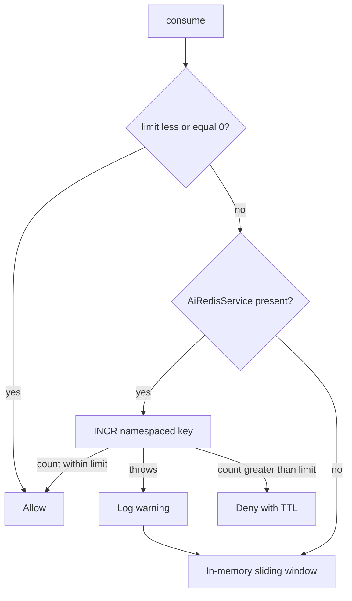

# Redis infrastructure

The `ai` service uses Redis for **one** purpose: distributed rate-limit counters for paid chat and resume-context reads.

It does not cache completions, prompts, resume text, or job descriptions.

## When Redis exists

`AiRedisConfig` creates connection beans only if:

```properties
app.ai.redis.enabled=true
```

The default is `false`. Copilot excludes Spring Boot Data Redis auto-configuration, so enabling this flag is what starts an AI-specific Lettuce factory — not a global Redis requirement.

If Redis is disabled, or a Redis increment throws, `AiRateLimitServiceImpl` falls back to an **in-memory sliding window**. That fallback is correct for a single JVM (local, tests). It is **not** shared across ECS/replicas.

## What is stored

| Data | Key shape | TTL |
|---|---|---|
| Request count in the current window | `{keyPrefix}:{namespace}:{identity}` | Set on first increment to the consume window (60 seconds for the filter) |

`keyPrefix` defaults to `ai` (`app.ai.redis.key-prefix`).

`namespace` is `rl-` plus the filter bucket, for example:

- `rl-chat-ip`
- `rl-chat-user`
- `rl-resume-context-ip`
- `rl-resume-context-user`

`identity` is the client IP or the numeric user id. Values are trimmed, lowercased, and **colons are replaced with underscores** so IPv6 addresses cannot collide with the key delimiter.

Production-shaped examples (filter bucket `chat` / identity `7` or an IPv6 address):

- `ai:rl-chat-user:7`
- `ai:rl-chat-ip:10.0.0.1`
- IPv6 identity `2001:db8::1` becomes `2001_db8__1` so colons cannot break the key

## Increment and expiration

`AiRedisRepository.increment`:

1. `INCR` the key.
2. If the new value is `1` and TTL is positive, `EXPIRE` the key for that duration.

Later increments in the same window do **not** refresh TTL. This is a **fixed window**, not a sliding window. When the key expires, the count starts over.

If the count is greater than the limit, `ttlSeconds` is used as `Retry-After`. If Redis reports no TTL, the filter/service uses the full window length.

## Failure behavior



Redis errors are not returned to the client as `500`. Limits continue in memory for that instance.

## Connection settings

`AiRedisProperties` (`app.ai.redis`):

| Property | Default | Role |
|---|---|---|
| `enabled` | `false` | Create Redis beans |
| `host` | `localhost` | Standalone Redis |
| `port` | `6379` | |
| `password` | empty | Set only if non-blank |
| `database` | `0` | Redis logical DB |
| `timeout-ms` | `2000` | Lettuce command timeout |
| `key-prefix` | `ai` | First segment of keys |

These AI Redis settings are independent of `app.auth.redis` and `app.jobextraction.redis`.

The example `application.properties.example` does not currently list `app.ai.redis.*`; the Java defaults above still apply.

## Related configuration

Rate-limit **thresholds** are not Redis properties. They are `app.ai.chat-per-minute` and `app.ai.resume-context-per-minute` on `AiRateLimitProperties`. See [RATE-LIMITING.md](./AI-SERVICE-SPECIFIC-DOCS/RATE-LIMITING.md).
