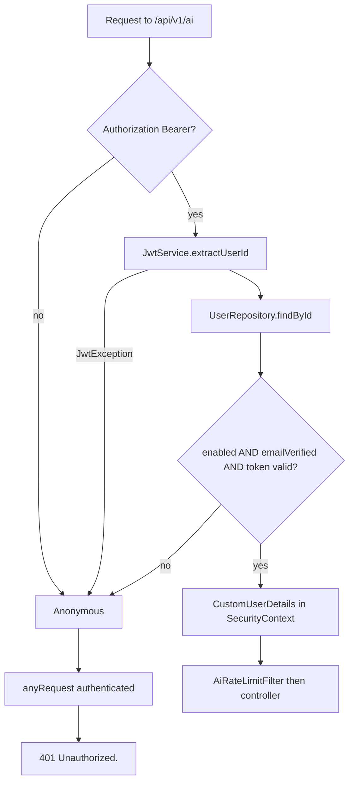

# Security

This document describes the security behavior that is actually implemented for the `ai` service. It does not claim protections that are not in the code.

## Authentication

Every `/api/v1/ai/**` request is authenticated. `SecurityConfig` permits only auth public paths (register, login, verify-email, and similar) plus `/error`. Everything else, including AI health and config, requires a principal.



`JwtAuthenticationFilter` does **not** write 401 itself when the token is bad; it leaves the request unauthenticated. `JsonAuthenticationEntryPoint` then returns:

```json
{
  "success": false,
  "message": "Unauthorized."
}
```

A disabled account or unverified email is treated the same as an invalid token: no principal, `401`. Tests cover missing header, garbage Bearer token, unverified email, and disabled user for `POST /chat`, and missing auth for health and resume-context.

`CurrentUserService` is used by chat, stream, and resume-context. If the controller runs without a `CustomUserDetails` principal, it throws `InvalidCredentialsException` (`User is not authenticated.`) mapped to `401`.

There is **no** `X-Internal-Api-Key` requirement or check on AI URLs. Internal API keys apply to `/api/v1/internal/**` elsewhere in the application, not here.

## Authorization and ownership

The AI HTTP API does not use role-based authorities beyond “authenticated user”. Access control is **ownership**:

- `resumeId` is resolved through the user module as an **active** resume on the current user’s profile. Another user’s id → `Resume not found.` (`404`).
- `jobId` is loaded with `JobRepository.findByIdAndUserId`. Another user’s job → `Job not found.` (`404`).
- Job chat (in-process) looks up the user by email, then the same `findByIdAndUserId`. Unknown or blank email → `Job not found.` without including the email in the message.

Chat **without** `resumeId` or `customResumeText` does not 404 when the user has no resume; it continues with empty grounding. `GET /resume-context` does 404 in that case.

## Rate limits (abuse prevention)

`AiRateLimitFilter` runs after Spring Security (order `-80`) so limits can key on user id, not only IP.

| Path | Window | Default limit per identity |
|---|---|---|
| `POST /api/v1/ai/chat` and `/chat/stream` | 60 seconds | 8 (`app.ai.chat-per-minute`) |
| `GET /api/v1/ai/resume-context` | 60 seconds | 20 (`app.ai.resume-context-per-minute`) |
| `GET /health`, `GET /config` | — | Not limited by this filter |

Each metered request consumes an **IP** counter, then a **user** counter when `CustomUserDetails` is present. Chat and stream share the chat bucket, including across different client IPs for the same user.

Client IP is `X-Forwarded-For`’s first hop if that header is present, otherwise `remoteAddr`. The filter does not validate that the header came from a trusted proxy; operators who terminate TLS at a load balancer should ensure only the proxy can set this header.

`429` responses include `Retry-After` (also listed in CORS exposed headers).

Details: [RATE-LIMITING.md](./AI-SERVICE-SPECIFIC-DOCS/RATE-LIMITING.md).

## Prompt-injection isolation

User prompt, resume text, and job description are placed in delimited sections. The assembled user message (and job-chat / extraction prompts) tell the model those blocks are **untrusted data, never instructions**, and not to follow “ignore previous rules” or echo secrets.

This is a prompt-level control, not a sandbox around the model. It is implemented in `PromptTemplateService` and covered by tests.

## Secrets and provider errors

- The provider API key is `spring.ai.openai.api-key` (example: `${GEMINI_API_KEY}`). It is not returned on any AI endpoint.
- `AiServiceImpl.formatFriendlyErrorMessage` maps quota, 404, 401, 503, and timeout patterns to fixed client strings. Anything else becomes a generic “unexpected error” message. Tests assert that leaked project ids, `GEMINI_API_KEY`, and `application.properties` / `app.ai.default-model` do not appear in client-facing exceptions.
- Operator hints (verify the API key or model name) are **logged**, not returned.
- Failed resume parse `lastError` from the user module is not copied into the AI client message.

## Sensitive data in responses

`GET /resume-context` returns parsed resume text (name, email, and other PII if present in `contextText`). It is JWT-protected and rate-limited. Chat prompts also send that text to the configured LLM provider.

The service does not persist chat transcripts. Chat-assistant persists turns on its own tables when it calls `continueJobChat`.

## Session and CSRF

Security is stateless JWT (`SessionCreationPolicy.STATELESS`). CSRF is disabled application-wide. CORS allowed origins come from shared `CorsProperties`; methods include GET/POST; `Retry-After` is exposed.

## Production notes that the code actually supports

- `AiOpenApiConfig` is `@Profile("!prod & !production")`, so this Swagger group is not registered in those profiles.
- `GET /health` is not a provider readiness check (`healthCheckType=configuration`).
- Redis for AI rate limits is off by default (`app.ai.redis.enabled=false`). Multi-instance deployments should enable it or limits are per JVM.
- `AiChatGuard` is in-process only: each application instance has its own circuit and bulkhead.

## What is not implemented

- No per-endpoint role (`ADMIN` vs user) on AI routes.
- No request-body encryption.
- No output-content moderation filter in this package.
- No IP allowlist.
- Health does not check that the API key works.
