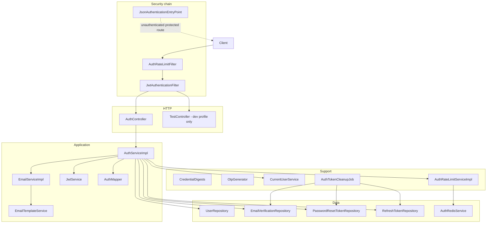
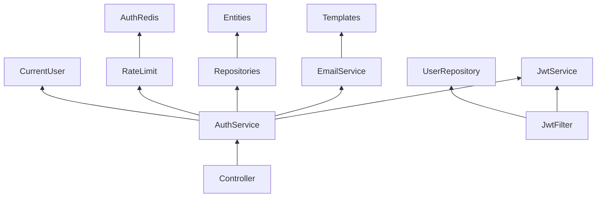

# Auth Architecture

Auth is a layered package inside the Copilot monolith. HTTP enters through Spring Security filters, then `AuthController`, then `AuthServiceImpl`. Persistence is JPA against MySQL. Redis is an optional side channel for counters only.

## Layers

Filter order is “both run before `UsernamePasswordAuthenticationFilter`.” Rate limiting is applied first on the selected public POST paths; the JWT filter then optionally populates the security context when `Authorization: Bearer` is present.

## Request path

1. **CORS** — `CorsConfigurationSource` from `SecurityConfig` / `CorsProperties`.
2. **`AuthRateLimitFilter`** — POST to login, register, verify-email, resend-otp, forgot-password, or refresh-token: per-IP consume. On deny, writes `429` itself (does not reach the controller).
3. **`JwtAuthenticationFilter`** — if a Bearer token is present, load user by id, require `enabled` and `emailVerified`, validate signature/expiry/`tv`. Invalid tokens are swallowed; the chain continues unauthenticated.
4. **Authorization** — `permitAll` for the public auth paths and `/error`; Swagger paths if not `prod`/`production`; everything else `authenticated()`.
5. **Controller** — Bean Validation on DTOs, then `AuthService`.
6. **Service** — additional per-email rate limits, business rules, JPA writes. Mail is registered `afterCommit`.
7. **Errors** — `GlobalExceptionHandler` and `RateLimitExceptionHandler` map exceptions to `ApiResponse`. Unauthenticated protected calls never reach the controller; `JsonAuthenticationEntryPoint` writes `401` `"Unauthorized."`

## Component groups

### HTTP

| Component | Role |
| --- | --- |
| `AuthController` | `/api/v1/auth` endpoints. Builds `ApiResponse` envelopes. Does not contain business rules. |
| `TestController` | `GET /api/v1/test` when Spring profile is `dev`. Hidden from OpenAPI. Requires authentication like any other non-public path. |

### Security

| Component | Role |
| --- | --- |
| `SecurityConfig` | Stateless session, CSRF off, CORS, authorize matchers, filter registration. |
| `SecurityBeansConfig` | `BCryptPasswordEncoder` and `AuthenticationManager` bean. Login does **not** call `AuthenticationManager`; it compares passwords in `AuthServiceImpl`. |
| `JwtAuthenticationFilter` | Bearer parsing and `SecurityContext` population. |
| `JwtService` | Create/parse HS256 JWTs; reject short or placeholder secrets at startup. |
| `CustomUserDetails` | `UserDetails` wrapper. `getUsername()` returns **email**. Authority is `ROLE_` + `Role` name. |
| `CustomUserDetailsService` | `UserDetailsService` lookup by email. Not on the JWT filter path (the filter loads by user id). |
| `JsonAuthenticationEntryPoint` | JSON `401` for missing authentication. |
| `AuthSecretsGuard` | `prod` / `production` only: refuse boot unless `APP_JWT_SECRET` is set in the environment. |
| `CorsProperties` | Allowed origins; strips `*`. |

### Application services

| Component | Role |
| --- | --- |
| `AuthService` / `AuthServiceImpl` | All auth use cases. Normalizes email/username to lowercase. Uses UTC `Clock`. |
| `EmailService` / `EmailServiceImpl` | MIME HTML mail. Requires `app.mail.from` and `app.mail.sender-name`. |
| `EmailTemplateService` | Thymeleaf `otp-email` and `password-reset`. |
| `AuthMapper` | `User` → `UserResponse` (no password, flags, or `tokenVersion`). |
| `AuthTokenCleanupJob` | Cron `0 0 * * * *` (every hour, minute 0). |

### Rate limiting and Redis

| Component | Role |
| --- | --- |
| `AuthRateLimitFilter` | Per-IP limits; does not read the JSON body. |
| `AuthRateLimitServiceImpl` | Redis counters when `AuthRedisService` exists; otherwise in-memory maps. |
| `AuthRateLimitConfig` | Wires the service and filter; **disables** servlet `FilterRegistrationBean` so the filter is not counted twice. |
| `AuthRedisConfig` | Connection factory, template, repository, key builder — only if `app.auth.redis.enabled=true`. |

### Persistence

Entities extend `BaseEntity` (`createdAt` / `updatedAt` via JPA auditing in `common.config.JpaConfig`).

| Entity | Table |
| --- | --- |
| `User` | `users` |
| `EmailVerification` | `email_verification` |
| `PasswordResetToken` | `password_reset_token` |
| `RefreshToken` | `refresh_token` |

`RefreshTokenRepository.findByTokenForUpdate` and `EmailVerificationRepository.findTopByUserEmailOrderByCreatedAtDesc` use `PESSIMISTIC_WRITE` so concurrent refresh/OTP attempts serialize on the row.

### Shared code used by auth

| Shared type | Why auth needs it |
| --- | --- |
| `ApiResponse` | Uniform success/error JSON. |
| `GlobalExceptionHandler` | Maps auth exceptions to HTTP statuses. |
| `CurrentUserService` | Resolves the authenticated `User` for `/me`, `/logout`, `/logout-all`. |
| JPA auditing | Populates `createdAt` / `updatedAt`. |

## Dependency direction

Controllers do not talk to repositories. Redis is not used to store sessions or JWTs. The JWT filter depends on `UserRepository` so it can enforce enabled/verified/`tokenVersion` on every authenticated request.

## Configuration beans

- `AuthConfig` — `@EnableScheduling`, UTC `Clock`.
- `AuthProperties` — OTP/reset/refresh lifetimes, rate-limit numbers, mail cooldown, max OTP attempts, max active refresh tokens.
- `EmailProperties` — sender address and display name (`prefix app.mail`).
- `AuthOpenApiConfig` — OpenAPI group `authentication` for `/api/v1/auth/**`, excluded on `prod` / `production`.
- `AuthRedisProperties` — host, port, database, timeout, key prefix, enabled flag.

## What is deliberately not a layer

There is no auth-specific API gateway, no cookie session store, and no separate auth database. Tokens that must survive restart live in MySQL. Rate-limit state may live only in process memory when Redis is off, so limits are per JVM in that mode.
