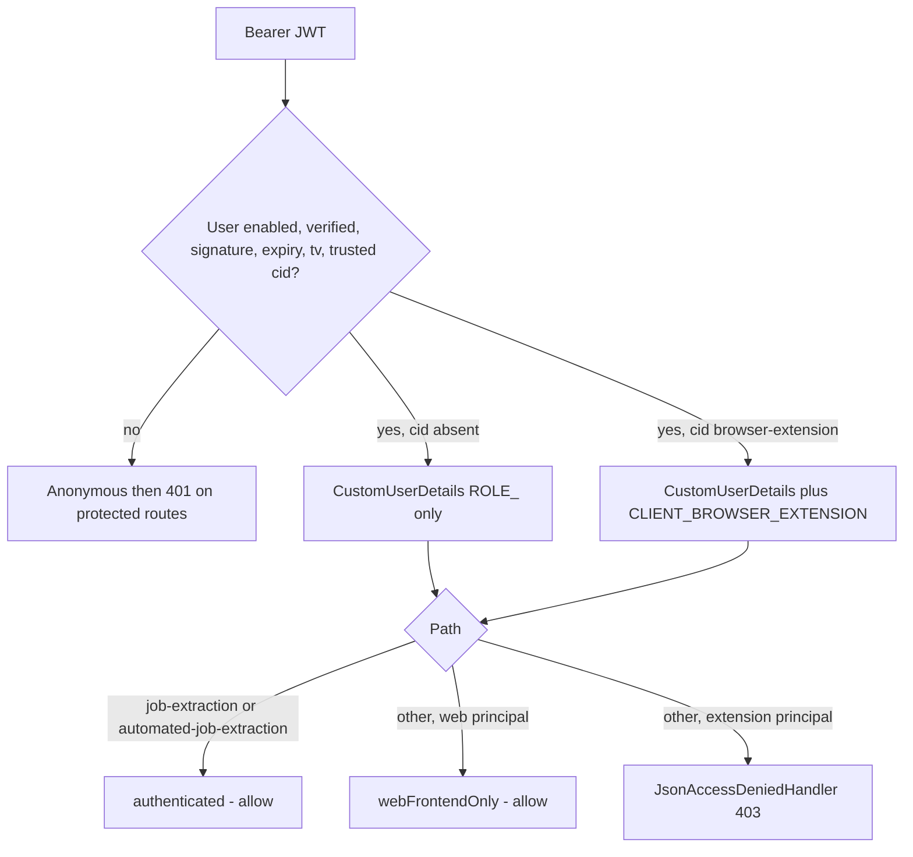
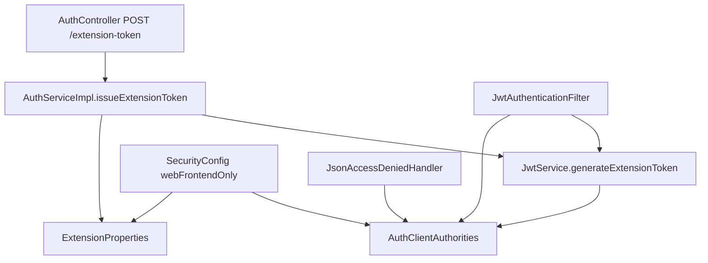

# Browser Extension (Auth)

Auth mints a **restricted access JWT** so one Chrome extension can call job-extraction APIs as an already-authenticated user. It does not add a second login, a second issuer, or a stored extension session.

Related: [FLOW.md](../FLOW.md), [ENDPOINTS.md](../ENDPOINTS.md), [SECURITY.md](../SECURITY.md), [TOKEN-LIFECYCLE.md](TOKEN-LIFECYCLE.md), [RATE-LIMITING.md](RATE-LIMITING.md), [CONFIGURATION.md](../CONFIGURATION.md), [TESTING.md](../TESTING.md).

## Purpose

The web frontend logs the user in with the existing HS256 access JWT plus refresh UUID. When that frontend needs a least-privilege token for the Chrome extension, it calls `POST /api/v1/auth/extension-token` with the **web** access JWT. Auth returns a short-lived JWT whose signed `cid` claim is `browser-extension`. That token may use job-extraction routes. Every other authenticated route returns `403`.

Auth owns minting, JWT validation, CORS for the extension origin, and the filter-chain matchers. Job-extraction request/response bodies live in those other packages.

## Why this lives in auth

The extension is the same `User` as the website session. Auth already issues `sub` / `email` / `role` / `tv` and already registers `SecurityConfig` for the whole application. A separate issuer or header-based client id would be a second trust boundary. Authorization is the signed `cid` claim copied onto Spring authority `CLIENT_BROWSER_EXTENSION`, never `X-Client`, `X-Extension-Id`, or `chrome-extension://…`.

## Trust boundary

| Mechanism | Role |
| --- | --- |
| Web access JWT (`cid` absent) | Full existing API access; required to mint an extension token |
| Extension access JWT (`cid=browser-extension`) | Authenticated user, job-extraction paths only |
| `app.extension.id` | CORS origin `chrome-extension://<id>` when set. Not a secret and not authorization |
| Refresh UUID | Never issued for the extension token. The extension cannot rotate sessions |

Unknown `cid` values fail `JwtService.isTokenValid`, so a forged client claim cannot inherit web privileges. Request headers cannot add or remove `CLIENT_BROWSER_EXTENSION`.

## Minting flow

```mermaid
sequenceDiagram
    participant W as Web client with web JWT
    participant RL as AuthRateLimitFilter
    participant JWT as JwtAuthenticationFilter
    participant SEC as SecurityConfig
    participant CTL as AuthController
    participant SVC as AuthServiceImpl
    W->>RL: POST /api/v1/auth/extension-token Authorization Bearer
    alt IP bucket extension-token-ip over limit
        RL-->>W: 429 Too many requests. Please try again later.
    else allowed
        RL->>JWT: continue
        JWT->>JWT: validate Bearer JWT; add CLIENT_BROWSER_EXTENSION if cid is browser-extension
        alt missing or invalid JWT
            JWT->>SEC: anonymous
            SEC-->>W: 401 Unauthorized.
        else authenticated extension client
            SEC-->>W: 403 This client is not authorized to access this resource.
        else authenticated web client
            SEC->>CTL: issueExtensionToken
            alt app.extension.enabled false
                SVC-->>W: 403 Browser extension access is disabled.
            else per-user extension-token over limit
                SVC-->>W: 429
            else
                SVC-->>W: 200 ExtensionAuthResponse
            end
        end
    end
```

How the website later gives that JWT to the Chrome extension is **outside** this package. Auth only serves the HTTP mint.

## Endpoint

`POST /api/v1/auth/extension-token`

- **Auth:** `Authorization: Bearer` with a web-frontend access JWT. Not `permitAll`.
- **Body:** none. No DTO.
- **Success:** `200` `"Browser extension access token issued."` with `ExtensionAuthResponse`: `accessToken`, `tokenType` (`Bearer`), `client` (`browser-extension`), `expiresIn` (seconds, `max(1, access-expiry-ms / 1000)`).
- **Not returned:** `refreshToken`.

Contract details: [ENDPOINTS.md](../ENDPOINTS.md).

## Token shape and lifecycle

`JwtService.generateExtensionToken` builds the same claims as `generateToken` (`sub`, `email`, `role`, `tv`, `iat`, `exp`) and adds `cid=browser-extension`. Lifetime is `app.extension.access-expiry-ms` (default 900_000 ms). Login and refresh still issue **web** tokens with no `cid`.

| Event | Effect on an extension JWT |
| --- | --- |
| Expiry | Filter leaves the context empty → `401` `"Unauthorized."` on protected routes |
| `logout-all` / `reset-password` | `tokenVersion` bump; `tv` check fails on the next request |
| Single-session `/logout` | Does not bump `tv`; the extension JWT remains valid until `exp` |
| `app.extension.enabled=false` | Minting returns `403` `"Browser extension access is disabled."`. Existing extension JWTs fail `isTokenValid` and look unauthenticated (`401`) |
| `JwtService.generateExtensionToken` while disabled | `IllegalStateException` `"Browser extension client is disabled."` (service checks enabled first and does not call this in the HTTP path) |

Access JWTs, including extension tokens, are **not** stored. There is no Redis blacklist. See [TOKEN-LIFECYCLE.md](TOKEN-LIFECYCLE.md) and [DATABASE.md](../DATABASE.md).

## Authorization after authentication



`SecurityConfig` matchers (any HTTP method):

- `/api/v1/job-extraction/**` and `/api/v1/automated-job-extraction/**` — `authenticated()` (web **or** extension).
- `anyRequest()` — authenticated **and not** `CLIENT_BROWSER_EXTENSION` (`webFrontendOnly()`).

That includes `/api/v1/auth/me`, `/logout`, `/logout-all`, `/extension-token`, and `GET /api/v1/test`. `issueExtensionToken` also rejects an extension principal if the request reached the service (`BrowserExtensionAccessDeniedException` with the same forbidden message).

`JsonAccessDeniedHandler` always writes `403` `"This client is not authorized to access this resource."` It logs `WARN` with method and URI (a distinct line when the principal is the extension client). It does not log the token.

## Rate limiting

Same counter machinery as other auth limits ([RATE-LIMITING.md](RATE-LIMITING.md)).

| Layer | Bucket | Identity | Default / 60s |
| --- | --- | --- | --- |
| `AuthRateLimitFilter` | `extension-token-ip` | Client IP (`X-Forwarded-For` first hop or `remoteAddr`) | `app.extension.token-rate-limit-per-minute` (10) |
| `AuthServiceImpl` | `extension-token` | `String.valueOf(user.getId())` | same property |

Limit `<= 0` disables that bucket. Deny is `429` `"Too many requests. Please try again later."` plus `Retry-After`.

When Redis is on, keys follow `{prefix}:rl-{bucket}:{identity}`, for example `auth:rl-extension-token-ip:10.0.0.1` and `auth:rl-extension-token:1`. See [REDIS-INFRASTRUCTURE.md](../REDIS-INFRASTRUCTURE.md).

## Database

No extra table, column, or row. Minting loads the current `User` through `CurrentUserService` (same as `/me`) and signs a JWT. Invalidation is expiry plus `tokenVersion`.

## Errors

| Situation | HTTP | Message |
| --- | --- | --- |
| No/invalid JWT on `/extension-token` | 401 | `"Unauthorized."` (`JsonAuthenticationEntryPoint`) |
| Extension JWT on a non-job-extraction path, including `/extension-token` | 403 | `"This client is not authorized to access this resource."` |
| Web JWT, `app.extension.enabled=false` | 403 | `"Browser extension access is disabled."` |
| IP or per-user mint over limit | 429 | `"Too many requests. Please try again later."` |

`BrowserExtensionAccessDeniedException` is mapped in `GlobalExceptionHandler` to 403 with `ex.getMessage()`. Filter-chain denials do not throw that exception; they use `JsonAccessDeniedHandler`.

## Configuration

Prefix `app.extension` (`ExtensionProperties`). Defaults: `enabled=true`, `id` blank, `access-expiry-ms=900000`, `token-rate-limit-per-minute=10`.

`id` is trimmed and lowercased. Blank means no extension CORS origin. If set, it must not contain `://`, `/`, `*`, `\`, or space; otherwise startup (`JwtService.validateConfiguration` → `resolvedOrigin()`) throws `IllegalStateException`. The allow-list entry is `chrome-extension://` + that id.

Positive `access-expiry-ms` is required at startup when `ExtensionProperties` is present.

## Components



| Component | Responsibility |
| --- | --- |
| `AuthController.issueExtensionToken` | HTTP 200 envelope; no body |
| `AuthServiceImpl.issueExtensionToken` | Enabled check, reject extension principal, per-user limit, mint, INFO log `userId` |
| `JwtService` | `cid` on generate; trust `cid` on validate |
| `JwtAuthenticationFilter` | Adds `CLIENT_BROWSER_EXTENSION` when `cid` is `browser-extension` |
| `AuthClientAuthorities` | Claim name `cid`, client id `browser-extension`, authority name, forbidden message |
| `SecurityConfig` | Job-extraction `authenticated()`; `anyRequest` not extension; CORS merge |
| `JsonAccessDeniedHandler` | JSON 403 |
| `ExtensionProperties` | Kill switch, CORS id, lifetime, mint limits |
| `AuthRateLimitFilter` | Per-IP `extension-token-ip` |
| `BrowserExtensionAccessDeniedException` | Service-layer 403 |

## End-to-end request (extension JWT to job extraction)

1. CORS may allow `chrome-extension://<id>` if configured.
2. `AuthRateLimitFilter` does not IP-limit job-extraction paths.
3. `JwtAuthenticationFilter` loads the user by `sub`, requires enabled/verified, validates signature/expiry/`tv`/trusted `cid`, and adds `CLIENT_BROWSER_EXTENSION`.
4. Matcher `/api/v1/job-extraction/**` or `/api/v1/automated-job-extraction/**` requires only authentication → controller in that package runs.
5. Any other path → `JsonAccessDeniedHandler` 403.

Unauthenticated calls to those job-extraction paths are `401` `"Unauthorized."`, same as other protected APIs.

## Tests

| Test | What it locks |
| --- | --- |
| `AuthControllerTest.issueExtensionToken_success_returns200WithoutRefreshToken` | Envelope fields; no `refreshToken` |
| `AuthSecurityTest` | `/extension-token` 401 anonymous, 200 web user, 403 extension; `/me` 403 for extension |
| `BrowserExtensionSecurityTest` | Job-extraction probes allowed; jobs/ai/chat/users/internal/auth probes 403; spoof headers ignored |
| `AuthServiceImplTest` | Mint without calling `generateToken`; disabled and extension-client throws |
| `JwtServiceTest` | Web token omits `cid`; extension token includes it; unknown `cid` invalid; disabled rejects existing extension JWT and mint |
| `JwtAuthenticationFilterTest.doFilterInternal_extensionToken_addsBrowserExtensionAuthority` | Authority granted from token |
| `AuthRateLimitFilterTest.extensionToken_isLimitedPerIp` | IP bucket |
| `ExtensionPropertiesTest` | Origin build/reject; defaults |
| `GlobalExceptionHandlerTest.handleBrowserExtensionAccessDenied_mapsTo403` | Exception → 403 |

`BrowserExtensionProbeController` exists only in tests to exercise `SecurityConfig` without loading production controllers.

## What is not implemented in auth

- Chrome extension code, permissions, storage, or `chrome.runtime` messaging
- Login or refresh from the extension
- Persisting or blacklisting extension JWTs
- Treating CORS or request headers as authorization
- Role (`USER` / `ADMIN`) checks specific to the extension
- Job-extraction parse payloads, email-verified business rules inside those services, or any API other than the filter-chain paths above
