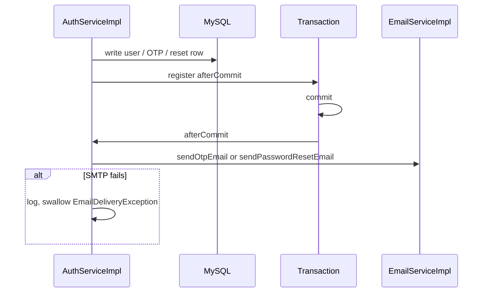

# Email Verification and Password Reset

Auth proves email ownership with a 6-digit OTP and recovers accounts with a one-time UUID sent over SMTP. Both flows hide whether an email exists, send mail only after the database transaction commits, and store digests rather than plaintext.

Related: [FLOW.md](../FLOW.md), [VALIDATION.md](../VALIDATION.md), [CONFIGURATION.md](../CONFIGURATION.md).

## Outbound mail

`EmailServiceImpl` sends MIME HTML via `JavaMailSender`.

| Mail | Subject | Template | Model |
| --- | --- | --- | --- |
| OTP | `Verify your Email - AI Copilot` | `otp-email` | `name`, `otp`, `expiryMinutes` |
| Reset | `Reset your Password - AI Copilot` | `password-reset` | `name`, `token`, `expiryMinutes` |

From-header: `app.mail.from` + `app.mail.sender-name`. Blank values fail startup.

OTP and reset expiry minutes in the template come from `AuthProperties` (defaults 10 and 15).

SMTP failures wrap as `EmailDeliveryException`. `AuthServiceImpl.sendMailSafely` catches that after commit, logs `"Email delivery failed after the account change was saved. Use resend-otp or forgot-password."`, and does **not** fail the HTTP success path.

If there is no active transaction synchronization, mail runs immediately.

## OTP generation and storage

`OtpGenerator` uses `SecureRandom` and formats `nextInt(1_000_000)` as six digits (`000000`–`999999`).

Stored value: `CredentialDigests.hmacSha256(otp, app.jwt.secret)` (hex, 64 chars). Comparison uses `hmacMatches` (`MessageDigest.isEqual`). OTP is **not** SHA-256 of the digits; rotating `app.jwt.secret` invalidates outstanding OTPs.

Issuance (`issueAndMailOtp`):

1. Delete all `email_verification` rows for the user.
2. Insert one row: HMAC, `expiresAt` = now + `otpExpiryMinutes`, `verified=false`, `failedAttempts=0`.
3. After commit, email the plaintext OTP.

Called from register (new user only) and resend (unverified user passing cooldown).

## Verify-email rules

Latest row for the email: `findTopByUserEmailOrderByCreatedAtDesc` with `PESSIMISTIC_WRITE`.

Order of checks: missing → already verified → expired → `failedAttempts >= maxOtpAttempts` (message `"OTP not found."`) → HMAC mismatch (increment attempts, `"Invalid OTP."`) → success (`verified=true`, user `enabled` and `emailVerified` true).

Clients never receive the OTP in JSON (`POST /register` 201 has no `data`).

## Anti-enumeration around mail

| Endpoint | HTTP if email unknown / already verified | Mail? |
| --- | --- | --- |
| Register (duplicate username or email) | 201 same as success | No |
| Resend OTP | 200 generic | Only unverified existing user + cooldown |
| Forgot password | 200 generic | Only existing user + cooldown |

Resend message: `"If the account requires verification, an OTP has been sent."`  
Forgot message: `"If the account exists, a password reset email has been sent."`

## Mail cooldown

`tryAcquireMail(identity, mailCooldownSeconds)` default 60s.

- Resend OTP identity: the email.
- Forgot password identity: `"reset:" + email` so OTP and reset cooldowns do not share one Redis/memory key.

Failure to acquire: log debug and return; HTTP still 200. Cooldown `<= 0` always acquires.

## Password reset tokens

Forgot (when mail is allowed):

1. `deleteByUserIdAndUsedFalse`
2. Raw `UUID.randomUUID()`
3. Persist SHA-256 hex, `expiresAt` = now + `resetExpiryMinutes`, `used=false`
4. Email the raw UUID after commit

Reset:

1. Lookup by SHA-256 of submitted `token`
2. Reject used or expired
3. BCrypt `newPassword`, bump `tokenVersion`, mark used + `usedAt`, revoke all refresh tokens

Reset is public and **not** IP-rate-limited. Security relies on UUID entropy, expiry, single use, and unused-token replacement on a new forgot request.

Unlike OTP, reset hashes are unsalted SHA-256 (no `app.jwt.secret`). JWT secret rotation does not invalidate unused reset links.

## Account state vs mail

A registered user cannot login until verify-email succeeds. Forgot-password **does** send mail to unverified users if the row exists (there is no `emailVerified` check on forgot). Reset still bumps `tokenVersion` and revokes refresh tokens for that user.

There is no “change email” flow in auth; email is set at register (lowercased) and is not updated here.

## Operational notes

- After a successful register with failed SMTP, tell the user (out of band) to use resend-otp; the API cannot admit that mail failed without extra product UI.
- Cleanup job deletes verified/expired OTP rows and used/expired reset rows hourly; verification still requires a live non-expired row at request time.
- HTML templates are the only user-visible copy for codes/tokens besides the API error strings on verify/reset.
