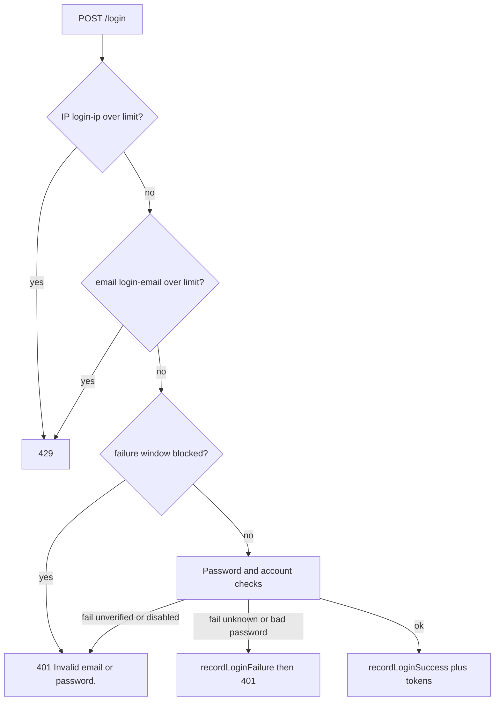

# Rate Limiting

Auth applies three kinds of request control: **per-IP** filters on expensive public POSTs, **per-email** counters in `AuthServiceImpl`, and **specialized** mail cooldown plus failed-login backoff. Storage is Redis when enabled, otherwise in-memory. See [REDIS-INFRASTRUCTURE.md](../REDIS-INFRASTRUCTURE.md) for keys and fallback.

Related: [ENDPOINTS.md](../ENDPOINTS.md), [CONFIGURATION.md](../CONFIGURATION.md).

## Why these limits exist

Login and register run BCrypt. Register, resend, and forgot can send SMTP. Refresh is public and CPU-cheap but guessable only if UUIDs leak; it is still IP-limited. The filter **does not read JSON**, so per-email limits run in the service after the body is bound.

## Filter: per-IP

`AuthRateLimitFilter` runs on the security chain only (`FilterRegistrationBean` disabled to avoid double counting).

Limited **POST** paths (exact `requestURI`):

| Path | Bucket | Default limit / 60s |
| --- | --- | --- |
| `/api/v1/auth/login` | `login-ip` | 5 |
| `/api/v1/auth/register` | `register-ip` | 5 |
| `/api/v1/auth/verify-email` | `verify-ip` | 10 |
| `/api/v1/auth/resend-otp` | `resend-ip` | 3 |
| `/api/v1/auth/forgot-password` | `forgot-ip` | 3 |
| `/api/v1/auth/refresh-token` | `refresh-ip` | 10 |

Not limited by this filter: `/reset-password`, `/logout`, `/logout-all`, `/me`, `/api/v1/test`.

Client IP: first value in `X-Forwarded-For` if present, else `remoteAddr`, else `unknown`. Behind a proxy this is only as trustworthy as the proxy configuration.

On deny the filter writes `429`, `Retry-After`, and `"Too many requests. Please try again later."` without calling the controller.

Limit `<= 0` skips the filter for that path.

## Service: per-email

After validation, `consumeOrThrow(bucket, email, limit, 60)`:

| Use case | Bucket | Default / 60s |
| --- | --- | --- |
| Register | `register-email` | 5 |
| Login | `login-email` | 5 |
| Verify | `verify-email` | 10 |
| Resend | `resend-email` | 3 |
| Forgot | `forgot-email` | 3 |

Throws `RateLimitExceededException` → `429` + `Retry-After` via advice. Email is already normalized lowercase.

Refresh has **no** per-email (or per-token) service limit.

## Mail cooldown

Not a 429. `tryAcquireMail`:

- Resend: identity = email, TTL = `mailCooldownSeconds` (60).
- Forgot: identity = `reset:` + email, same TTL.

If not acquired, mail and new OTP/reset rows are skipped; HTTP remains the generic 200.

## Failed-login window

Separate from the per-minute login rate limit.

- `recordLoginFailure` on unknown email or bad password.
- `isLoginBlocked` when failure count `>= maxFailedLogins` (10) inside `failedLoginWindowMinutes` (15).
- Blocked logins still run dummy BCrypt and return `401` `"Invalid email or password."` — not 429.
- Successful login calls `recordLoginSuccess` (deletes Redis key / memory deque).
- Correct password on unverified/disabled does **not** record a failure.

`maxFailedLogins <= 0` disables lockout.

## Combined login picture

An attacker can therefore hit 429 (too many tries per minute) or 401 with lockout (too many failures in 15 minutes) depending on which counter trips first. Lockout does not disclose that the email exists.

## Redis vs memory

| | Redis (`enabled=true` and call succeeds) | Memory |
| --- | --- | --- |
| Rate limit | `INCR` of `rl-{bucket}` + identity; TTL on first increment (**fixed window**) | Sliding timestamps |
| Multi-instance | Shared | Per JVM |
| Redis exception | Warn; that call uses memory | — |

Defaults keep Redis **off**, so local/dev limits are per process.

## Adding a new limited route

1. If the cost is BCrypt/SMTP/public: add the path to `LIMITED_PATHS`, `limitFor`, and `bucketFor` in `AuthRateLimitFilter`.
2. If identity is in the body: `consumeOrThrow` in the service with a new `AuthProperties` field.
3. Extend `AuthRateLimitFilterTest` / service tests.
4. Update [ENDPOINTS.md](../ENDPOINTS.md) and [CONFIGURATION.md](../CONFIGURATION.md).

Do not register the filter as a servlet filter; it would double-count with the security chain.
