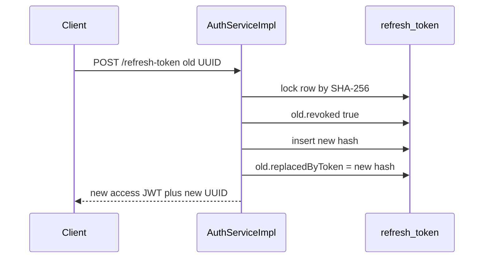

# Token Lifecycle

Access JWTs and refresh UUIDs are the contract between auth and every other HTTP API in Copilot. This document describes issuance, validation, rotation, reuse detection, session capping, and invalidation as implemented in `JwtService`, `JwtAuthenticationFilter`, and `AuthServiceImpl`.

Related: [FLOW.md](../FLOW.md), [SECURITY.md](../SECURITY.md), [DATABASE.md](../DATABASE.md).

## Two tokens, two jobs

| Token | Format | Stored? | Default life | Sent as |
| --- | --- | --- | --- | --- |
| Access | HS256 JWT | No | 15 minutes (`app.auth.access-expiry-ms`) | `Authorization: Bearer` |
| Refresh | UUID string | SHA-256 in `refresh_token` | 30 days | JSON field `refreshToken` |

The refresh value is not a JWT. `/refresh-token` is public; anyone who has the UUID can rotate it. Treat it like a password.

## Access JWT shape

`JwtService.generateToken`:

- **alg / key:** HMAC-SHA using `app.jwt.secret` bytes (`Keys.hmacShaKeyFor`).
- **`sub`:** `User.id` as string.
- **`email`:** current email.
- **`role`:** `Role.name()` (`USER` or `ADMIN`).
- **`tv`:** `tokenVersion` (null treated as 0).
- **`iat` / `exp`:** now and now + `access-expiry-ms`.

Startup refuses secrets shorter than 32 characters or placeholder-like values.

Validation (`isTokenValid`): parse with `verifyWith` (rejects `alg=none`), user id equals `sub`, `exp` not in the past, `tv` equals the user’s current `tokenVersion` (missing `tv` → 0).

The filter also requires the user row to exist, `enabled == true`, and `emailVerified == true`. It authenticates with `extractUserId` only. It does not compare the JWT `email` or `role` claims to the database; those claims are informational for clients/other layers. Identity is `sub` + live user row + `tv`.

## `tokenVersion`

Integer on `users.token_version`, default 0.

Incremented (`bumpTokenVersion`) by:

- `resetPassword`
- `logoutAllDevices`

**Not** incremented by login, refresh, or `/logout` (single session).

After a bump, existing access JWTs fail `tv` checks. The user must login again (or already hold a new JWT from a later login). Refresh does not restore a bumped version; it only issues a JWT for the **current** version. If the account was logout-all’d, old refresh tokens are also revoked, so refresh fails too.

## Refresh issuance (login)

`buildAuthResponse` → `persistRefreshToken(user, replaced=null)`:

1. `capActiveRefreshTokens`: if `maxActiveRefreshTokens > 0`, load active tokens oldest-first; revoke overflow so that after inserting one new token the active count would not exceed the max.
2. Generate UUID, store SHA-256, `expiresAt` = now + `refreshExpiryDays`, `revoked=false`, `replacedByToken=null`.
3. Return the **raw** UUID in `AuthResponse`.

## Rotation (refresh)

`findByTokenForUpdate` (pessimistic write) on SHA-256 of the submitted UUID.

Success path:

1. Mark current row `revoked=true`.
2. Persist a new row (no session cap on rotation — cap runs only when `replaced == null`).
3. Set current `replacedByToken` to the **new row’s stored hash**.
4. Issue a new access JWT.

The client must discard the old UUID. Only the new UUID can rotate again.

## Reuse detection vs logout

If the locked row is already `revoked`:

- **`replacedByToken != null`** (it was rotated): call `revokeAllRefreshTokens` for that user, then `RefreshTokenRevokedException`. All devices must log in again. Access JWTs still work until expiry unless something else bumped `tv` (reuse detection does **not** bump `tokenVersion`).
- **`replacedByToken == null`** (typical `/logout`, cap eviction, or logout-all already revoked): throw revoked **without** an extra family wipe.

Expired but not revoked → `RefreshTokenExpiredException` (no family wipe). Unknown hash → `InvalidRefreshTokenException`. Disabled/unverified user → `InvalidRefreshTokenException` without rotating.

## Logout behaviors

| API | Refresh rows | `tokenVersion` | Access JWT |
| --- | --- | --- | --- |
| `POST /logout` | That UUID revoked, no `replacedByToken` | Unchanged | Valid until `exp` |
| `POST /logout-all` | All active revoked | +1 | Invalid on next request |
| `POST /reset-password` | All active revoked | +1 | Invalid on next request |

`/logout` requires the refresh UUID to belong to the JWT user and still be `revoked=false`.

## Session cap

Default 5 active (`revoked=false`) tokens per user, applied on **login** only. Concurrent logins beyond the cap revoke the oldest. Refresh rotation does not drop other devices.

Setting `max-active-refresh-tokens` to `0` or negative skips capping.

## Cleanup vs security

Hourly job deletes revoked or expired refresh **rows**. Security decisions use `revoked` and `expiresAt` **before** delete. After purge, a replay of an old UUID looks like an unknown token (`Invalid refresh token.`) instead of `revoked`.

## Client practical rules

1. Send access JWT on `/me`, `/logout`, `/logout-all`, and all non-auth APIs.
2. When access expires (`401 Unauthorized.`), call `/refresh-token` once with the current UUID; store the new pair.
3. Never retry refresh with a UUID that already rotated; that can revoke every session.
4. After password reset or logout-all, discard both tokens and use login.
5. `/logout` is enough to stop refresh on that device; wait out or ignore the access JWT, or use logout-all if the access JWT must die immediately.
