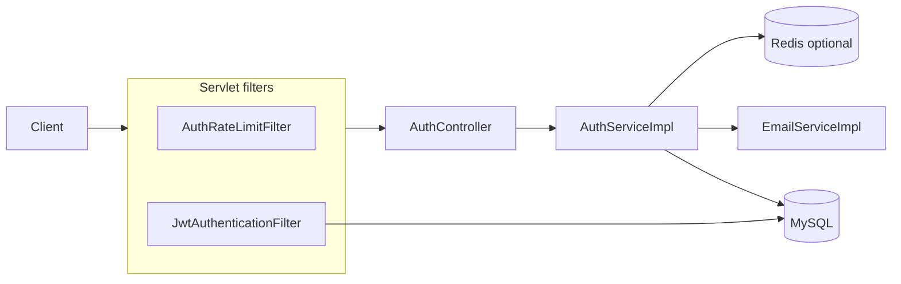

# Auth Service

The auth package (`com.developer.copilot.auth`) is the identity boundary of the Copilot Spring Boot application. It is not a separately deployed microservice. Other packages depend on the `User` it persists and on the JWT it issues.

A new developer should start here, then follow the links at the bottom for architecture, APIs, security, and the three deeper topics: token lifecycle, email verification / password reset, and rate limiting.

## Purpose

Auth proves who a caller is and whether that account is allowed to use the rest of the API.

It creates accounts, proves email ownership with a one-time code, issues a short-lived access JWT plus an opaque refresh UUID, rotates and revokes sessions, and resets passwords. It also owns the HTTP security filter chain that every request in the application passes through.

## Responsibilities

- Register users without leaking whether a username or email already exists.
- Keep new accounts disabled until the emailed OTP is verified.
- Authenticate with email and password, using the same error message for every login failure.
- Issue HS256 access JWTs (subject = user id, default lifetime 15 minutes) and store only hashes of refresh tokens.
- Rotate refresh tokens on use and revoke every session if a previously rotated token is replayed.
- Invalidate access JWTs immediately on password reset and logout-from-all-devices by bumping `tokenVersion`.
- Rate-limit expensive public routes by IP and by email, with optional Redis for multi-instance deployments.
- Send OTP and password-reset mail after the database transaction commits.
- Hourly purge of expired or used OTP, reset, and refresh rows.

Auth does **not** implement user profiles, resumes, jobs, chat, or internal service-to-service APIs. Those packages consume the JWT and `CurrentUserService`. Auth endpoints also do not distinguish `USER` from `ADMIN`; both roles are stored and placed on the JWT, but `/api/v1/auth/**` only checks “anonymous vs authenticated.”

## Major capabilities

| Capability | What the implementation does |
| --- | --- |
| Registration | Creates `Role.USER`, `enabled=false`, `emailVerified=false`. Duplicate username/email still returns HTTP 201 with the same message. |
| Email verification | 6-digit OTP, HMAC-SHA256 stored (keyed with `app.jwt.secret`), default 10-minute expiry, max 5 failed attempts. |
| Login | BCrypt password check. Unknown user, wrong password, unverified, disabled, and lockout all return `401` `"Invalid email or password."` |
| Access JWT | Signed with `app.jwt.secret`. Claims: `sub` (user id), `email`, `role`, `tv` (token version). |
| Refresh | Opaque UUID, SHA-256 in MySQL, default 30 days. Public endpoint; the UUID is the secret. |
| Session cap | Default 5 active refresh tokens per user; oldest revoked when a new login would exceed the cap. |
| Logout | Revokes that refresh token only. The access JWT remains valid until it expires (about 15 minutes). |
| Logout all / reset password | Bump `tokenVersion` and revoke all refresh tokens so existing access JWTs fail on the next request. |
| Password reset | UUID emailed, SHA-256 stored, default 15-minute expiry, single use. |
| Abuse controls | Per-IP filter + per-email counters + mail cooldown + failed-login window. |

## Service boundary

**In scope:** everything under `src/main/java/com/developer/copilot/auth/`, plus the shared pieces auth actually uses (`ApiResponse`, `GlobalExceptionHandler` mappings for auth exceptions, `CurrentUserService`, JPA auditing).

**Out of scope:** user profile, storage, jobs, AI, chat, and the internal API key filter. Those are other packages. Auth only supplies identity they rely on.

The HTTP security configuration lives in auth (`SecurityConfig`) and applies to the whole application: public auth paths and Swagger (non-production) are anonymous; every other route requires a valid access JWT for an enabled, email-verified user.

## Main components

- **`AuthController`** — REST surface at `/api/v1/auth`.
- **`AuthServiceImpl`** — account, OTP, login, refresh, logout, and reset logic.
- **`JwtService` / `JwtAuthenticationFilter`** — issue and validate access tokens.
- **Repositories** — `User`, `EmailVerification`, `PasswordResetToken`, `RefreshToken`.
- **`AuthRateLimitFilter` + `AuthRateLimitServiceImpl`** — IP and email limits; Redis when enabled, otherwise in-memory.
- **`EmailServiceImpl`** — SMTP + Thymeleaf templates `otp-email` and `password-reset`.
- **`AuthTokenCleanupJob`** — hourly deletion of stale token rows.
- **`TestController`** — `GET /api/v1/test` on the `dev` profile only; not a production API.

## Major integrations

| Integration | Role |
| --- | --- |
| MySQL via Spring Data JPA | Users and token tables. Schema updates follow `spring.jpa.hibernate.ddl-auto`. |
| SMTP (`JavaMailSender`) | OTP and password-reset HTML mail. |
| Redis (optional) | Distributed rate-limit / mail-cooldown / login-backoff counters. Off by default. |
| Rest of the app | Access JWT in `Authorization: Bearer`. `CurrentUserService` reads `CustomUserDetails` from the security context. |

## Important flows (summary)

1. **Register → verify-email → login** — account stays unusable until OTP verification.
2. **Login / refresh** — returns `accessToken` + `refreshToken`. Clients send the access JWT on protected routes and the refresh UUID to `POST /refresh-token`.
3. **Forgot-password → reset-password** — generic 200 on forgot; reset rotates the password, bumps `tokenVersion`, and revokes refresh tokens.
4. **Logout vs logout-all** — one session vs every session plus immediate JWT invalidation.

See [FLOW.md](FLOW.md) for diagrams. Token rotation and reuse detection are detailed in [TOKEN-LIFECYCLE.md](AUTH-SERVICE-SPECIFIC-DOCS/TOKEN-LIFECYCLE.md).

## Security responsibilities

Auth owns:

- Password hashing (BCrypt), OTP HMAC, refresh/reset SHA-256 storage.
- Stateless session policy, CSRF disabled, CORS with an explicit origin list (`allowCredentials=true`; `*` is dropped).
- JSON `401 Unauthorized.` when a protected route has no valid JWT.
- Production guards: `APP_JWT_SECRET` required; Swagger not public on `prod` / `production`.

See [SECURITY.md](SECURITY.md). Do not assume protections that are not implemented (there is no refresh-token HTTP-only cookie, no MFA, and no per-endpoint `ADMIN` check inside auth).

## Infrastructure

- **MySQL** — source of truth for accounts and tokens ([DATABASE.md](DATABASE.md)).
- **Redis** — optional counter store, not a session store ([REDIS-INFRASTRUCTURE.md](REDIS-INFRASTRUCTURE.md)).
- **SMTP** — outbound mail only.

## Documentation map

| Document | Contents |
| --- | --- |
| [ARCHITECTURE.md](ARCHITECTURE.md) | Layers, components, dependency direction |
| [FLOW.md](FLOW.md) | Request and business workflows |
| [ENDPOINTS.md](ENDPOINTS.md) | REST contract |
| [SECURITY.md](SECURITY.md) | Authn/z, filters, secrets, CORS |
| [DATABASE.md](DATABASE.md) | Entities, tables, lifecycle |
| [REDIS-INFRASTRUCTURE.md](REDIS-INFRASTRUCTURE.md) | Redis keys, fallback, failure |
| [ERROR-HANDLING.md](ERROR-HANDLING.md) | Exceptions → HTTP |
| [VALIDATION.md](VALIDATION.md) | DTO, business, and security checks |
| [CONFIGURATION.md](CONFIGURATION.md) | Properties that affect auth |
| [TESTING.md](TESTING.md) | Test layout and what they cover |
| [DEPENDENCIES.md](DEPENDENCIES.md) | Why each major dependency exists |
| [TOKEN-LIFECYCLE.md](AUTH-SERVICE-SPECIFIC-DOCS/TOKEN-LIFECYCLE.md) | JWT, refresh rotation, `tokenVersion` |
| [EMAIL-VERIFICATION-AND-RESET.md](AUTH-SERVICE-SPECIFIC-DOCS/EMAIL-VERIFICATION-AND-RESET.md) | OTP, reset mail, after-commit send |
| [RATE-LIMITING.md](AUTH-SERVICE-SPECIFIC-DOCS/RATE-LIMITING.md) | IP, email, lockout, cooldown |
