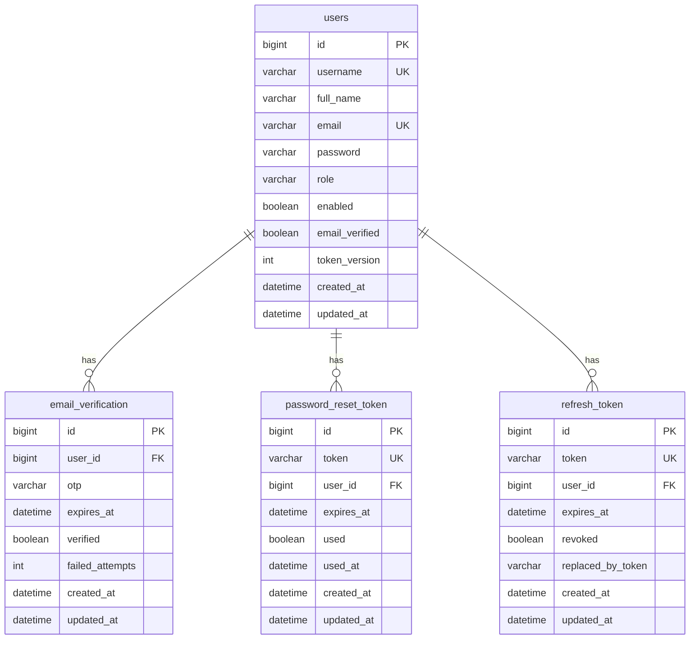

# Auth Database

Auth persists four JPA entities in MySQL. Table names and columns come from the entity mappings. Schema creation/update follows the application’s `spring.jpa.hibernate.ddl-auto` (typically `update` in local properties). There are no auth-specific Flyway/Liquibase migrations in this package.

## Relationship overview

All four entities extend `BaseEntity`: `createdAt` (`created_at`, not updatable) and `updatedAt` (`updated_at`), filled by Spring Data JPA auditing (`@EnableJpaAuditing` in common `JpaConfig`). The auth `Clock` bean is UTC; auditing timestamps use the JPA auditing clock (application default) unless configured otherwise.

## `users` (`User`)

Identity record for the whole application, not only auth HTTP.

| Field | Constraints / meaning |
| --- | --- |
| `id` | Identity PK. JWT `sub`. |
| `username` | Required, length 50. Unique. Stored lowercase. |
| `fullName` | Column `full_name`, required, length 100. |
| `email` | Required, length 255. Unique. Stored lowercase. Login key. |
| `password` | BCrypt hash. Never mapped to API responses. |
| `role` | Enum string, default `USER`. Also `ADMIN`. |
| `enabled` | Default `false`. Must be true to authenticate. |
| `emailVerified` | Column `email_verified`. Default `false`. |
| `tokenVersion` | Column `token_version`. Default `0`. Compared to JWT claim `tv`. |

**Lifecycle:** insert on register (`enabled`/`emailVerified` false, `tokenVersion` 0, `Role.USER`). Verify-email sets both flags true. Reset password and logout-all increment `tokenVersion`. There is no delete-user flow in auth.

**Uniqueness:** DB unique constraints on `username` and `email`. Register also checks `existsByUsername` / `existsByEmail` and treats `DataIntegrityViolationException` on save as a silent duplicate.

## `email_verification` (`EmailVerification`)

| Field | Meaning |
| --- | --- |
| `otp` | HMAC-SHA256 hex of the 6-digit code (length 64), not the plaintext. |
| `expiresAt` | Default now + `otpExpiryMinutes` (10). |
| `verified` | Set true when the code succeeds. |
| `failedAttempts` | Incremented on HMAC mismatch. Cap `maxOtpAttempts` (5). |

Index: `idx_email_verification_user` on `user_id`.

**Lifecycle:** issuing an OTP deletes all rows for that `user_id` then inserts one. Verify reads the latest row by user email with a pessimistic write lock. Hourly job deletes expired or already-verified rows.

## `password_reset_token` (`PasswordResetToken`)

| Field | Meaning |
| --- | --- |
| `token` | SHA-256 hex of the emailed UUID. Unique. |
| `expiresAt` | Default now + `resetExpiryMinutes` (15). |
| `used` / `usedAt` | Set when reset succeeds. |

Indexes: `idx_password_reset_token` on `token`; `idx_password_reset_user_used` on `user_id, used`.

**Lifecycle:** forgot-password deletes unused tokens for the user, then inserts one. Reset marks used. Hourly job deletes used or expired rows.

## `refresh_token` (`RefreshToken`)

| Field | Meaning |
| --- | --- |
| `token` | SHA-256 hex of the UUID given to the client. Unique. |
| `expiresAt` | Default now + `refreshExpiryDays` (30). |
| `revoked` | True after rotation, logout, logout-all, reset, reuse detection, or session cap. |
| `replacedByToken` | Hash of the successor token after rotation. Null for login-created tokens and logout-revoked tokens. |

Indexes: `idx_refresh_token_token`; `idx_refresh_token_user_revoked` on `user_id, revoked`.

**Lifecycle:**

- Login: maybe revoke oldest active tokens, insert new row (`revoked=false`, `replacedByToken=null`).
- Refresh: lock row by hash; mark revoked; insert successor; set `replacedByToken` to the new hash.
- Logout: set `revoked=true` on that row only.
- Logout-all / reset / reuse of a rotated token: revoke all `revoked=false` rows for the user.

Hourly job deletes revoked or expired rows.

## Important queries and transactions

Auth use cases on `AuthServiceImpl` are `@Transactional`. Mail is scheduled `afterCommit` so SMTP runs only if the transaction succeeds.

| Operation | Persistence behavior |
| --- | --- |
| Register | Save user; delete OTP by user id; save OTP. |
| Verify OTP | Lock latest verification by email; save verification + user. |
| Refresh | `findByTokenForUpdate`; save old + new refresh; maybe `saveAll` on family revoke. |
| Login success | `findAllByUserIdAndRevokedFalseOrderByCreatedAtAsc` for the cap; save new refresh. |
| Cleanup job | Bulk JPQL deletes; `@Transactional` on the job method. |

`UserRepository.findByUsername` exists but is unused by `AuthServiceImpl` (register uses `existsByUsername`).

## What is not stored

- Access JWTs (web and browser-extension) are not stored. Invalidation is `tokenVersion` + expiry.
- Redis does not persist users or tokens.
- Plain OTP, refresh UUID, and reset UUID are not stored.

## Other packages

`CurrentUserService` and the JWT filter load this `User` entity. Profile/resume tables in the user package are separate; they are not documented here.
