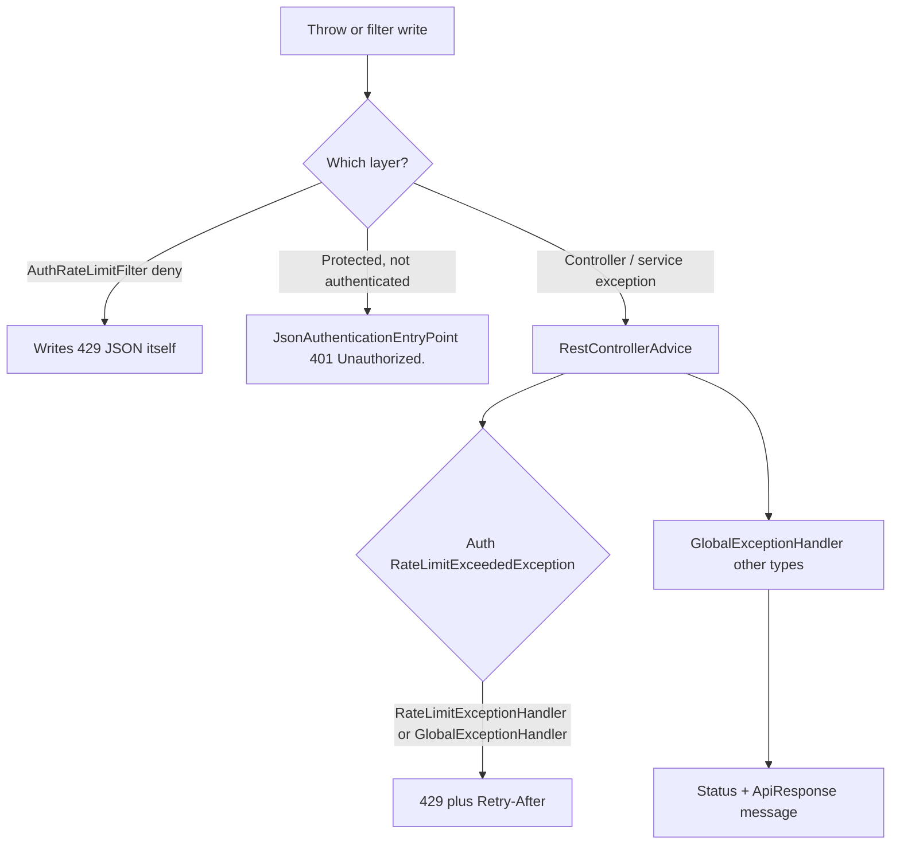

# Auth Error Handling

Auth does not define its own `@RestControllerAdvice` except `RateLimitExceptionHandler`. Most mappings live in common `GlobalExceptionHandler`. Filters can write `ApiResponse` JSON without going through that handler.

## Envelope

Every documented client error uses:

```json
{
  "success": false,
  "message": "Human-readable text",
  "data": null,
  "timestamp": "2026-01-01T12:00:00"
}
```

`429` responses also set header `Retry-After` (seconds).

## From exception to HTTP response



`RateLimitExceededException` is handled in **both** `auth.ratelimit.exception.RateLimitExceptionHandler` and `GlobalExceptionHandler`. Both produce the same `429` body and `Retry-After`. IP-limit denials in the filter never throw; they write the body directly.

## Auth exceptions and status codes

| Exception | Typical HTTP | Message as thrown by auth |
| --- | --- | --- |
| `InvalidCredentialsException` | 401 | `"Invalid email or password."` (login). `"User is not authenticated."` (`CurrentUserService`) |
| `InvalidOtpException` | 400 | `"OTP not found."` / `"OTP already used."` / `"Invalid OTP."` |
| `OtpExpiredException` | 400 | `"OTP has expired."` |
| `InvalidPasswordResetTokenException` | 400 | `"Invalid password reset token."` |
| `PasswordResetTokenUsedException` | 400 | `"Password reset token is invalid or already used."` |
| `PasswordResetTokenExpiredException` | 400 | `"Password reset token has expired."` |
| `InvalidRefreshTokenException` | 401 | `"Invalid refresh token."` |
| `RefreshTokenExpiredException` | 401 | `"Refresh token has expired."` |
| `RefreshTokenRevokedException` | 401 | `"Refresh token has been revoked."` |
| `RateLimitExceededException` | 429 | `"Too many requests. Please try again later."` |
| `EmailDeliveryException` | 503 | Handler message `"Unable to send email. Please try again later."` (not the internal cause) |

`EmailDeliveryException` is thrown by `EmailServiceImpl` on SMTP/template failure. Register/resend/forgot wrap send in `sendMailSafely`, which **catches** this exception and logs it. Those flows therefore usually still return success after a mail failure. The `503` mapping applies if the exception escapes (for example a future caller that does not use `sendMailSafely`).

## `ResourceAlreadyExistsException`

Mapped to `409` with `ex.getMessage()`. **AuthServiceImpl does not throw it.** Duplicates on register are silent 201. The type remains in the auth package and in the global handler.

## Validation and request-shape errors

| Condition | Handler | HTTP | Message |
| --- | --- | --- | --- |
| Bean Validation on `@Valid` body | `MethodArgumentNotValidException` | 400 | `field: defaultMessage` joined by commas |
| `ConstraintViolationException` | global | 400 | violation messages joined |
| Missing/malformed JSON | `HttpMessageNotReadableException` | 400 | `"Request body is missing or malformed JSON."` |
| Wrong HTTP method | `HttpRequestMethodNotSupportedException` | 405 | `"Method not allowed."` |
| Unsupported Content-Type | `HttpMediaTypeNotSupportedException` | 415 | `"Unsupported media type."` |
| `IllegalArgumentException` starting with `username: size must be` | global | 400 | that message |
| Other `IllegalArgumentException` | global | 500 | `"Something went wrong."` |
| Unhandled `Exception` | global | 500 | `"Something went wrong."` |
| `DataIntegrityViolationException` not caught in register | global | 409 | `"The request conflicts with existing data. Please retry."` |

Register catches `DataIntegrityViolationException` on user insert and returns normally (201).

`CredentialDigests.hmacSha256` throws `IllegalArgumentException` `"HMAC value and secret are required."` if value or secret is null. That prefix is in the global allow-list for client `400`. Auth OTP issuance does not pass nulls in the normal path.

## Security errors that are not exceptions

| Situation | Mechanism | HTTP / message |
| --- | --- | --- |
| No authentication on `/me`, `/logout`, `/logout-all` | `JsonAuthenticationEntryPoint` | 401 `"Unauthorized."` |
| Per-IP rate limit | `AuthRateLimitFilter` | 429 `"Too many requests. Please try again later."` |

Jwt parse failures are logged at debug and do not throw to the client; the entry point runs only if the route requires authentication.

## Infrastructure failures

| Failure | Behavior |
| --- | --- |
| Redis errors in rate limiting | Fallback to memory; user may still get 429 from memory limits |
| SMTP after commit | Logged; auth HTTP success still returned |
| DB failure in JWT filter user load | Propagates → typically 500 `"Something went wrong."` |
| Mail properties blank at startup | `EmailServiceImpl` throws `IllegalStateException` — process fails to start |
| JWT secret too short / placeholder | `JwtService` startup `IllegalStateException` |
| Missing `APP_JWT_SECRET` on prod | `AuthSecretsGuard` startup `IllegalStateException` |

## Login vs JWT 401

Clients must distinguish:

- **Login** `401` `"Invalid email or password."` — credentials or account state.
- **Protected route** `401` `"Unauthorized."` — missing or unaccepted access JWT.

Do not treat those messages as interchangeable.
