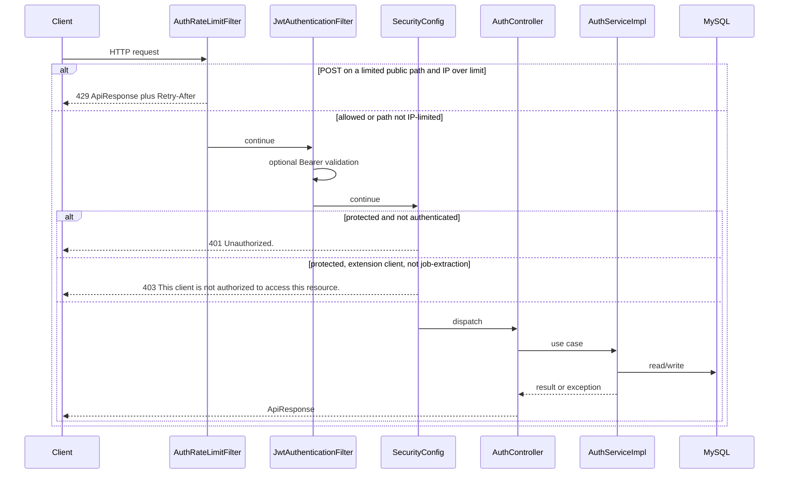
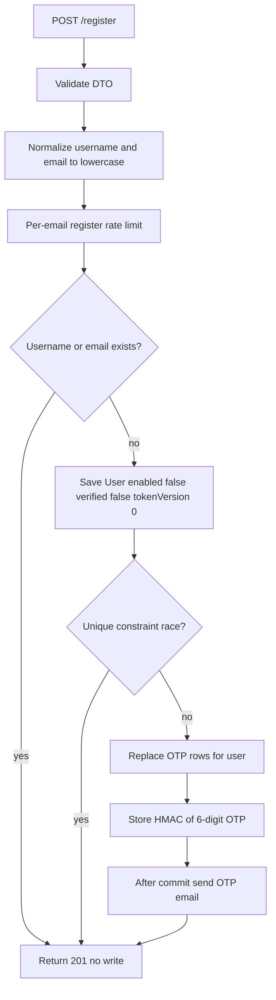
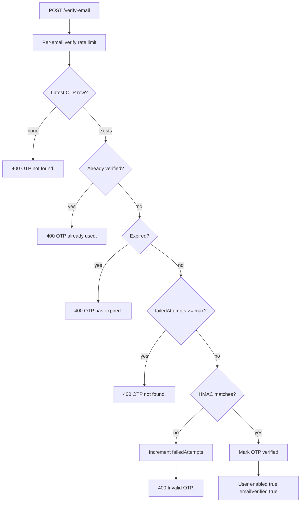
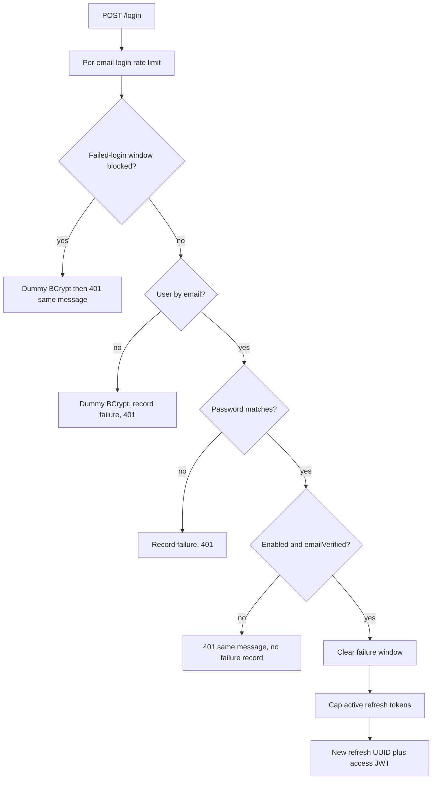
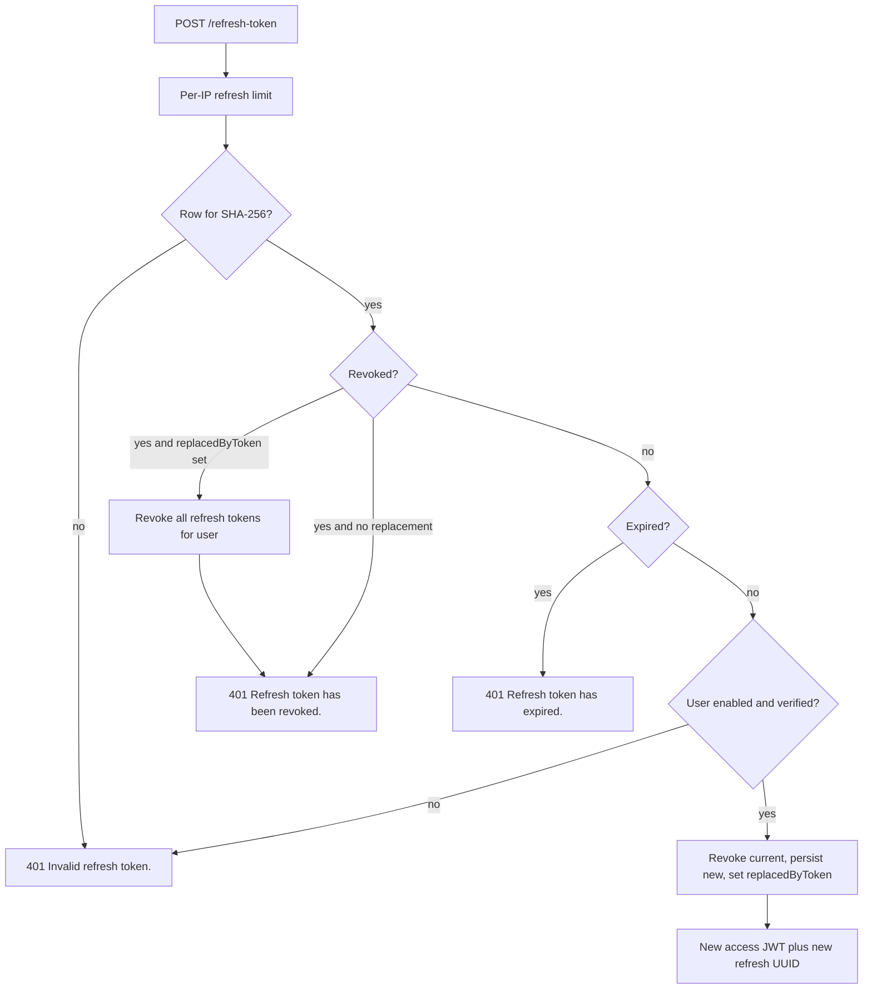
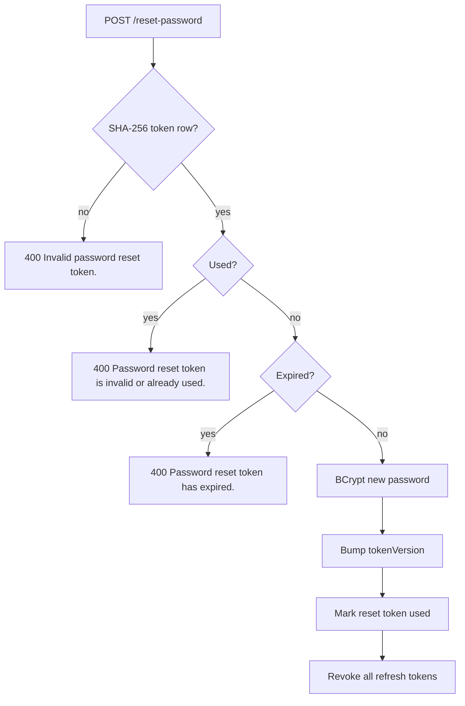
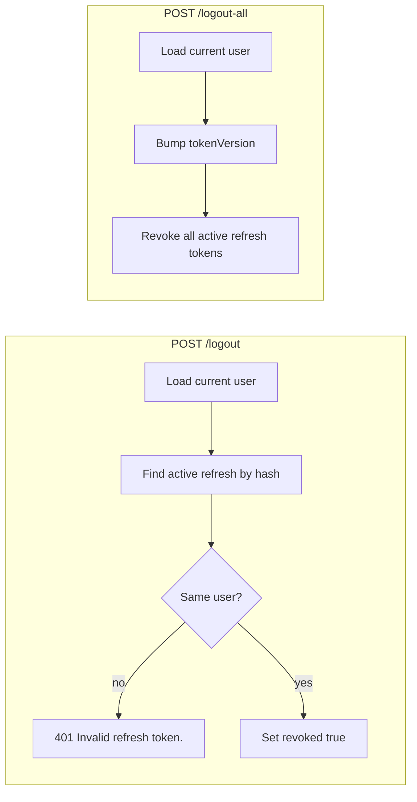
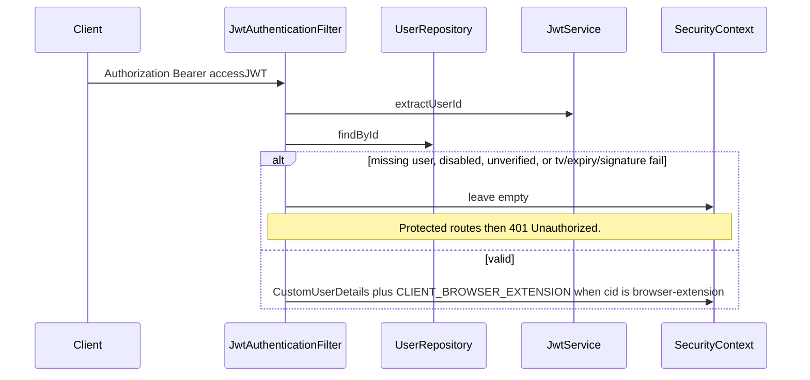
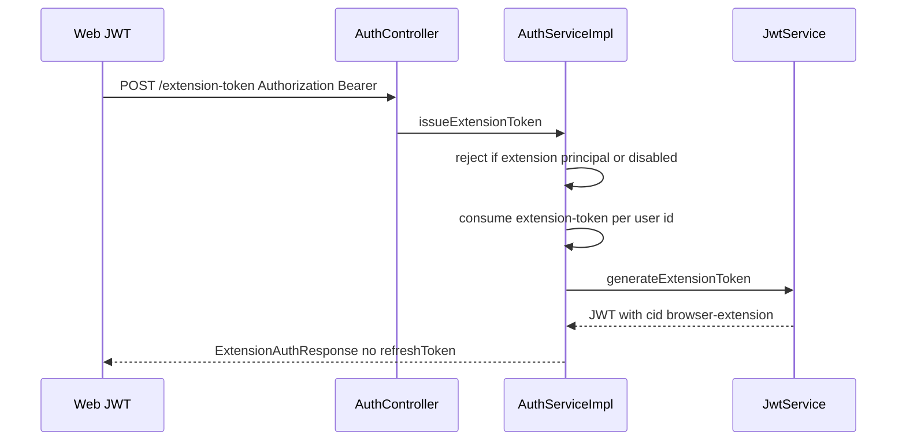

# Auth Flows

These workflows are the ones implemented in `AuthServiceImpl`, the security filters, and `AuthTokenCleanupJob`. Defaults below come from `AuthProperties` (overridable via `app.auth.*`).

## Request lifecycle

Every call to `/api/v1/auth/**` follows the same outer path. Public routes skip authentication; protected routes (`/me`, `/logout`, `/logout-all`, `/extension-token`) require a live access JWT. `/extension-token` additionally rejects browser-extension JWTs.

## Register

Goal: create an unverified account or silently no-op if the username or email already exists. The HTTP contract is always `201` `"User registered successfully."` so callers cannot probe occupancy from the status code.

Side effects on a real insert: BCrypt password, `Role.USER`, OTP row, SMTP after commit. Mail failures after commit are logged and swallowed (`sendMailSafely`); the account still exists. The user can call resend-otp.

## Verify email

Uses the latest `EmailVerification` for that email (`PESSIMISTIC_WRITE`).

Default: 10-minute OTP, 5 attempts. After the attempt cap, the message is `"OTP not found."` rather than `"Invalid OTP."`

## Resend OTP

Always HTTP `200` `"If the account requires verification, an OTP has been sent."`

Mail is sent only when the email exists, the account is not yet verified, and mail cooldown allows it (`tryAcquireMail` on the email, default 60 seconds). Verified accounts, unknown emails, and cooldown skips are silent.

## Login

The client-visible message is always `"Invalid email or password."` Dummy BCrypt on unknown/blocked emails keeps timing closer to a real password check.

Unverified or disabled accounts that present the correct password do **not** increment the failure counter.

## Refresh token

The path is `permitAll`. The refresh UUID is the credential. Lookup uses SHA-256 of the raw UUID with `PESSIMISTIC_WRITE`.

Replaying a token that was already rotated (`revoked` with `replacedByToken` set) is treated as theft: every active refresh token for that user is revoked. Replaying a token revoked by **logout** (no `replacedByToken`) returns revoked without wiping other sessions.

Refresh does not bump `tokenVersion`. Old access JWTs remain valid until they expire.

## Password reset

**Forgot** always returns `200` `"If the account exists, a password reset email has been sent."` If the user exists and mail cooldown allows (`identity` `reset:` + email), unused reset rows for that user are deleted, a new UUID is stored as SHA-256, and the raw UUID is emailed after commit.

**Reset** is public; the emailed UUID is the secret. It is **not** IP-rate-limited by `AuthRateLimitFilter`.

Default reset expiry: 15 minutes.

## Logout vs logout-all

Both require a valid **web** access JWT. A browser-extension JWT is `403` on these paths.

`/logout` does not bump `tokenVersion`. That device cannot refresh; its access JWT still works until expiry (~15 minutes). `/logout-all` makes existing access JWTs fail `tv` checks on the next request.

## Authenticated request to the rest of the API

Database failures during user load are **not** swallowed; they propagate (typically `500`).

## Browser-extension token

The web frontend, already holding a full-privilege access JWT (no `cid`), calls `POST /api/v1/auth/extension-token`. Auth mints a short-lived JWT with `cid=browser-extension` and **no** refresh token. The caller must not already be an extension client. `app.extension.enabled=false` returns `403` `"Browser extension access is disabled."`

That JWT may call `/api/v1/job-extraction/**` and `/api/v1/automated-job-extraction/**`. Other authenticated routes, including `/me` and `/extension-token`, return `403` `"This client is not authorized to access this resource."`

How a website process delivers the JWT to a Chrome extension is outside the auth package. Details: [BROWSER-EXTENSION.md](AUTH-SERVICE-SPECIFIC-DOCS/BROWSER-EXTENSION.md).

## Hourly cleanup

`AuthTokenCleanupJob.purgeExpiredRows` runs at minute 0 of every hour (`cron 0 0 * * * *`), using the UTC clock:

- delete refresh rows that are revoked or past `expiresAt`
- delete reset rows that are used or expired
- delete OTP rows that are verified or expired

This is housekeeping, not a security event. Revocation is already recorded on the row before purge.
