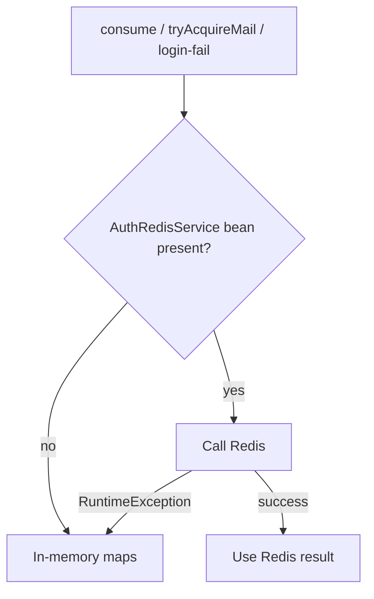

# Auth Redis Infrastructure

Redis is **optional** and used only for distributed **counters**: rate limits, mail cooldown, and failed-login backoff. It is not a session store, JWT blacklist, or cache of users.

Default: `app.auth.redis.enabled=false`. Boot’s Data Redis auto-configuration is excluded on `CopilotApplication` so a local process does not need `localhost:6379`. Auth creates its own Lettuce connection factory when the flag is true.

## Why Redis exists here

`AuthRateLimitServiceImpl` must work in tests and on a single JVM without Redis. When Redis is enabled and reachable, the same operations use Redis so multiple application instances share limits. When Redis throws, the service logs a warning and **falls back to in-memory maps** for that call.



In-memory state is per process and is lost on restart. Redis state expires via key TTL.

## What auth stores

Three namespaces (after sanitization they become part of the key):

| Logical use | Redis namespace passed to `AuthRedisService` | Operation |
| --- | --- | --- |
| Rate-limit buckets | `rl-` + bucket name, e.g. `rl-login-email`, `rl-login-ip` | `INCR` + TTL on first increment |
| Mail cooldown | `mail` | `SET key 1 NX` with TTL = cooldown |
| Login failures | `login-fail` | `INCR` with TTL = failure window; `GET`; `DEL` on success |

Identity is email (already lowercased by the service), numeric **user id** (`extension-token` mint), or client IP (or `unknown`).

## Key structure

`AuthRedisKeyBuilder`:

```text
{prefix}:{namespace}:{identity}
```

Default prefix `auth` (`app.auth.redis.key-prefix`). Namespace and identity are trimmed, lowercased, and **colons replaced with `_`** so IPv6 and emails cannot shift key segments.

Examples:

- `auth:rl-login-email:jane@example.com`
- `auth:rl-login-ip:10.0.0.1`
- `auth:mail:jane@example.com`
- `auth:mail:reset_jane@example.com` (forgot-password uses identity `reset:` + email, colon becomes `_`)
- `auth:login-fail:jane@example.com`
- `auth:rl-extension-token:1` (per-user mint)
- `auth:rl-extension-token-ip:10.0.0.1`
- `auth:rl-login_ip:2001_db8__1` if a namespace still contained a colon

Blank identity becomes `unknown`.

## Semantics vs in-memory

| Feature | Redis | In-memory |
| --- | --- | --- |
| Rate limit | Counter + TTL set when the value becomes `1` (fixed window from first hit) | Sliding window of timestamps |
| Mail cooldown | `SET NX` — second acquire fails until TTL | Last-send epoch map |
| Login failures | Integer count; TTL from first increment in the window | Sliding deque of failure times |
| Limit `<= 0` | Permit without writing | Same |

`ttlSeconds` uses Redis `TTL`. If TTL is missing or negative, deny uses the configured window length.

## Related request controls

Redis does not decide HTTP status by itself. `AuthRateLimitFilter` and `consumeOrThrow` turn a denied `RateLimitResult` into `429`. Mail cooldown does **not** throw; resend/forgot simply skip sending and still return 200. Login lockout still throws the generic `InvalidCredentialsException` (`401`), not 429.

See [RATE-LIMITING.md](AUTH-SERVICE-SPECIFIC-DOCS/RATE-LIMITING.md).

## Components

| Class | Responsibility |
| --- | --- |
| `AuthRedisProperties` | `enabled`, `host`, `port`, `password`, `database`, `timeout-ms`, `key-prefix` |
| `AuthRedisConfig.Enabled` | Beans only if `app.auth.redis.enabled=true` |
| `AuthRedisKeyBuilder` | Key format |
| `AuthRedisRepository` | `StringRedisTemplate` INCR/GET/SETNX/TTL/DEL |
| `AuthRedisServiceImpl` | Namespace + identity → key, then repository |

`AuthRateLimitConfig` injects `AuthRedisService` with `ObjectProvider.getIfAvailable()`, so the limiter constructs with `null` Redis when disabled.

## Configuration

Prefix `app.auth.redis`:

| Property | Default | Purpose |
| --- | --- | --- |
| `enabled` | `false` | Create Redis beans |
| `host` | `localhost` | Standalone Redis |
| `port` | `6379` | |
| `password` | unset | Optional AUTH |
| `database` | `0` | Logical DB index |
| `timeout-ms` | `2000` | Lettuce command timeout |
| `key-prefix` | `auth` | Key prefix |

Connection: Redis standalone + Lettuce, `validateConnection=false`. Not cluster/sentinel in this config.

## Failure behavior

- Redis down after enable: each limiter call catches `RuntimeException`, warns, uses memory for **that** call. Limits then diverge across instances and from Redis until Redis recovers.
- Redis disabled: no connection attempt.
- `increment` returning null is treated as `0`.
- Non-numeric GET on a count key is treated as `0`.

Auth does not retry, circuit-break, or fail the user request solely because Redis is down (except the in-memory limit that then applies).
