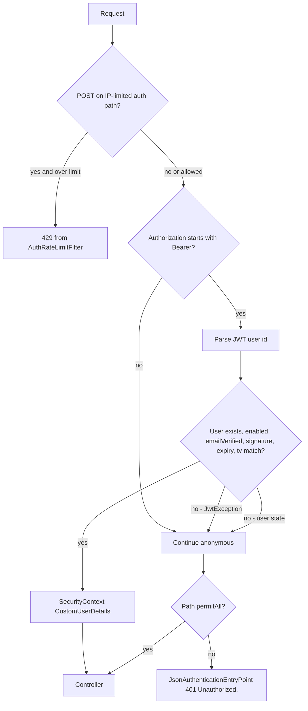

# Auth Security

This document describes only mechanisms present in the auth package and the security filter chain it registers. Claims that are not implemented (MFA, refresh cookies, CAPTCHA, IP allowlists, role checks on `/api/v1/auth/**`) are omitted.

## Authentication model

Two credentials:

1. **Access JWT** — short-lived HS256 token in `Authorization: Bearer`. Default lifetime `app.auth.access-expiry-ms` = 900_000 ms (15 minutes). `JwtService` does **not** read `app.jwt.expiration` even if that property appears in a local file.
2. **Refresh UUID** — opaque token returned at login/refresh. Stored as SHA-256. Sent in JSON, not as a Bearer JWT. Default lifetime 30 days.

Login is a custom BCrypt comparison in `AuthServiceImpl`, not Spring form login and not `AuthenticationManager`.

## How a request is authenticated

Invalid JWTs do not produce a dedicated “bad token” body from the filter; the request continues unauthenticated. Protected routes then return `"Unauthorized."`

The filter requires **both** `enabled` and `emailVerified`. A token issued before those flags could theoretically exist only if generated another way; login and refresh already refuse unverified/disabled users.

`tv` (token version) in the JWT must equal `User.tokenVersion`. Missing `tv` is treated as `0`. Password reset and logout-all increment the version so old access JWTs fail immediately.

## Authorization

`SecurityConfig`:

- **Permit all:** `/api/v1/auth/register`, `/api/v1/auth/login`, `/api/v1/auth/verify-email`, `/api/v1/auth/resend-otp`, `/api/v1/auth/forgot-password`, `/api/v1/auth/reset-password`, `/api/v1/auth/refresh-token`, `/error`.
- **Swagger paths:** permit all unless active profile is `prod` or `production`.
- **Job extraction:** `/api/v1/job-extraction/**` and `/api/v1/automated-job-extraction/**` — any authenticated user (web frontend **or** browser-extension JWT).
- **Everything else:** authenticated **and not** `CLIENT_BROWSER_EXTENSION`. Browser-extension JWTs receive `403` `"This client is not authorized to access this resource."`

Auth controllers do not use `@PreAuthorize` or `hasRole`. `Role.USER` and `Role.ADMIN` are stored, copied into the JWT `role` claim, and exposed as `ROLE_USER` / `ROLE_ADMIN` on `CustomUserDetails`. The extension restriction is a **client** authority (`CLIENT_BROWSER_EXTENSION`) copied from the signed JWT `cid` claim, not from request headers.

`/logout` additionally checks that the refresh token’s user id equals the JWT user.

`POST /api/v1/auth/extension-token` mints the restricted JWT. It requires a web-frontend access token. Extension tokens cannot mint another extension token.

## Session and CSRF

`SessionCreationPolicy.STATELESS`. CSRF is disabled. Clients must not expect cookies or CSRF headers. CORS `allowCredentials` is true for the configured origin list, but auth tokens are designed to travel in `Authorization` and JSON bodies, not cookies.

## CORS / request origin

`cors.allowed-origins` (Java defaults: localhost `5173`, `5174`, `3000` on `localhost` and `127.0.0.1`). Methods GET/POST/PUT/PATCH/DELETE/OPTIONS. Headers `*`. Exposed: `Authorization`, `Content-Type`, `Retry-After`. `allowCredentials=true`.

When `app.extension.id` is set, `chrome-extension://<id>` is added to that list. CORS is **not** the authorization boundary. A wildcard `*` is dropped so credentialed CORS cannot pair with a wildcard.

## Secrets and credential protection

| Secret / credential | Handling |
| --- | --- |
| Account password | BCrypt (`BCryptPasswordEncoder`). Never returned in `UserResponse`. |
| Access JWT signing key | `app.jwt.secret`, min 32 characters. Placeholder strings containing `enter-your-jwt` / `your-jwt-configuration` or `changeme` refuse to boot. |
| OTP | HMAC-SHA256 using the **same** `app.jwt.secret`. Compared with `MessageDigest.isEqual`. |
| Refresh UUID / reset UUID | SHA-256 hex in the database. Raw values exist only in API/email responses. |
| Production JWT secret | `AuthSecretsGuard` (`prod`/`production`): `APP_JWT_SECRET` must be set in the environment; do not boot from a committed secret. |

Rotating `app.jwt.secret` invalidates all access JWTs **and** makes outstanding OTPs unverifiable (same key). Refresh and reset tokens are SHA-256 without that secret, so they survive a JWT secret rotation.

## Token and session security

- Refresh **rotation** on every successful `/refresh-token`.
- **Reuse detection:** revoked token with `replacedByToken` set → revoke all refresh tokens for that user.
- Logout-revoked tokens have no `replacedByToken`; reuse does not wipe other sessions.
- Max 5 active refresh tokens per user on new login (`maxActiveRefreshTokens`); oldest revoked.
- Refresh lookup uses pessimistic write locking to serialize concurrent rotation.
- Unsigned `alg=none` JWTs are rejected (`JwtServiceTest`).

Details: [TOKEN-LIFECYCLE.md](AUTH-SERVICE-SPECIFIC-DOCS/TOKEN-LIFECYCLE.md).

## Abuse prevention

See [RATE-LIMITING.md](AUTH-SERVICE-SPECIFIC-DOCS/RATE-LIMITING.md).

- Per-IP fixed/sliding windows on selected POSTs.
- Per-email limits on register/login/verify/resend/forgot.
- Per-user and per-IP limits on `POST /api/v1/auth/extension-token`.
- Mail cooldown (default 60s) for OTP resend and password-reset mail.
- Failed-login window (default 10 failures / 15 minutes) still returns the generic login 401.
- `X-Forwarded-For`: first hop is used as client IP. Only accurate if a trusted proxy overwrites that header.

`/reset-password` is **not** in the IP filter. Brute force of reset UUIDs is limited mainly by UUID unguessability and token expiry.

## Anti-enumeration

- Register: same 201 whether the account is new or already present.
- Login: same 401 message for unknown, wrong password, unverified, disabled, lockout.
- Dummy BCrypt when the user is missing or lockout is active.
- Resend OTP / forgot password: generic 200.
- OTP lockout message `"OTP not found."` after max attempts.

## Unauthorized / forbidden behavior

| Situation | Result |
| --- | --- |
| Protected route, no/invalid JWT | `401` `"Unauthorized."` |
| Login failure | `401` `"Invalid email or password."` |
| Bad refresh | `401` with refresh-specific messages |
| `CurrentUserService` without `CustomUserDetails` | `401` `"User is not authenticated."` |
| Browser-extension JWT on a non-job-extraction route | `403` `"This client is not authorized to access this resource."` |
| Role mismatch | Not enforced on auth endpoints |

## Sensitive information in responses and logs

- OTP and reset tokens are not in JSON success bodies (reset token is only in email).
- Login/register debug logs avoid printing emails in some paths; failed login uses `log.debug`. Email delivery failures log without the recipient in `EmailServiceImpl` (`"Failed to send verification email"`).
- Unhandled exceptions map to `"Something went wrong."` (`500`), not stack traces.
- OpenAPI is an attack map: disabled in `application-prod.properties` / `application-production.properties`, and Swagger matchers are not `permitAll` on those profiles.

## Production considerations supported by code

1. Set `APP_JWT_SECRET` (and do not commit a real secret).
2. Run with `prod` or `production` so Swagger is off and `AuthSecretsGuard` runs.
3. Enable `app.auth.redis.enabled=true` when more than one app instance must share rate limits; otherwise counters are per JVM.
4. Configure `cors.allowed-origins` to the real SPA origins; never `*`. Set `app.extension.id` to the shipped Chrome extension ID (CORS only).
5. Put a trusted proxy in front if you rely on `X-Forwarded-For`.
6. Keep SMTP credentials out of source control (`application.properties.example` uses placeholders).

## What the JWT filter does not do

It does not write 401 itself. It does not refresh tokens. It does not check `Role`. Database outages while loading the user are propagated, not turned into anonymous requests.
