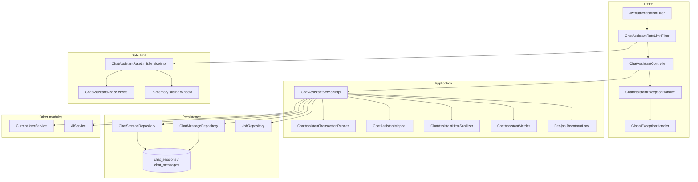
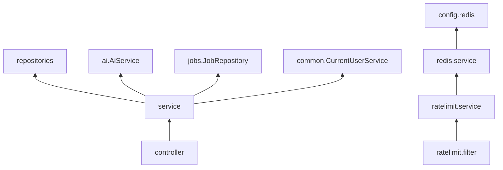

# Architecture

The chat assistant is a vertical slice inside the Copilot Spring Boot application: one REST controller, one application service, two JPA entities, optional Redis for rate-limit counters, and a servlet filter that runs **after** Spring Security.

It does not own prompt templates or the LLM client. Those stay in the AI module. The boundary is a single in-process call: `AiService.continueJobChat`.

## Layers

Request direction is always **inward**: HTTP → service → repositories / AI. Repositories and the AI service never call back into the controller.

## HTTP layer

`ChatAssistantController` is mapped to `/api/v1/chat-assistant`. It:

- Requires `@Valid` on `SendChatMessageRequest`
- Caps paging (`page >= 0`, `1 <= size <= 50`) before calling the service
- Forces history sort to `turnNumber ASC` (clients cannot change sort)
- Wraps every success in the shared `ApiResponse` envelope
- Returns **201** for send (a turn was created) and **200** for read/delete

`ChatAssistantOpenApiConfig` registers a Springdoc group `chat-assistant` on `/api/v1/chat-assistant/**`. It is active only when the profile is **not** `prod` or `production`.

Exception handling is split:

- `ChatAssistantExceptionHandler` (`@Order(HIGHEST_PRECEDENCE)`, assigned to this controller) maps type-mismatch job ids, constraint violations, and `ChatConflictException`
- `GlobalExceptionHandler` maps validation, JWT/auth, job-not-found, AI failures, data-integrity conflicts, and the unused-but-present `RateLimitExceededException` type

Rate-limit **429** responses are written by the filter itself, not by an exception handler. See [ERROR-HANDLING.md](./ERROR-HANDLING.md).

## Application layer

`ChatAssistantService` is the public API. `ChatAssistantServiceImpl` is the only implementation.

| Collaborator | Why it exists |
| --- | --- |
| `CurrentUserService` | Resolve the authenticated `User` from the security context |
| `JobRepository` | Ownership check: `findByIdAndUserId` |
| `ChatSessionRepository` / `ChatMessageRepository` | Session lookup, pessimistic lock, recent turns, paging, bulk delete |
| `AiService` | Model call; chat assistant only passes `JobChatAiRequest` (job id, prior turns, new prompt) |
| `ChatAssistantTransactionRunner` | Short transactions around prepare/persist so the AI provider wait is **not** inside a DB transaction |
| `ChatAssistantMapper` | Map entities and Spring Data pages to response DTOs |
| `ChatAssistantHtmlSanitizer` | Strip `` from model content before persist |
| `ChatAssistantMetrics` | Increment log-backed counters (`sendSuccess`, `jobNotFound`, `providerFailure`, `blankResponse`, `conflict`) |

A `ConcurrentHashMap<Long, ReentrantLock>` serializes sends **for the same job id inside one JVM**. A second overlapping send gets `ChatConflictException` without calling the model. Cross-instance safety is the database unique constraint on `(chat_session_id, turn_number)` plus `SELECT ... FOR UPDATE` on the session row. Details: [SEND-AND-CONCURRENCY.md](./CHATASSISTANT-SERVICE-SPECIFIC-DOCS/SEND-AND-CONCURRENCY.md).

## Persistence layer

Two tables, both extending `BaseEntity` (`created_at`, `updated_at`):

- **`chat_sessions`** — one row per job (`job_id` unique). Stores denormalized `user_id` and a snapshot `chat_title`
- **`chat_messages`** — one row per turn; unique `(chat_session_id, turn_number)`

Growing a chat is always an `INSERT` of a message plus bumping `session.updatedAt`. Prior turns are never rewritten.

Repositories are Spring Data JPA interfaces. Notable queries:

- `ChatSessionRepository.findByIdForUpdate` — pessimistic write lock
- `ChatMessageRepository.findRecentByChatSessionId` — last N turns (N = 16) for the model
- `ChatMessageRepository.deleteByChatSessionId` — bulk delete, no entity load

See [DATABASE.md](./DATABASE.md) and [JOB-SCOPED-SESSIONS.md](./CHATASSISTANT-SERVICE-SPECIFIC-DOCS/JOB-SCOPED-SESSIONS.md).

## Rate limiting and Redis

`ChatAssistantRateLimitConfig` registers `ChatAssistantRateLimitFilter` on `/api/v1/chat-assistant` and `/api/v1/chat-assistant/*` at order **-80** (Spring Security’s chain is **-100**). JWT has already populated the principal, so user-id buckets work. The filter is **not** added to the security filter chain, so it is not counted twice.

Only `POST /api/v1/chat-assistant/jobs/{jobId}/messages` is limited. GET history, GET list, and DELETE pass through.

`ChatAssistantRateLimitServiceImpl` prefers Redis when `ChatAssistantRedisService` exists; on Redis errors it falls back to an in-memory sliding window. Redis beans are created only when `app.chatassistant.redis.enabled=true`.

See [REDIS-INFRASTRUCTURE.md](./REDIS-INFRASTRUCTURE.md) and [RATE-LIMITING.md](./CHATASSISTANT-SERVICE-SPECIFIC-DOCS/RATE-LIMITING.md).

## DTO boundary

| DTO | Direction | Notes |
| --- | --- | --- |
| `SendChatMessageRequest` | In | `prompt` only; extra JSON fields are ignored |
| `SendChatMessageResponse` | Out | Session id, title, **latest turn only** |
| `ChatSessionResponse` | Out | Paged history; `chatSessionId`/`chatTitle` null when unused |
| `ChatSessionListResponse` / `ChatSessionSummaryResponse` | Out | Sidebar; includes job title/company from an entity graph |
| `ChatMessageResponse` | Out | One turn |
| `JobChatAiRequest` / `ChatTurnDto` | Internal to AI | Not HTTP; built in the service |
| `ApiResponse<T>` | Envelope | Shared `success`, `message`, `data`, `timestamp` |

Session id is **output-only**. Clients always address a chat by job id.

## Configuration

- `ChatAssistantRateLimitProperties` — `app.chatassistant.messages-per-minute` (default 8)
- `ChatAssistantRedisProperties` — `app.chatassistant.redis.*` (enabled default **false**)

These properties currently rely on Java defaults unless set in `application.properties`. See [CONFIGURATION.md](./CONFIGURATION.md).

## Dependency direction

Chat assistant **depends on** auth/common, jobs, and AI. Those modules do not depend on chat assistant (except `GlobalExceptionHandler`, which references this module’s conflict and rate-limit exception types).
