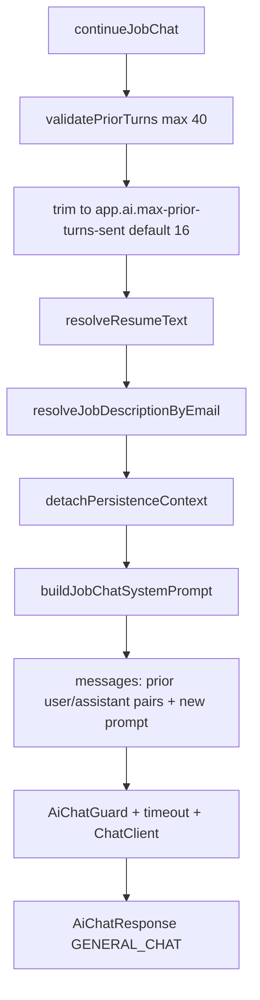

# AI integration

Chat assistant never builds a system prompt and never holds a `ChatClient`. It passes plain data into `AiService.continueJobChat` and persists `AiChatResponse.getContent()` (after script stripping).

This is **not** `POST /api/v1/ai/chat`. That endpoint is general copilot (modes, optional streaming). Job chat is a separate in-process method used only by this module.

## Contract

```text
AiChatResponse continueJobChat(JobChatAiRequest request, String userEmail)
```

`userEmail` is `currentUser.getEmail()`. HTTP AI routes use `userId`; job chat still uses email (documented on `AiService`).

`JobChatAiRequest` fields chat assistant sets:

| Field | Value |
| --- | --- |
| `jobId` | Path variable |
| `priorTurns` | Up to 16 `ChatTurnDto` (oldest first) |
| `newPrompt` | HTTP `prompt` |
| `resumeId` | always `null` |
| `customResumeText` | always `null` |

Clients cannot attach a different resume on this API. Extra JSON on the send body is ignored.

## What the AI service does with that request



Resume resolution with null id: load the user’s **high-priority active** resume. If there is no profile or no resume, the AI service catches `ResumeNotFoundException` / `UserProfileNotFoundException` and uses **empty** resume context (`[No resume context provided]` in the system prompt). Job chat still runs.

If a default resume **exists** but parsing is in progress → `AiResumePendingException` → **409**.  
If parsing **failed** or context text is empty → `ResumeParsingException` → **422**.

Job text: `JobEntity.description` if non-blank, else `originalDescription`. Lookup is `userRepository.findByEmail` then `jobRepository.findByIdAndUserId`. Missing user or job → `"Job not found."` **404**.

The system prompt embeds resume + job **once**. Later turns are normal chat messages so the conversation can grow without re-paying for the full job description every time. The prompt also treats those blocks as untrusted data (prompt-injection hardening in the AI module).

Model options use `AiMode.GENERAL_CHAT` (default max completion tokens, configured model). Guard: 5 concurrent provider calls, 3 consecutive failures open the circuit for 30s → **503**.

## Errors that propagate to this API

| AI / resume outcome | HTTP on send |
| --- | --- |
| Provider / timeout / generic failure | 502 `AiServiceException` |
| Blank content after mapping (chat assistant also rejects blank after strip) | 502 |
| Circuit open / bulkhead | 503 `AiUnavailableException` |
| Resume pending | 409 |
| Resume parse failed | 422 |
| Job not found in AI lookup | 404 |
| Prior turns > 40 (should not happen from this client) | 400 |

Chat assistant does not catch these types except `RuntimeException` around `continueJobChat` (for metrics + empty-session discard) — it rethrows the original exception.

## Time and streaming

Job chat is **synchronous**. This controller does not expose SSE. The send can last until `app.ai.timeout-seconds` (default 60). OpenAPI copy on the controller mentions a ~60s Gemini wait; the actual provider is whatever the AI module is configured to use.

## Separation of concerns

| Chat assistant | AI service |
| --- | --- |
| Who may talk (JWT + job ownership) | How to talk (prompt, model, tokens) |
| How much history to **store** (unlimited turns) | How much history to **send** (trim/validate) |
| Persist after a non-blank reply | Call provider under timeout/circuit |
| Strip `<script>` | Map provider errors to friendly messages |

Do not add prompt strings to the chat-assistant package; change `PromptTemplateService.buildJobChatSystemPrompt` in the AI module instead.
