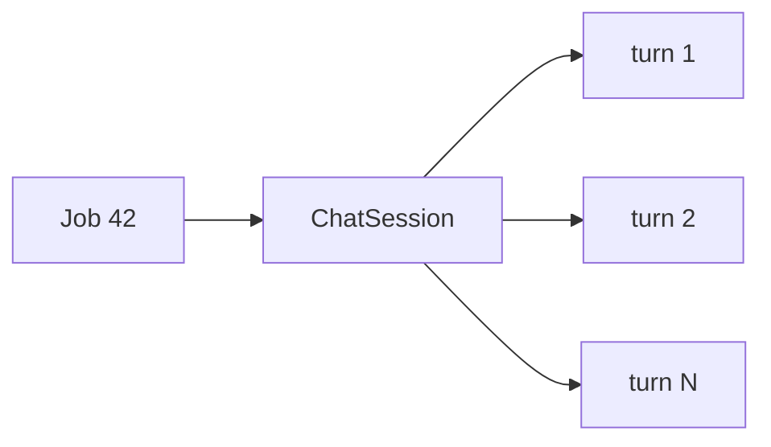

# Job-scoped sessions

The product rule is: **one chat per saved job**, keyed by job id. Session id is an implementation detail returned to the client, never required on the URL.

This document covers session creation, titles, history, the sidebar list, and delete. Send internals (locks, transactions, sanitization) are in [SEND-AND-CONCURRENCY.md](./SEND-AND-CONCURRENCY.md).

## Why job id is the chat key

A candidate talks about a posting they already saved. The jobs API already identified that row. Requiring the client to create a session first would add a round trip and a second identifier to keep in sync.

The unique constraint on `chat_sessions.job_id` makes “start chat” and “continue chat” the same `POST .../jobs/{jobId}/messages` call.

## Creation

Sessions are **lazy**. GET history on a job you own but have never chatted about returns 200 with `chatSessionId: null` and `messages: []`. Nothing is inserted until prepare-send runs.

On first send:

1. Ownership check
2. `findByJobIdAndUserId` empty → `createSession`
3. Title snapshot from the job at that moment
4. Unique collision → re-read the winner’s row (another request created it)

If the AI call then fails and no turns exist, that empty session is deleted so the unused-chat GET shape is preserved.

## Title snapshot

`chatTitle` is **not** a live view of the job.

Format: `"{company} - {title}"` when both are non-blank after trim; otherwise whichever side is non-blank; both blank → `""`. Length is clamped to 255 with a trailing `"..."`.

Renaming the job later does **not** update existing chats. Sidebar `jobTitle` / `company` **do** come from the current `JobEntity` (entity graph on list), so the list can show a new job title next to an old `chatTitle`. That split is intentional.

Titles are not unique. Two Amazon roles can both be `"Amazon - SDE 1"`.

## One session, many turns

Turns are 1-based and strictly increasing. History is ordered by `turnNumber`, not by clock, so ordering does not depend on timestamp precision.

The model only sees the **last 16 complete turns**. GET history can page older ones (`size` max 50). Send does not load the full table (`findRecentByChatSessionId` only).

## Read APIs

| API | Empty state |
| --- | --- |
| GET `/jobs/{jobId}` | 200, null session id, empty `messages` |
| GET `/` (list) | 200, empty `chats` |
| DELETE `/jobs/{jobId}` | 200 even if no session |

404 on job-scoped routes always means the **job** is missing or not yours — never “chat missing”.

List is newest `updatedAt` first. `updatedAt` is stored on the session and set when a turn is saved, so a long-idle chat sinks in the sidebar.

## Delete and start over

DELETE removes all messages (bulk JPQL) then the session. The job row stays. The next POST creates a **new** session id and a **new** title snapshot.

Deleting the **job** (jobs service) cascades to the session at the database (`@OnDelete` on `job_id`).

## Ownership denormalization

`chat_sessions.user_id` copies `job.user` at insert. Listing “my chats” filters on that column. The code assumes a job is never reassigned to another user; there is no sync job.

## Mapper shapes

- Unused job: `ChatAssistantMapper.toSessionResponse(jobId, null, emptyPage)` → null ids, empty messages, page metadata from the empty `Page`
- Summary with a null job association: job fields null, `chatTitle` still set (defensive; production rows always have a job)
