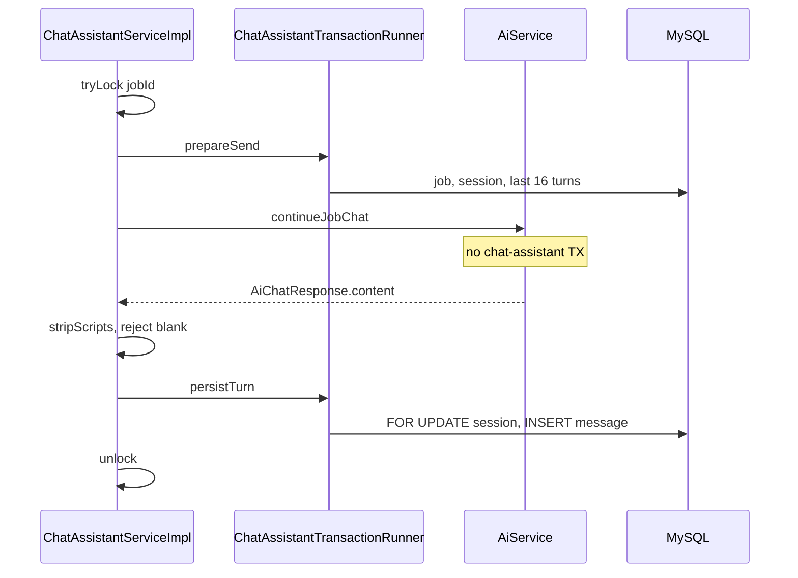
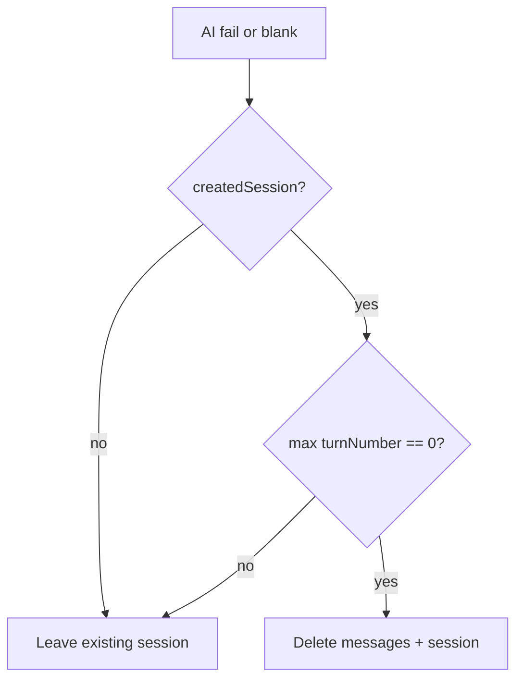

# Send path and concurrency

`sendMessage` is the only chat-assistant use case that calls the model, writes turns, and can run for tens of seconds. This document describes that lifecycle as implemented in `ChatAssistantServiceImpl`.

## Why the AI provider call is outside a transaction

Holding a JPA transaction open for the model timeout (default 60s) would pin connections and row locks. `ChatAssistantTransactionRunner` wraps **prepare** and **persist** in separate `TransactionTemplate` calls. Between them the persistence context is not held by chat assistant (`AiService` also detaches before the provider call).



## In-JVM lock

```java
sendLocks.computeIfAbsent(jobId, id -> new ReentrantLock())
if (!lock.tryLock()) throw new ChatConflictException(...)
```

`tryLock` is non-blocking. A second send for the **same job id on the same JVM** while the first is still in `continueJobChat` fails immediately with 409. Different jobs do not share a lock.

The map is never pruned (locks stay for job ids seen on that instance). That is an implementation detail, not a public API.

This lock is **not** cluster-wide. Multi-instance overlap is handled at persist time.

## Prepare

Inside the first transaction:

1. `getJobForCurrentUser` — 404 if needed
2. Find or create `ChatSession`
3. `findRecentByChatSessionId(sessionId, page=0, size=16)` ordered by `turnNumber DESC`
4. Reverse to oldest-first
5. Drop turns with blank prompt or reply
6. Build `JobChatAiRequest` with `jobId`, `priorTurns`, `newPrompt`; `resumeId` and `customResumeText` left null

The user prompt in the HTTP body is **not** inserted yet. If the AI call fails, there is no orphan user-only row.

## After the model returns

1. `ChatAssistantHtmlSanitizer.stripScripts` on `content` (null → `""`)
2. If blank → `recordBlankResponse`, discard empty new session, throw `AiServiceException` (502)
3. If `continueJobChat` threw → `recordProviderFailure`, discard empty new session, rethrow (409/422/502/503 depending on type)

Script stripping is only applied to **model** text, not to the user prompt.

## Persist

Inside the second transaction:

1. Ownership check again (job may have been deleted during the wait)
2. `findByIdForUpdate(sessionId)`, else find by job+user, else `createSession` (session vanished mid-call)
3. `nextTurn = findMaxTurnNumber + 1`
4. `INSERT` message; bump `session.updatedAt`; save session
5. Return `SendChatMessageResponse` with `latestTurn` only

On `DataIntegrityViolationException` (duplicate turn number): metric `conflict`, lock the session again, retry `insertTurn` once, then 409.

## Empty session discard



`createdSession` is true only when **this** request inserted the session row. A failure on turn 5 does not delete the chat.

## What the client sees

Always **201** when persist succeeds, including later turns. Body is not the transcript. The UI is expected to append `latestTurn` locally or refetch history.

## Metrics on the happy path

`recordSendSuccess(aiLatency)` logs `aiLatencyMs` from immediately before `continueJobChat` to immediately after it returns (not including persist).
