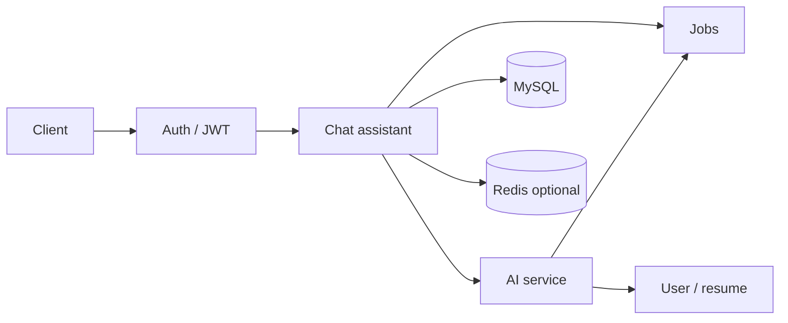

# Chat Assistant Service

The chat assistant is the job-scoped conversation module. It lets an authenticated user talk with the AI about **one saved job at a time**, and it persists that conversation so the user can resume it later.

It is **not** the general copilot. General copilot lives at `POST /api/v1/ai/chat`. This service lives at `/api/v1/chat-assistant` and keys every conversation by **job id**. Session ids are created by the server and returned in responses; clients do not send them as input.

A new developer should start here, then follow the linked documents for architecture, APIs, and the job-chat specifics.

## Purpose

Help a candidate think through a specific saved job across multiple turns, using:

- that job’s description (from the jobs service)
- the candidate’s default (high-priority) resume, when one exists
- the last 16 persisted turns of this chat (older turns stay in the database and are available via history paging)

The chat assistant owns **history persistence, ownership checks, concurrency, rate limiting, and response sanitization**. Prompt construction and the model call stay inside the AI service.

## Responsibilities

- Expose REST APIs to send a turn, page chat history, list the current user’s chats, and delete a job’s chat
- Enforce that the caller owns the job (missing and foreign job ids both look like “not found”)
- Create at most one chat session per job, lazily on the first successful send
- Persist each turn as an append-only row (one user prompt + one AI reply)
- Call `AiService.continueJobChat` **outside** a database transaction
- Rate-limit paid sends (8 per minute per IP and per user by default)
- Strip `<script>` blocks from model output before saving
- Discard an empty session if the first send fails before a turn is stored

## What this service does not do

- Issue JWTs or manage login (auth service)
- Create, update, or delete jobs (jobs service)
- Parse resumes or choose which PDF is high-priority (user/resume services, invoked indirectly by the AI service)
- Build the system prompt or talk to the LLM provider (AI service)
- Stream tokens; job chat is a single synchronous reply
- Store chat history in Redis (Redis is only used for optional distributed rate-limit counters)

## Major capabilities

| Capability | Behavior |
| --- | --- |
| Send a message | Creates the session on first use, calls the AI service, stores exactly one new turn, returns **201** with that turn only |
| Get history | Pages turns oldest-first (`turnNumber` ascending). If no chat exists yet, returns **200** with empty messages — not 404 |
| List my chats | Paged sidebar summaries, newest-updated first |
| Delete a chat | Removes all turns and the session. Does **not** delete the job. Idempotent if no chat exists |

## Service boundary

The chat assistant talks to other modules only at these points:

- **Auth / common security** — JWT filter plus `CurrentUserService` to load the logged-in user
- **Jobs** — `JobRepository.findByIdAndUserId` to confirm the job exists and is owned by the caller
- **AI** — in-process `AiService.continueJobChat(JobChatAiRequest, userEmail)`
- **User / resume** — not called directly; the AI service loads the default resume (or empty context if none)

## Main components

| Area | Role |
| --- | --- |
| `ChatAssistantController` | HTTP adapter under `/api/v1/chat-assistant` |
| `ChatAssistantServiceImpl` | Session/turn lifecycle, ownership, concurrency lock, AI call, sanitization |
| `ChatSession` / `ChatMessage` | MySQL entities: one session per job, append-only turns |
| `ChatAssistantRateLimitFilter` | Per-IP and per-user limit on `POST .../messages` only |
| `ChatAssistantRedisService` | Optional Redis counters for those limits |
| `ChatAssistantExceptionHandler` | Controller-scoped 400/409 mappings; other errors go to `GlobalExceptionHandler` |
| `ChatAssistantMapper` | Entity → API DTOs |
| `ChatAssistantMetrics` | Log-line counters for sends, 404s, provider failures, blank replies, conflicts |

## Important request and business flows

1. **Send** — authenticate → rate-limit → validate prompt → lock the job → load or create session → send last 16 turns to the AI service → sanitize → insert the new turn → **201**.
2. **History / list / delete** — authenticate → ownership check (except list, which is “my rows only”) → no model call.
3. **Failure on first send** — if the AI call fails or returns blank content, an empty session created for that attempt is deleted so history still looks unused.

See [FLOW.md](./FLOW.md) and [SEND-AND-CONCURRENCY.md](./CHATASSISTANT-SERVICE-SPECIFIC-DOCS/SEND-AND-CONCURRENCY.md).

## Security responsibilities

- Every endpoint requires a valid Bearer JWT (`authenticated()`, no extra role check)
- Job access is always `findByIdAndUserId`; a job that is not yours is indistinguishable from a missing job (`404` + `"Job not found."`)
- Paid sends are limited per IP and per user
- Model HTML `<script>` blocks are stripped before persist
- CORS exposes `Retry-After` so browsers can read 429 backoff

See [SECURITY.md](./SECURITY.md).

## Infrastructure

- **MySQL** via JPA/Hibernate for `chat_sessions` and `chat_messages` (tables are created/updated with `spring.jpa.hibernate.ddl-auto`, currently `update`)
- **Redis** only when `app.chatassistant.redis.enabled=true`, and only for rate-limit counters. Local and tests default to an in-memory sliding window

See [DATABASE.md](./DATABASE.md) and [REDIS-INFRASTRUCTURE.md](./REDIS-INFRASTRUCTURE.md).

## Documentation index

| Document | Contents |
| --- | --- |
| [ARCHITECTURE.md](./ARCHITECTURE.md) | Layers, components, dependency direction |
| [FLOW.md](./FLOW.md) | Request, send, history, delete, concurrency, and rate-limit workflows |
| [ENDPOINTS.md](./ENDPOINTS.md) | REST contract for all four endpoints |
| [SECURITY.md](./SECURITY.md) | JWT, ownership, CORS, sanitization, 401/404 behavior |
| [DATABASE.md](./DATABASE.md) | Session and message tables |
| [REDIS-INFRASTRUCTURE.md](./REDIS-INFRASTRUCTURE.md) | Optional Redis rate-limit counters |
| [ERROR-HANDLING.md](./ERROR-HANDLING.md) | Exceptions and HTTP mappings |
| [VALIDATION.md](./VALIDATION.md) | Input, paging, ownership, and business checks |
| [CONFIGURATION.md](./CONFIGURATION.md) | `app.chatassistant.*` and related properties |
| [TESTING.md](./TESTING.md) | Test layout and what is covered |
| [DEPENDENCIES.md](./DEPENDENCIES.md) | Internal modules and libraries this service needs |

### Service-specific

| Document | Contents |
| --- | --- |
| [JOB-SCOPED-SESSIONS.md](./CHATASSISTANT-SERVICE-SPECIFIC-DOCS/JOB-SCOPED-SESSIONS.md) | One chat per job, titles, history, list, delete |
| [SEND-AND-CONCURRENCY.md](./CHATASSISTANT-SERVICE-SPECIFIC-DOCS/SEND-AND-CONCURRENCY.md) | Send lifecycle, locks, transactions, sanitization |
| [RATE-LIMITING.md](./CHATASSISTANT-SERVICE-SPECIFIC-DOCS/RATE-LIMITING.md) | IP/user buckets, Redis vs in-memory |
| [AI-INTEGRATION.md](./CHATASSISTANT-SERVICE-SPECIFIC-DOCS/AI-INTEGRATION.md) | `continueJobChat` contract, grounding, AI errors |
