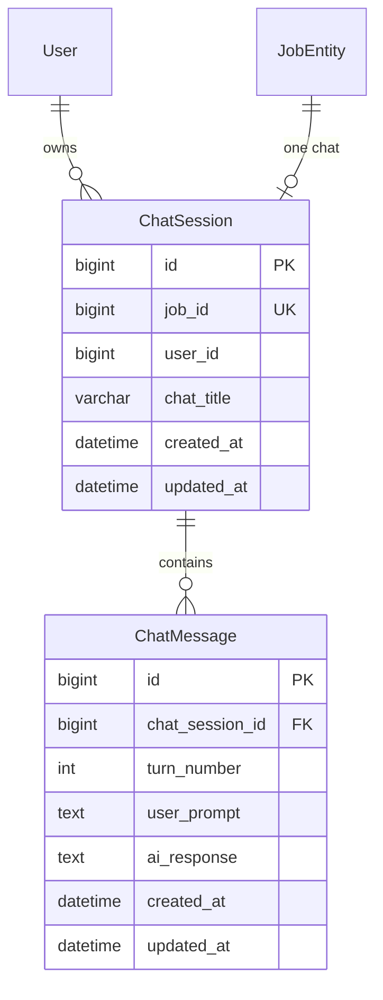
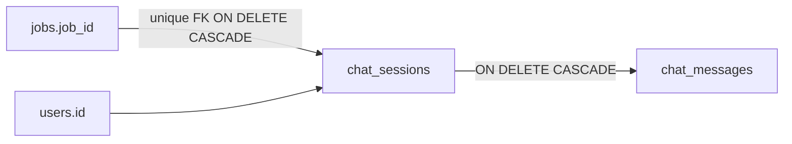

# Database

Chat assistant persistence is two MySQL tables mapped by JPA. There is no Flyway/Liquibase changelog for them in this project; schema is applied by Hibernate (`spring.jpa.hibernate.ddl-auto`, currently `update` in application properties).

Chat history is **not** stored in Redis.

## Entities

`User` and `JobEntity` belong to other modules. Chat assistant only needs: job id + owner, job `title` / `company` for the chat title and list sidebar, and cascade-on-job-delete.

Both chat entities extend `BaseEntity`:

| Column | Source |
| --- | --- |
| `created_at` | `@CreatedDate`, not updatable |
| `updated_at` | `@LastModifiedDate`; send also sets `session.updatedAt` explicitly when a turn is saved |

JPA auditing is enabled application-wide (`@EnableJpaAuditing` in `JpaConfig`), so `created_at` / `updated_at` populate on persist.

## `chat_sessions` (`ChatSession`)

One **ongoing** conversation about exactly one job.

| Field | Constraint / meaning |
| --- | --- |
| `id` | Identity PK |
| `job` / `job_id` | `OneToOne`, `nullable = false`, **unique** — database enforces one chat per job |
| `user` / `user_id` | `ManyToOne`, not null. Denormalized from `job.user` so “list my chats” does not join through `jobs`. A job’s owner is treated as immutable after creation |
| `chat_title` | `varchar(255)`, not null, **not unique**. Snapshot at session creation (`"{Company} - {Title}"` with fallbacks). Never recomputed if the job is later renamed |

Indexes: `idx_chat_session_user_id` on `user_id`. Uniqueness of `job_id` comes from `@JoinColumn(..., unique = true)`.

Lifecycle:

1. Inserted lazily on first send (`createSession`)
2. If two first-sends race, `DataIntegrityViolationException` on unique `job_id` is caught and the existing row is re-read
3. If that first send’s AI call fails and no turns exist, the session is **deleted** (`discardEmptySessionIfCreated`)
4. `updatedAt` is bumped on every persisted turn (sidebar sort)
5. Deleted by `DELETE /jobs/{jobId}`, or by Hibernate `@OnDelete(CASCADE)` when the **job** row is deleted

The session row does **not** embed messages. Turns live in `chat_messages` so growth is O(1) inserts.

## `chat_messages` (`ChatMessage`)

One conversational **turn**: user prompt + AI reply.

| Field | Constraint / meaning |
| --- | --- |
| `id` | Identity PK |
| `chatSession` / `chat_session_id` | `ManyToOne`, not null. `@OnDelete(CASCADE)` if the session is removed at the database |
| `turn_number` | 1-based position in the session. Unique with session: `uq_chat_message_session_turn` (`chat_session_id`, `turn_number`) |
| `user_prompt` | `TEXT`, not null |
| `ai_response` | `TEXT`, not null (already script-stripped) |

Lifecycle:

- Append-only `INSERT`. Prior turns are never updated by send
- `turn_number` = `MAX(turn_number) + 1` (or 1 if none)
- Unique constraint is the last line of defense against two writers assigning the same next number
- History reads page by `turnNumber ASC`
- Model context loads the newest 16 rows (`ORDER BY turnNumber DESC` + reverse in memory)
- Delete uses `DELETE FROM ChatMessage m WHERE m.chatSession.id = :id` (bulk, no load)

A failed or blank AI call does **not** insert a message.

## Relationships to jobs and users

Deleting a **job** cascades to the session (entity `@OnDelete` on `job`). Deleting a **chat** via the API deletes messages first, then the session; the job remains.

`user_id` on the session does not declare `@OnDelete`. Listing and ownership always use the current user’s id from the JWT.

## Important queries and transactions

| Operation | Transaction | Notes |
| --- | --- | --- |
| `prepareSend` | Short TX via `ChatAssistantTransactionRunner` | Job check, create/find session, load 16 turns |
| `continueJobChat` | **No** open persistence context from chat assistant | Intentionally outside TX |
| `persistTurn` | Short TX | `findByIdForUpdate`, insert message, save session |
| `getChatHistory` / `listMyChats` | `@Transactional(readOnly = true)` | |
| `deleteChat` | `@Transactional` | Messages then session |
| Discard empty session | Short TX | Only if this request created the session and `max(turn_number) == 0` |

`findByIdForUpdate` is `LockModeType.PESSIMISTIC_WRITE` (`SELECT ... FOR UPDATE` on supported MySQL/InnoDB).

`listMyChats` uses `@EntityGraph(attributePaths = "job")` so title/company for the sidebar are loaded in the same query.

## Title rules (persisted value)

Computed once in `buildChatTitle`:

| Company | Title | Stored `chat_title` |
| --- | --- | --- |
| non-blank | non-blank | `{company} - {title}` |
| non-blank | null/blank | company |
| null/blank | non-blank | title |
| both blank | | `""` (allowed; column is not-null but empty string is valid) |

Strings longer than 255 are clamped to 252 characters plus `"..."`.
