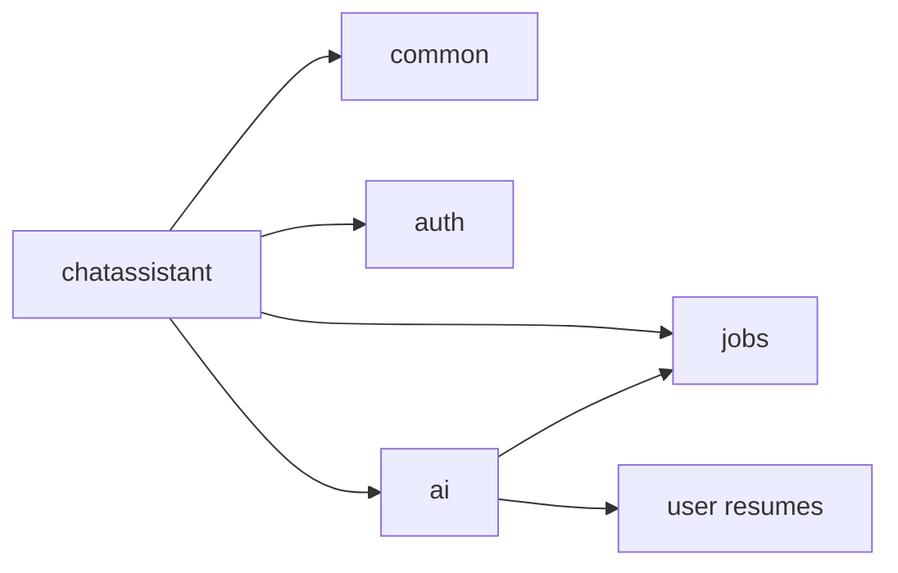

# Dependencies

Chat assistant is a package inside the Copilot Spring Boot app (`com.developer.copilot.chatassistant`). It has no separate Maven module. Dependencies below are what **this service actually uses**, and why.

## Internal modules

| Dependency | Why chat assistant needs it |
| --- | --- |
| **Auth** (`User`, `CustomUserDetails`, JWT filter, `SecurityConfig`) | Identify the caller. JWT admission is global; the service then reads `User` via `CurrentUserService` |
| **Common** (`CurrentUserService`, `ApiResponse`, `GlobalExceptionHandler`) | Current user, response envelope, most HTTP error mappings |
| **Jobs** (`JobEntity`, `JobRepository`, `JobNotFoundException`) | Job must exist and belong to the caller; title/company for chat title and list |
| **AI** (`AiService.continueJobChat`, `JobChatAiRequest`, `ChatTurnDto`, `AiChatResponse`, `AiServiceException`, `AiUnavailableException`, `AiResumePendingException`) | Only path that generates a reply. Chat assistant does not use Spring AI `ChatClient` itself |
| **User** (indirect) | Resume parse pending/failed exceptions surface on send because the AI service loads the default resume |

Chat assistant does **not** call the user or resume controllers. Resume grounding is entirely inside `AiService` / `ResumeContextService`.

`GlobalExceptionHandler` (common) references `ChatConflictException` and chat-assistant `RateLimitExceededException` — a small reverse compile dependency from common to this package for HTTP mapping.

## Framework

| Library | Why |
| --- | --- |
| `spring-boot-starter-webmvc` | REST controller, filters, `MockMvc` tests |
| `spring-boot-starter-validation` | `@NotBlank` / `@Size` on `SendChatMessageRequest` |
| `spring-boot-starter-data-jpa` | `ChatSession` / `ChatMessage`, transactions, pessimistic lock |
| `spring-boot-starter-security` | Authenticated endpoints, CORS, entry point |
| `spring-boot-starter-data-redis` | Optional Lettuce `StringRedisTemplate` for rate-limit counters |
| Spring Transaction (`TransactionTemplate`) | `ChatAssistantTransactionRunner` so the model call is not in a TX |
| Jackson | Filter-written 429 JSON; request/response mapping |
| Hibernate `@OnDelete` | DB-level cascade from job → session and session → messages |
| Lombok | Entities, DTOs, constructors |

Servlet filter order uses `FilterRegistrationBean` (not Spring Security’s `addFilterAfter`) so the limiter is not registered twice.

## Security libraries

| Library | Why |
| --- | --- |
| `jjwt-*` | Used by **auth** `JwtService`; chat assistant does not parse JWTs itself |
| Spring Security | `SecurityContextHolder` in the rate-limit filter and `CurrentUserService` |

## Persistence and datastore

| Library | Why |
| --- | --- |
| MySQL driver (`mysql-connector-j`) | Runtime for `chat_sessions` / `chat_messages` |
| Lettuce (via Spring Data Redis) | Optional distributed counters |

## API documentation

| Library | Why |
| --- | --- |
| `springdoc-openapi-starter-webmvc-ui` | `@Tag` / `@Operation` on the controller; `GroupedOpenApi` `chat-assistant` (non-prod) |

## Validation

Jakarta Validation (`jakarta.validation.constraints`) on the send DTO. No Hibernate Validator custom constraints in this package.

Paging uses manual `IllegalArgumentException`, not Bean Validation.

## Testing

| Library | Why |
| --- | --- |
| JUnit 5, Mockito | Service, mapper, rate-limit, sanitizer |
| `spring-boot-starter-webmvc-test` | `@WebMvcTest` security tests |
| `spring-boot-starter-security-test` | Security slice |

## Explicitly not used by this service

- Spring AI starter — used by the **AI** module, which chat assistant calls
- WebFlux / SSE — job chat is synchronous `ChatClient` `.call()`, not a stream from this controller
- MinIO / PDFBox — resume files; not referenced here
- Mail / Thymeleaf — auth/user flows
- Micrometer Actuator — metrics here are **log lines** (`ChatAssistantMetrics`), not meters

## Runtime peers (sequence)

