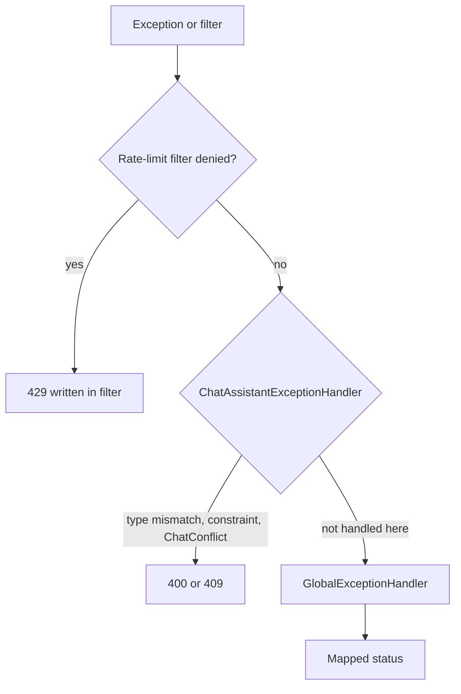

# Error handling

Chat assistant returns the shared `ApiResponse` envelope. Success and error bodies both use `success`, `message`, `data`, and `timestamp`. Error `data` is null.

There are two handler layers plus one filter that writes 429 without throwing.



`ChatAssistantExceptionHandler` is `@RestControllerAdvice(assignableTypes = ChatAssistantController.class)` with `@Order(HIGHEST_PRECEDENCE)`, so it wins over the global handler for the types it declares.

## How an exception becomes a response

1. Filter/controller/service throws or the rate-limit filter short-circuits
2. Matching `@ExceptionHandler` builds `ApiResponse.success(false)` with a **client-safe** message
3. HTTP status is set on the `ResponseEntity` (or on `HttpServletResponse` for 429)

Unhandled types fall through to `Exception` → **500** `"Something went wrong."` (logged).

## Service-specific exceptions

| Exception | Thrown when | HTTP | Message |
| --- | --- | --- | --- |
| `ChatConflictException` | `tryLock` failed; unique session/turn clash after retry; unique `job_id` insert could not be re-read | **409** | `"This chat was updated at the same time. Please retry."` |
| `RateLimitExceededException` | `consumeOrThrow` on the rate-limit service | **429** | `"Too many requests. Please try again later."` + `Retry-After` |

The **filter** does not throw `RateLimitExceededException`; it writes JSON itself. `GlobalExceptionHandler` still maps that type in case something calls `consumeOrThrow`.

`ChatAssistantExceptionHandler` and `GlobalExceptionHandler` both map `ChatConflictException` to 409 with `ex.getMessage()`. The controller-scoped handler runs first for this controller.

## Exceptions from other modules used on this API

| Exception | HTTP | Typical cause on this API |
| --- | --- | --- |
| `JobNotFoundException` | 404 | Job missing or not owned (`"Job not found."`) |
| `InvalidCredentialsException` | 401 | No principal in `CurrentUserService` |
| `AiServiceException` | 502 | Provider error, timeout mapping, or blank content after sanitization (`"The AI service returned an empty response. Please try again."`) |
| `AiUnavailableException` | 503 | Circuit open or bulkhead full in `AiChatGuard` |
| `AiResumePendingException` | 409 | Default resume still parsing |
| `ResumeParsingException` | 422 | Resume parse failed or empty usable text |
| `DataIntegrityViolationException` | 409 | Unique clash that escaped the service: `"The request conflicts with existing data. Please retry."` |
| `IllegalArgumentException` | 400 or 500 | 400 only if the message starts with an allow-listed prefix (paging and AI prior-turn checks). Others → 500 `"Something went wrong."` |

Paging uses `"page must be >= 0 and size must be between 1 and 50."`, which matches the global allow-list prefix `"page must be >= 0"`.

If the AI service ever threw `"Prior turns cannot exceed 40 entries."`, that is also allow-listed to 400. Chat assistant itself only sends 16 turns.

`ResumeNotFoundException` / `UserProfileNotFoundException` from default-resume lookup are **swallowed inside the AI service** when `resumeId` is null (chat assistant always passes null). Job chat then continues with empty resume context instead of 404. Those 404 mappings would only apply if a resume id were passed — this API does not do that.

## Validation and binding errors

| Type | HTTP | Message |
| --- | --- | --- |
| `MethodArgumentNotValidException` | 400 | `"prompt: Prompt cannot be blank."` / `"prompt: Prompt cannot exceed 8000 characters."` (field + default message) |
| `HttpMessageNotReadableException` | 400 | `"Request body is missing or malformed JSON."` |
| `MethodArgumentTypeMismatchException` | 400 | `"Invalid job id."` for **every** type mismatch on this controller (the handler does not inspect the parameter name) |
| `ConstraintViolationException` | 400 | Joined violation messages, or `"Invalid request parameter."` |
| `HttpRequestMethodNotSupportedException` | 405 | `"Method not allowed."` |
| `HttpMediaTypeNotSupportedException` | 415 | `"Unsupported media type."` |

## Rate-limit errors

Written by `ChatAssistantRateLimitFilter`:

```json
{
  "success": false,
  "message": "Too many requests. Please try again later.",
  "timestamp": "2026-08-24T15:30:00"
}
```

Status **429**, header `Retry-After` = seconds until the window allows another send (at least 1).

## Example error body

```json
{
  "success": false,
  "message": "Job not found.",
  "data": null,
  "timestamp": "2026-08-24T15:30:00"
}
```

## Metrics on error paths

`ChatAssistantMetrics` logs (not Actuator):

- `jobNotFound` — ownership miss
- `providerFailure` — any `RuntimeException` from `continueJobChat`
- `blankResponse` — empty/whitespace content after sanitization
- `conflict` — unique-turn `DataIntegrityViolationException` (including the retry)

These are operator log lines (`chatassistant metric=...`), not HTTP fields.
