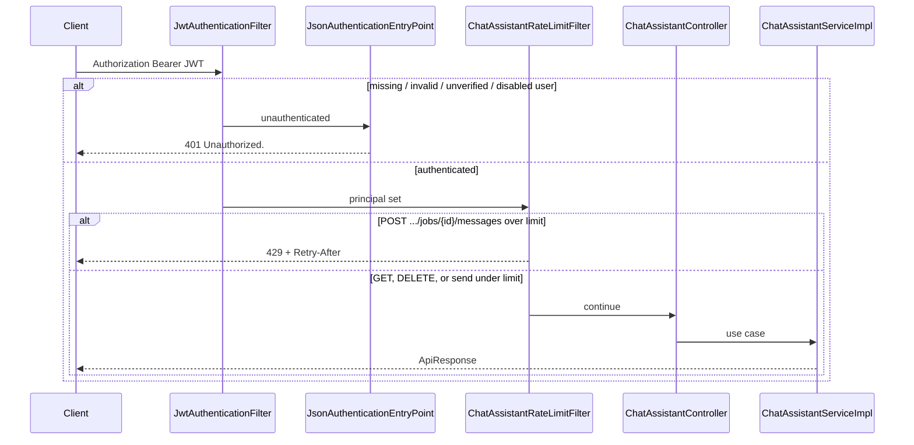
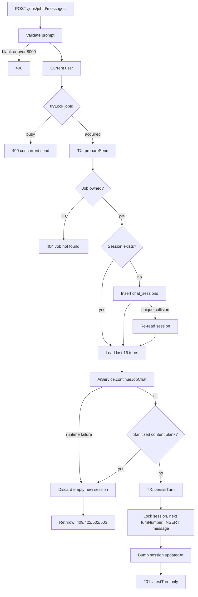
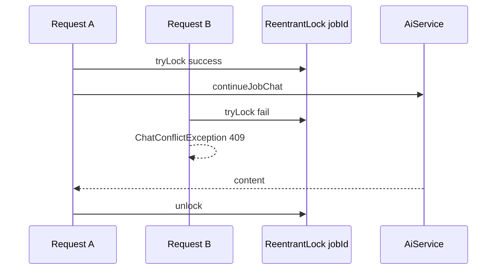
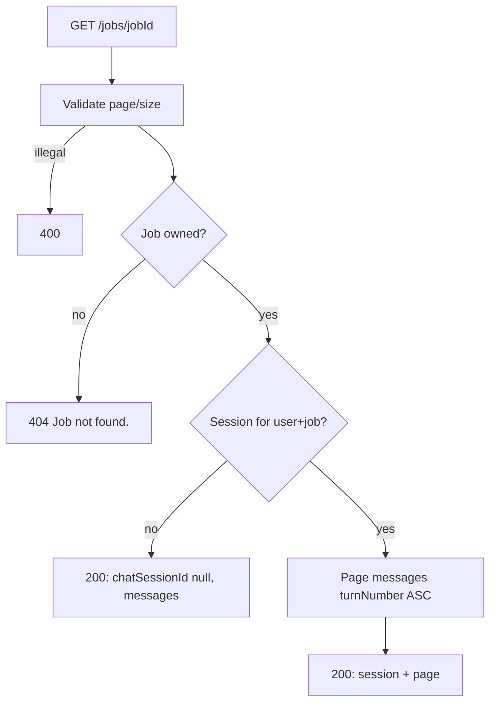
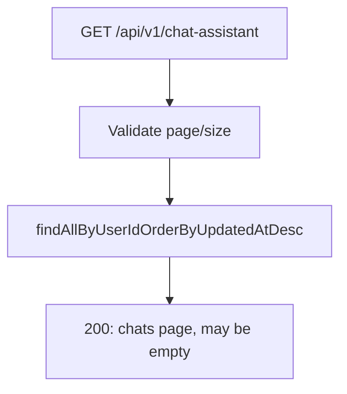
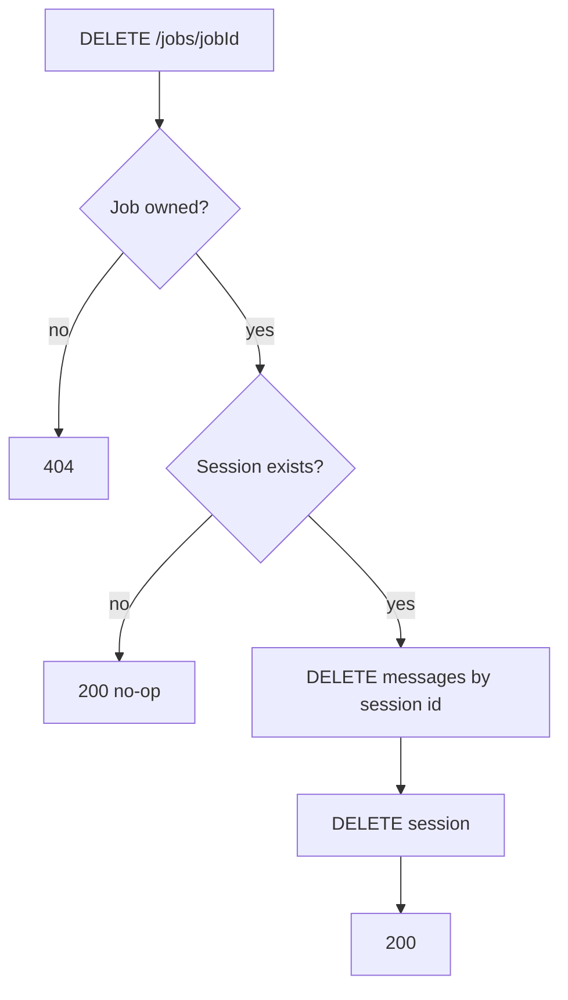
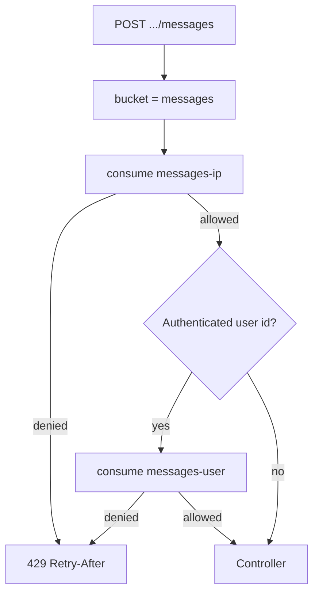

# Flows

This document covers the workflows the chat assistant actually implements. Diagrams follow the code in `ChatAssistantController`, `ChatAssistantServiceImpl`, `ChatAssistantRateLimitFilter`, and the shared security filter.

## 1. Request lifecycle

Every call hits Spring Security first, then the chat-assistant rate-limit filter, then the controller.

GET history, GET list, and DELETE skip rate-limit counting (`limitFor` returns 0). Only send is a paid door.

## 2. Send a message

This is the only path that calls the model. The AI provider wait runs **between** two short transactions.

Behavior that is easy to miss:

- HTTP **201** means a **turn** was created, including turn 20 — not only the first message
- The response is **not** the full thread; clients poll GET history
- `resumeId` and `customResumeText` are left null; the AI service uses the user’s high-priority resume or empty context
- Prior turns with blank prompt or reply are dropped before the model call
- If this send **created** the session and the AI call then fails (or returns blank), the empty session is deleted so GET history still returns the unused-chat shape

See [SEND-AND-CONCURRENCY.md](./CHATASSISTANT-SERVICE-SPECIFIC-DOCS/SEND-AND-CONCURRENCY.md) and [AI-INTEGRATION.md](./CHATASSISTANT-SERVICE-SPECIFIC-DOCS/AI-INTEGRATION.md).

## 3. Concurrent send on the same job

The in-memory lock is **per JVM**. Two instances can both pass `tryLock`. Persist then uses `findByIdForUpdate` and a unique `(session, turn_number)` constraint; a remaining collision becomes 409 after one retry (`"This chat was updated at the same time. Please retry."`).

## 4. Get chat history

Does **not** call the AI service.

404 always means **job** missing or not yours. A missing chat is success with empty data. That lets a UI open a fresh composer without special-casing 404.

## 5. List my chats

No job-id parameter. Rows are already scoped by `user_id`. Job title and company are loaded with an `@EntityGraph` on `job` to avoid N+1. `updatedAt` is the session row, bumped when a turn is saved.

## 6. Delete a job’s chat

Does **not** delete the job and does **not** call the AI service.

After delete, the next send creates a new session and a new title snapshot. Message ids and session id will be new.

## 7. Rate-limit on send

Window is 60 seconds. Default limit is 8 (`app.chatassistant.messages-per-minute`). Redis uses a **fixed** counter + TTL; memory uses a **sliding** window of timestamps. Redis failures fall back to memory. See [RATE-LIMITING.md](./CHATASSISTANT-SERVICE-SPECIFIC-DOCS/RATE-LIMITING.md).

## 8. AI grounding inside continueJobChat

Once the chat assistant has prepared `JobChatAiRequest`, the AI service:

1. Validates prior turns (max 40 inbound; chat assistant only sends 16)
2. Resolves resume text (default high-priority resume, or `""` if none)
3. Resolves job description by user email + job id (second ownership check)
4. Builds a job-chat system prompt (resume + job embedded once)
5. Sends prior turns as user/assistant messages, then the new prompt
6. Runs the call through `AiChatGuard` (circuit + bulkhead) and a timeout

Failures map to 409 (resume still parsing), 422 (parse failed/empty), 502 (provider/blank after mapping), or 503 (circuit open / bulkhead full). See [AI-INTEGRATION.md](./CHATASSISTANT-SERVICE-SPECIFIC-DOCS/AI-INTEGRATION.md).

## 9. Security path for a stolen or garbage token

`JwtAuthenticationFilter` only sets the security context when:

- `Authorization: Bearer ...` is present
- the JWT parses to a user id
- that user exists, is enabled, has verified email, and the token is valid for that user

Otherwise the request continues unauthenticated and `SecurityFilterChain` (`anyRequest().authenticated()`) returns **401** with `"Unauthorized."` via `JsonAuthenticationEntryPoint`. The controller is never reached. Garbage tokens are tested in `ChatAssistantSecurityTest`.
