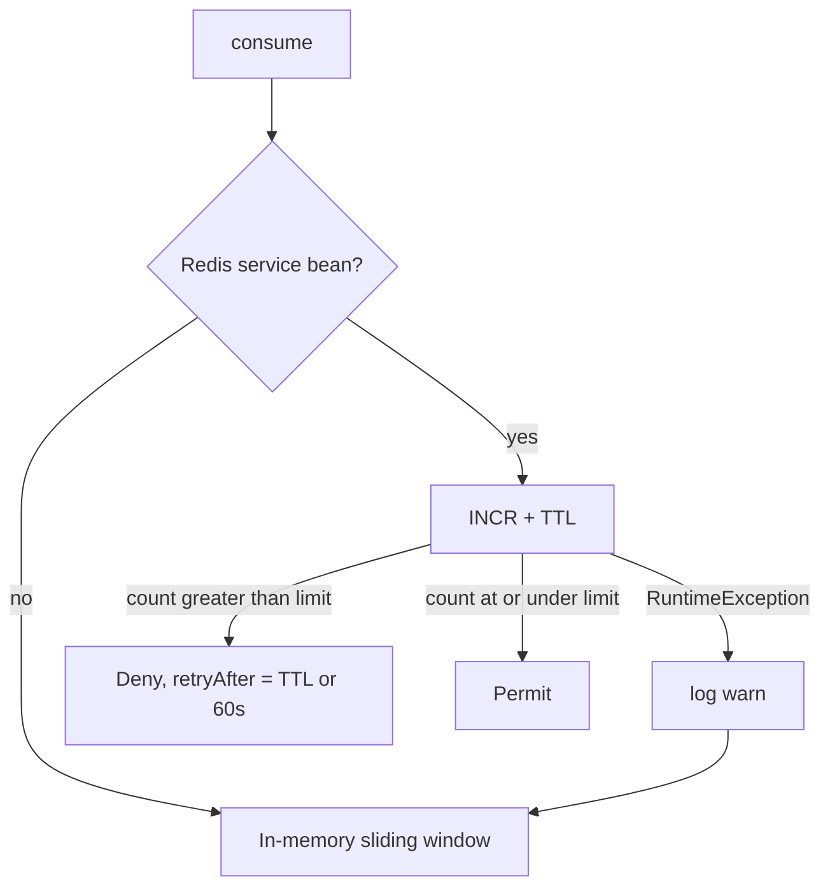

# Redis infrastructure

Chat assistant uses Redis for **one** purpose: shared rate-limit counters on `POST /api/v1/chat-assistant/jobs/{jobId}/messages`.

It does **not** cache sessions, messages, titles, or AI replies. Those live in MySQL. If Redis is down or disabled, chats still work; only the limiter falls back to an in-memory window on that JVM.

## Why Redis exists here

The send endpoint calls a paid model. Limits must hold across multiple application instances (for example ECS). An in-memory `ConcurrentHashMap` of timestamps is enough for a single process and for tests (`app.chatassistant.redis.enabled` defaults to **false**).

## When Redis beans exist

`ChatAssistantRedisConfig.Enabled` is `@ConditionalOnProperty(prefix = "app.chatassistant.redis", name = "enabled", havingValue = "true")`.

When enabled, the module creates its **own** Lettuce connection factory and `StringRedisTemplate` (not the auth or job-extraction Redis beans):

- `chatAssistantRedisConnectionFactory`
- `chatAssistantStringRedisTemplate`
- `ChatAssistantRedisRepository`
- `ChatAssistantRedisKeyBuilder`
- `ChatAssistantRedisService` / `ChatAssistantRedisServiceImpl`

`ChatAssistantRateLimitServiceImpl` receives Redis through `ObjectProvider.getIfAvailable()`. If the bean is absent, every `consume` uses memory.

## What is stored

String keys, integer counters, a TTL.

| Operation | Redis |
| --- | --- |
| `INCR` | Increment the counter for `(namespace, identity)` |
| `EXPIRE` | Set only when the new value is **1** (first hit in the window) |
| `TTL` | Used as `Retry-After` when the counter exceeds the limit |

This is a **fixed window**: the TTL starts at the first increment and is not refreshed on later hits. The in-memory path is a **sliding** window of timestamps — they are not identical algorithms.

Window length for sends is **60 seconds** (hard-coded on the filter). Limit is `app.chatassistant.messages-per-minute` (default 8).

## Key structure

`ChatAssistantRedisKeyBuilder.build(namespace, identity)`:

```text
{prefix}:{namespace}:{identity}
```

- `prefix` — `app.chatassistant.redis.key-prefix`, default `chatassistant`
- `namespace` / `identity` — trimmed, lowercased, `:` replaced with `_` so IPv6 cannot collide with the delimiter. Blank → `unknown`

Rate-limit namespace is `rl-` + bucket:

| Bucket (filter) | Redis namespace |
| --- | --- |
| `messages-ip` | `rl-messages-ip` |
| `messages-user` | `rl-messages-user` |

Examples:

```text
chatassistant:rl-messages-ip:10.0.0.1
chatassistant:rl-messages-user:7
```

Identity for IP is the first `X-Forwarded-For` hop or `remoteAddr`. Identity for user is the numeric user id as a string.

## Failure behavior



If `INCR` throws, the implementation logs `"Chat-assistant Redis rate-limit failed; using in-memory fallback"` and uses memory for **that** call. It does not fail the HTTP request with 5xx because Redis is unavailable.

`ttlSeconds`: Redis `PTTL`/`TTL` below 0 (no key or no expire) is treated as 0, and deny then uses the full `windowSeconds` as `Retry-After`.

Connection settings: `validateConnection` is **false** on the Lettuce factory. Command timeout is `app.chatassistant.redis.timeout-ms` (default 2000).

## Configuration

Prefix `app.chatassistant.redis` (`ChatAssistantRedisProperties`). These are **not** currently listed in `application.properties`; Java defaults apply until you set them.

| Property | Default | Purpose |
| --- | --- | --- |
| `app.chatassistant.redis.enabled` | `false` | Create Redis beans |
| `app.chatassistant.redis.host` | `localhost` | Standalone host |
| `app.chatassistant.redis.port` | `6379` | Port |
| `app.chatassistant.redis.password` | empty | Optional; set only if Redis requires AUTH. Use a secret, not a committed value |
| `app.chatassistant.redis.database` | `0` | Logical DB index |
| `app.chatassistant.redis.timeout-ms` | `2000` | Lettuce command timeout |
| `app.chatassistant.redis.key-prefix` | `chatassistant` | Key prefix |

Related (not Redis): `app.chatassistant.messages-per-minute` (default 8) is the counter limit.

Standalone Redis only (`RedisStandaloneConfiguration`). Sentinel/cluster is not implemented in this config.

## Responsibilities split

| Class | Role |
| --- | --- |
| `ChatAssistantRedisKeyBuilder` | Namespaced, sanitized keys |
| `ChatAssistantRedisRepository` | `INCR` / `EXPIRE` / `TTL` on `StringRedisTemplate` |
| `ChatAssistantRedisServiceImpl` | Map `(namespace, identity)` → key, then repository |
| `ChatAssistantRateLimitServiceImpl` | Choose Redis vs memory, compare to limit |
| `ChatAssistantRateLimitFilter` | Which HTTP calls consume which buckets |

Chat history delete does **not** delete Redis keys. Counters expire on their own TTL.
