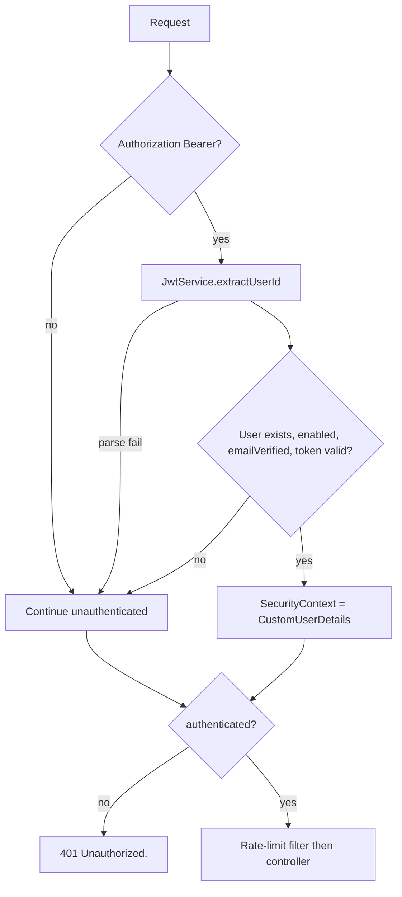

# Security

The chat assistant has no login of its own. It relies on the application-wide JWT filter and then applies **job ownership**, **send rate limits**, and **output sanitization**.

Nothing in this module implements CSRF tokens (CSRF is disabled globally; the API is stateless Bearer auth), password hashing, or refresh-token rotation.

## Authentication

`SecurityConfig` requires `authenticated()` for every path that is not an explicit auth permit-all or (non-prod) Swagger path. `/api/v1/chat-assistant/**` is therefore JWT-only.



`JwtAuthenticationFilter` loads the user from the database. Tokens for disabled users or unverified emails never become a principal, so the caller sees the same **401** as a missing token.

`JsonAuthenticationEntryPoint` body:

```json
{
  "success": false,
  "message": "Unauthorized.",
  "timestamp": "2026-08-24T15:30:00"
}
```

If the controller runs without a usable principal, `CurrentUserServiceImpl` throws `InvalidCredentialsException("User is not authenticated.")`, mapped to **401** by `GlobalExceptionHandler`. Controller tests that stand up MockMvc without security still hit this path when the service is exercised directly.

There is **no** `@PreAuthorize` / role check on the controller. Any authenticated role that can obtain a JWT can call these APIs. Authorization is **ownership of the job**, not `ROLE_*`.

## Authorization (job ownership)

Every job-scoped method (`send`, `getChatHistory`, `deleteChat`) loads the job with:

```text
jobRepository.findByIdAndUserId(jobId, currentUser.getId())
```

Empty result → `JobNotFoundException("Job not found.")` → **404**. The message is the same for a missing id and for someone else’s job, so clients cannot probe which job ids exist.

`listMyChats` does not take a job id; it queries `findAllByUserIdOrderByUpdatedAtDesc`. You only ever see your own sessions.

The AI service repeats a job lookup by **email** inside `continueJobChat`. That is a second ownership check, not a substitute for the first.

## Rate limiting (abuse prevention)

`ChatAssistantRateLimitFilter` runs at servlet order **-80**, after `springSecurityFilterChain` (**-100**), so user-id buckets see the JWT principal.

| What | Limit |
| --- | --- |
| `POST .../jobs/{jobId}/messages` | `app.chatassistant.messages-per-minute` (default **8**) per **IP** and per **user**, 60-second window |
| GET history, GET list, DELETE | Not limited by this filter |

IP identity: first hop of `X-Forwarded-For`, else `remoteAddr`. User identity: `CustomUserDetails.getUser().getId()`. If the principal is missing, only the IP bucket is applied.

429 body: `"Too many requests. Please try again later."` with header `Retry-After` (seconds). CORS `exposedHeaders` includes `Retry-After` so browser clients can read it.

This is **not** a substitute for provider quota; it only protects the paid send door. Details: [RATE-LIMITING.md](./CHATASSISTANT-SERVICE-SPECIFIC-DOCS/RATE-LIMITING.md).

## Request origin (CORS)

`SecurityConfig` applies `CorsProperties` to `/**`. Allowed methods include GET, POST, DELETE (and others unused here). `Retry-After` is exposed. Credentials are allowed; a configured origin of `*` is dropped so it cannot pair with `allowCredentials=true`.

Chat assistant does not add its own CORS configuration.

## Sensitive data

Stored in MySQL:

- User prompts (`TEXT`)
- AI replies (`TEXT`)
- Chat title (company + job title snapshot)

The service does not log prompt or reply bodies on the success path. It logs session/job/user ids and metric counters. AI failures log `ex.getMessage()` with jobId and userId — not the prompt.

Redis, when enabled, stores **counters only** (namespaced keys with user id or IP). It does not store chat text.

HTML sanitization is narrow: `ChatAssistantHtmlSanitizer` removes `<script>...</script>` (case-insensitive, including attributes) from model output before persist. Markdown is otherwise left intact for the SPA. This is not a full HTML sanitizer.

User prompts are **not** HTML-stripped; they are stored as submitted (after Bean Validation length/blank checks).

## Secrets

Chat assistant has no API keys of its own. Optional Redis password is `app.chatassistant.redis.password`. LLM credentials belong to the AI / Spring AI configuration, not this package.

OpenAPI for this group is **disabled** on `prod` / `production` profiles (`ChatAssistantOpenApiConfig`).

## Unauthorized vs not found vs conflict

| Situation | Status |
| --- | --- |
| No/invalid JWT | 401 `"Unauthorized."` |
| Job not yours / missing | 404 `"Job not found."` |
| Chat not started yet | 200 empty history (not 401/404) |
| Overlapping send or resume pending | 409 |
| Rate limit | 429 |

This service does not return HTTP 403. Email verification is enforced when the JWT is accepted, so an unverified user looks like any other unauthenticated caller (401).

## Production notes supported by the code

- Stateless sessions (`SessionCreationPolicy.STATELESS`)
- Per-instance send lock is **not** a cluster lock; unique turn numbers + pessimistic session lock cover multi-instance races
- Enable Redis (`app.chatassistant.redis.enabled=true`) on multiple app instances so rate limits are shared; otherwise each instance has its own in-memory window
- Trust `X-Forwarded-For` only behind a proxy that overwrites it; the filter uses the first comma-separated hop as-is
