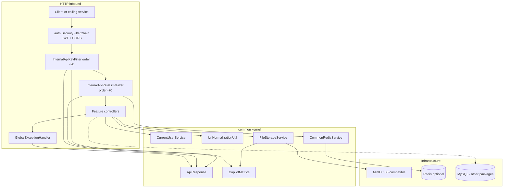
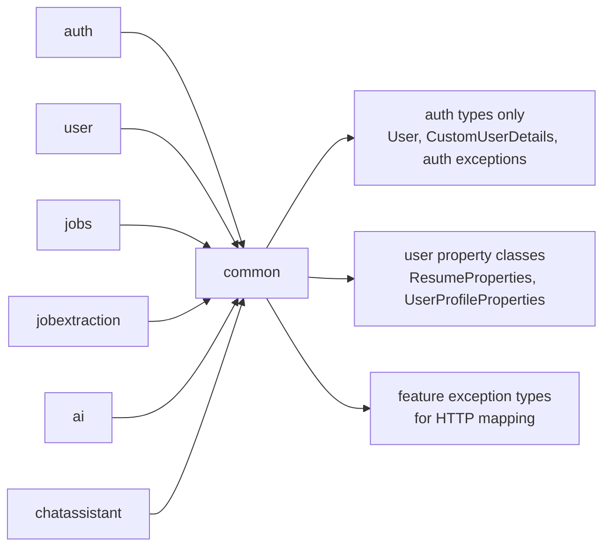

# Architecture

Common is a **shared kernel inside one Spring Boot process**. Feature packages call into it; it does not call feature business services. The only “inbound HTTP” it owns is servlet filters scoped to `/api/v1/internal/**` and a `@RestControllerAdvice` that sits after every controller.

## Architectural layers

Filters on the internal prefix are registered with `FilterRegistrationBean`, **outside** Spring Security’s own chain. Comments in `InternalApiSecurityConfig` place them after `springSecurityFilterChain` (`-100`) so the JWT is already present, and the key filter (`-90`) runs before the rate-limit filter (`-70`) so 401s are not counted as traffic.

## Component groups

### HTTP contract

| Component | Role |
|---|---|
| `ApiResponse<T>` | Uniform JSON envelope. `timestamp` is `LocalDateTime` with **no timezone offset**. |
| `GlobalExceptionHandler` | Application-wide `@RestControllerAdvice`. Maps feature and framework exceptions to `ApiResponse`. |
| `SwaggerConfig` | OpenAPI info, Bearer + InternalApiKey schemes, shared `ApiResponse` schema. Active only when the profile is **not** `prod` or `production`. |

Feature controllers (in other packages) return `ResponseEntity<ApiResponse<...>>`. Filters that reject early write the same JSON shape themselves so clients never see an empty 401/429 body.

### Security helpers (common-owned)

| Component | Role |
|---|---|
| `InternalApiProperties` | `internal.api.*` (key, previous key, header name, path prefix, enabled). |
| `InternalApiSecurityConfig` | Registers `InternalApiKeyFilter` on the internal prefix only. |
| `InternalApiKeyFilter` | Constant-time comparison of `X-Internal-Api-Key` (or a configured header) against current and previous secrets. |
| `InternalApiStartupValidator` | `ApplicationRunner` that refuses to boot with a disabled, blank, short, or placeholder key outside `local`/`dev`. |
| `CurrentUserService` | Reads `SecurityContextHolder` and returns `auth.entity.User`. |

JWT validation stays in `auth` (`JwtAuthenticationFilter`, `SecurityConfig`). Common never parses tokens.

### Internal hallway rate limiting

| Component | Role |
|---|---|
| `CommonRateLimitProperties` | `app.common.internal-key-per-minute` (default 60) and `internal-user-per-minute` (default 30). |
| `CommonRateLimitService` | `consume` / `consumeOrThrow` against a bucket + identity. |
| `CommonRateLimitServiceImpl` | Redis INCR+TTL when Redis is on and reachable; otherwise an in-memory sliding window. |
| `InternalApiRateLimitFilter` | Applies two buckets on the internal prefix: `internal-key` / identity `"service"`, then `internal-user` / JWT user id. |

The key bucket uses a **fixed** identity `"service"`, not a hash of the secret. All callers that share the key share that 60/minute hallway. The user bucket is per numeric user id when `CustomUserDetails` is present.

### Redis (optional)

Created only when `app.common.redis.enabled=true` (`CommonRedisConfig.Enabled`). Boot’s Data Redis auto-configuration is excluded in `CopilotApplication`, so localhost:6379 is not required unless a package explicitly enables its own Redis.

Beans: `LettuceConnectionFactory`, `StringRedisTemplate`, `CommonRedisKeyBuilder`, `CommonRedisRepository`, `CommonRedisService`.

### Object storage

| Component | Role |
|---|---|
| `StorageProperties` | `storage.*` endpoint, credentials, bucket, auto-create. |
| `StorageConfig` | Builds `MinioClient`. Accepts provider `minio` or `s3` (both use the same client). |
| `FileStorageService` | `initializeStorage`, `upload`, `download`, `delete`, `exists`. |
| `FileStorageServiceImpl` | PDF-only uploads, SHA-256 checksum, UUID object keys, path allow-list, JWT ownership check. |
| `StorageStartupValidator` | `@PostConstruct`: reject default `minioadmin` / auto-create on remote endpoints outside laptop profiles, then initialize the bucket. |
| `StoredFile` | Returned metadata: storage key, original filename, content type, size, checksum. |

### Shared utilities

| Component | Role |
|---|---|
| `UrlNormalizationUtil` | Canonical http(s) job URLs; `sha256Hex` for a fixed-length uniqueness key. |
| `InvalidJobUrlException` | Thrown when a URL is empty or not a safe absolute http(s) URL. |
| `ChecksumUtil` | Streaming SHA-256 hex for uploaded bytes. |
| `CopilotMetrics` | Micrometer `Counter` increments that swallow all runtime failures. |

### JPA bootstrap

`JpaConfig` enables `@EnableJpaAuditing` and registers `ResumeProperties` plus `UserProfileProperties`. Those two property classes belong to `user`; they are wired here so they exist as beans even though they are not persistence entities.

## Dependency direction

Common **imports types** from other packages so the global handler and current-user helper can compile. It does **not** call their services. Feature packages call common services and DTOs.

`GlobalExceptionHandler` is the main place where common knows about other packages’ exception classes. A test scans every custom `*Exception` under `com.developer.copilot` and fails if one lacks an `@ExceptionHandler`.

## Boundaries

- **URL pattern:** Internal filters register only `{pathPrefix}` and `{pathPrefix}/*` (default `/api/v1/internal` and `/api/v1/internal/*`). Public and authenticated user APIs never require the service key.
- **Filter vs controller:** 401 from a missing internal key and 429 from the hallway limiter are written by filters. They never reach a controller or `GlobalExceptionHandler`.
- **Storage trust:** Callers must build `folderPath` / `storageKey` from the authenticated user id (for example `users/{id}/resumes`). The implementation still rejects traversal and, when a JWT user is present, any path not under `users/{thatUserId}/`. Background work without a JWT (resume parse) gets character checks only.
- **Redis isolation:** Common Redis keys use prefix `app.common.redis.key-prefix` (default `common`). They are not the auth or job-extraction Redis clients.

## What is intentionally absent

There is no common REST controller, no common JPA entity, no common mapper layer, and no scheduled job in this package. OpenAPI “groups” for features are registered in those features; `SwaggerConfig` only supplies the shared document, security schemes, and the rule that public auth paths do not require Bearer in Try-it-out.
