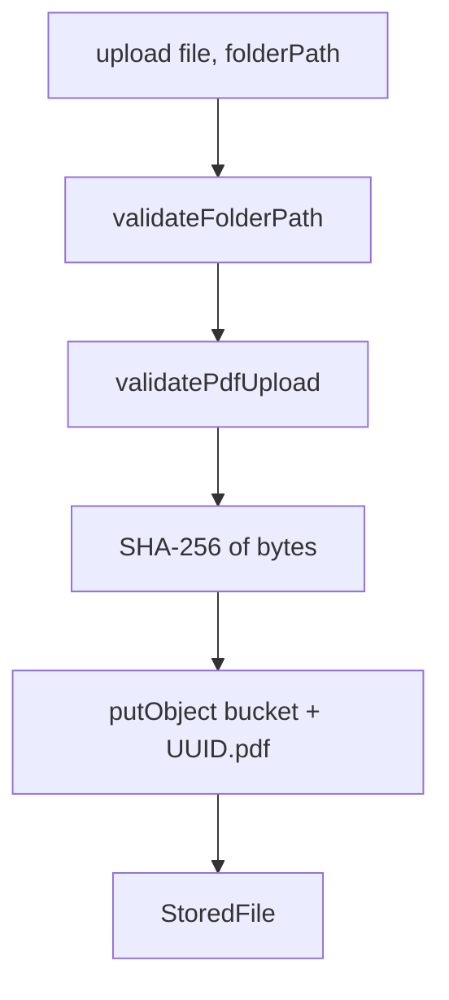
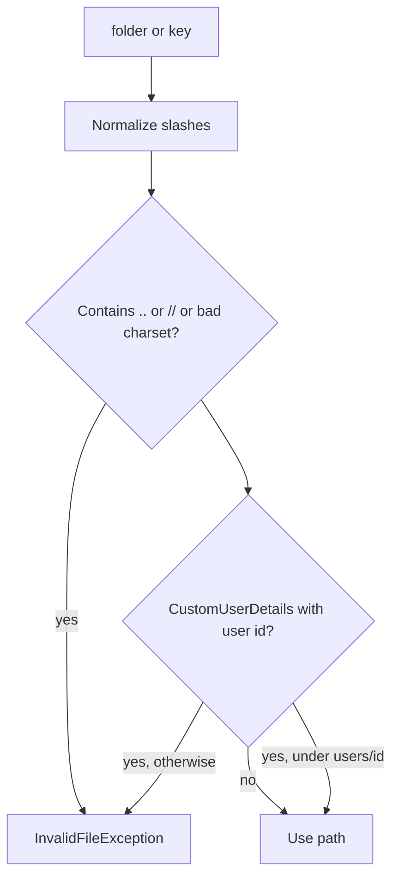

# File storage

Common owns the object-storage adapter used for resume PDFs. Callers (`UserServiceImpl`, `UserProfileServiceImpl`, `ResumeParsingServiceImpl`, `ResumeParser`) never talk to MinIO directly.

There is a single implementation: `FileStorageServiceImpl` + `MinioClient`. `storage.provider=s3` still uses that client against an S3-compatible endpoint.

## Responsibilities

- Create or verify the bucket at process start.
- Upload only PDFs, with a SHA-256 checksum and a UUID object name.
- Download / delete / exists with the same path safety rules.
- Refuse path traversal and, when a JWT user is present, paths outside `users/{userId}/`.
- Map MinIO failures to `InvalidFileException`, `StorageObjectNotFoundException`, or `StorageException`.

## Object layout

Uploads write:

```
{normalizedFolder}/{uuid}.pdf
```

Example: `users/1/resumes/3f2a...c1.pdf`

Callers should pass folder `users/{currentUserId}/resumes` (or another prefix already proven to belong to that user). The service does not read a folder from the HTTP request.

`StoredFile` returned on upload:

| Field | Meaning |
|---|---|
| `storageKey` | Object key in the bucket |
| `originalFilename` | Client filename |
| `contentType` | Always `application/pdf` after a successful upload |
| `fileSize` | Byte length |
| `checksum` | SHA-256 hex of the bytes (`ChecksumUtil`) |

## Upload pipeline



PDF rules are in [VALIDATION.md](../VALIDATION.md). Magic bytes are required so a renamed `.pdf` that is not a PDF never reaches the bucket.

## Path contract



Background parse has no JWT; only the character allow-list runs. That is intentional so workers are not blocked, and it is why callers must never pass a raw request parameter as `storageKey`.

## MinIO error mapping

| Situation | Type | HTTP via global handler |
|---|---|---|
| Client file/path problem | `InvalidFileException` | 400, message kept, WARN, metric `copilot.storage.failure` `type=invalid_file` |
| Download, object missing (`NoSuchKey` / `NoSuchObject` / `NotFound`) | `StorageObjectNotFoundException` | 404 `File not found.` |
| `exists`, same missing codes | `false` (not an exception) | — |
| Other MinIO / I/O errors | `StorageException` | 500 generic storage message, ERROR log, metric with `operation` and `type=storage` or `not_found` |

Delete wraps all failures as `StorageException` (no not-found distinction).

## Startup

`StorageStartupValidator` `@PostConstruct`:

1. `validateNonLaptopCredentials()` — see [CONFIGURATION.md](../CONFIGURATION.md) / [SECURITY.md](../SECURITY.md).
2. `fileStorageService.initializeStorage()` — `bucketExists`; `makeBucket` if missing and auto-create; else `IllegalStateException` including the bucket name.
3. Metric `copilot.storage.boot` `result=success`.

Provider check runs when the `MinioClient` bean is created: non-blank provider must be `minio` or `s3`.

## Timeouts

OkHttp on the client: connect 10 seconds, read/write 30 seconds. Not configurable via properties.

## What this adapter does not do

- No presigned URLs, no public bucket policy management, no multipart chunk API.
- No encryption settings in Java (configure the store itself).
- No non-PDF types.
- No listing of prefixes; callers persist `storageKey` in their own tables.
