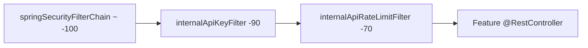
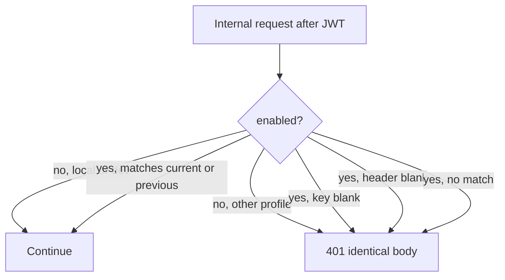

# Internal API hallway

Feature packages can add controllers under `/api/v1/internal/**` without copying authentication or rate-limit code. Common supplies a **hallway**: JWT (from `auth`) plus a shared service key, then two rate-limit buckets, then the controller.

This is the only HTTP surface common owns. The current controller on the prefix is `user` `InternalResumeController` (`GET .../resumes/parsed` and `GET .../resumes/{id}/parsed`). Those routes still require this hallway.

## Why it exists

Internal parsed-resume payloads are PII and are not for the browser SPA. A stolen user JWT alone must not be enough to scrape `/api/v1/internal/**` from the public internet. The calling service must also present a secret that never ships in frontend code.

The key identifies the **service**. The JWT identifies the **user**. Ownership checks stay on the user id.

## Filter order

401s from a bad key are not counted toward 429. Both filters are registered only on `pathPrefix` and `pathPrefix/*`.

## Shared secret

Header default: `X-Internal-Api-Key`.

Accepted values: `internal.api.key`, or `internal.api.previous-key` if that is configured (rotation). Compare with `MessageDigest.isEqual` on UTF-8 bytes.

Client body is always `"Invalid or missing internal service key."` Metrics tag `reason` is `disabled` | `unconfigured` | `missing` | `invalid`.

## Startup guard

`InternalApiStartupValidator` runs at boot. Outside `local`/`dev`:

- enabled must be true
- key length ≥ 32 after trim
- key must not contain placeholder tokens (alphanumeric-normalized substrings listed in [SECURITY.md](../SECURITY.md))
- previous-key, if present, same rules

## Hallway rate limits

Implemented in `InternalApiRateLimitFilter` + `CommonRateLimitServiceImpl`.

| Bucket name | Identity | Default cap / 60s |
|---|---|---|
| `internal-key` | constant `"service"` | 60 |
| `internal-user` | JWT user id, if `CustomUserDetails` has one | 30 |

The first bucket is **not** hashed per distinct key string. All traffic that passed the key filter shares `"service"`. The second bucket is per user so one JWT cannot exhaust the hallway for everyone as quickly, and a stolen JWT is keyed by user id.

`0` on a property disables that bucket. Redis vs memory: [REDIS-INFRASTRUCTURE.md](../REDIS-INFRASTRUCTURE.md).

429 body: `"Too many requests. Please try again later."` plus `Retry-After`.

## Adding a new internal controller

1. Map it under `internal.api.path-prefix` (keep the default `/api/v1/internal/...` unless every caller and both filters are updated).
2. Require Bearer JWT in Spring Security (already `anyRequest().authenticated()`).
3. Document `InternalApiKey` on the OpenAPI operation (see `InternalResumeController`).
4. Resolve data with `CurrentUserService` (or equivalent) so the key cannot select another user’s rows.
5. Do not re-implement the key filter. Optional: add a *tighter* feature limiter; the hallway still applies.

Do not call these URLs from the SPA. Do not put the service key in frontend env files.
