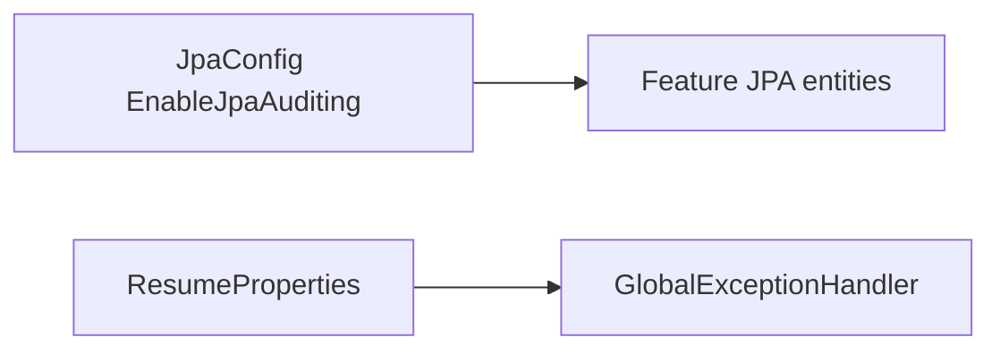

# Database

Common **does not own tables, entities, or repositories**. Persistence for users, jobs, resumes, tokens, and chat lives in other packages.

What common *does* for the database is bootstrap JPA auditing and register two `user` configuration-property beans next to that config.

## JPA auditing

`JpaConfig` is annotated with `@EnableJpaAuditing`.

Entities in other packages that declare Spring Data auditing annotations (`@CreatedDate`, `@LastModifiedDate`, and similar) receive timestamps from this switch. Without it those fields would stay null.

Common does not define an `AuditorAware` bean in this package. Created-by / last-modified-by user auditing is therefore **not** something this package implements; only the auditing feature flag is turned on here.

## Configuration-property beans on `JpaConfig`

`@EnableConfigurationProperties({ResumeProperties.class, UserProfileProperties.class})` is declared on `JpaConfig` even though those classes live under `user`. They are not entities.

| Type | Prefix | Why it is mentioned here |
|---|---|---|
| `ResumeProperties` | `resume` | `GlobalExceptionHandler` uses `resume.max-file-size-mb` (default 5) when mapping `MaxUploadSizeExceededException`. |
| `UserProfileProperties` | `user.profile` | Registered as a bean for the user package; common does not read it in business logic. |

`InternalApiProperties` is **not** registered on `JpaConfig`. It is enabled from `InternalApiSecurityConfig`.

## Schema and DDL

`application.properties.example` sets `spring.jpa.hibernate.ddl-auto=update` and a MySQL datasource. That is application-wide Boot configuration, not a common-owned schema. Common introduces no migrations and no `@Table` types.

## Transactions

There are no `@Transactional` services in common. `FileStorageServiceImpl` talks to MinIO, not JDBC. Redis increment is a separate optional store.

## Relationships

There is nothing to draw as an `erDiagram` for this package. Feature ER diagrams belong in those services’ `DATABASE.md` files.

