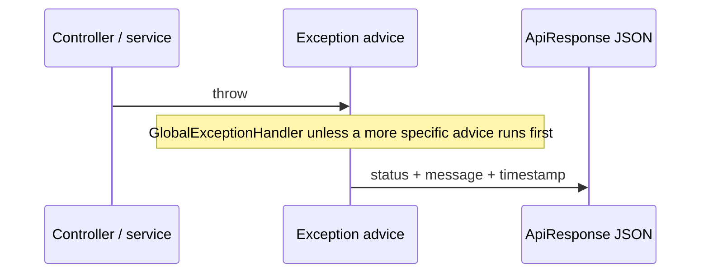

# Error handling

Almost every JSON error in Copilot is produced by `GlobalExceptionHandler` (`@RestControllerAdvice`) as `ApiResponse` with `success: false`, `data: null`, and a `timestamp`. Two important exceptions: servlet **filters** may write the same shape themselves, and a few packages register extra advice (auth rate limit, chat assistant).

## How an exception becomes a response



Filter-written errors (no controller):

| Filter | Status | Message |
|---|---|---|
| `InternalApiKeyFilter` | 401 | `Invalid or missing internal service key.` |
| `InternalApiRateLimitFilter` | 429 | `Too many requests. Please try again later.` + `Retry-After` |
| auth `JsonAuthenticationEntryPoint` | 401 | `Unauthorized.` |

## Envelope

```json
{
  "success": false,
  "message": "Something went wrong.",
  "data": null,
  "timestamp": "2026-01-01T12:00:00"
}
```

Clients should display `message`. It is intended to be safe (no SQL, bucket names, SMTP URLs, or raw exception text on unexpected 500s).

## Common-owned exceptions

| Exception | Typical cause | HTTP | Client message |
|---|---|---|---|
| `InvalidJobUrlException` | Empty or non-http(s) job URL | 400 | Exception message (`Job URL must not be empty.` or `Job URL must be a valid absolute http or https link.`) |
| `InvalidFileException` | Empty/non-PDF upload or unsafe path | 400 | Exception message (for example `Only PDF uploads are supported.`) |
| `StorageObjectNotFoundException` | MinIO missing object | 404 | Always `File not found.` (bucket/key not leaked) |
| `StorageException` | MinIO/I/O failure | 500 | `A file storage error occurred. Please try again later.` |
| `common.ratelimit.exception.RateLimitExceededException` | Hallway `consumeOrThrow` | 429 | `Too many requests. Please try again later.` + `Retry-After` |

`InvalidFileException` is logged at WARN. `StorageException` is logged at ERROR. Generic `Exception` is logged at ERROR with the stack, client sees `Something went wrong.`

## Framework and validation errors

| Exception | HTTP | Client message |
|---|---|---|
| `MethodArgumentNotValidException` | 400 | `field: message` joined with `, ` |
| `ConstraintViolationException` | 400 | Violation messages joined; blank → `Invalid request parameter.` |
| `HttpMessageNotReadableException` | 400 | `Request body is missing or malformed JSON.` |
| `MethodArgumentTypeMismatchException` | 400 | `Invalid job id.` if parameter name is `jobId`, else `Invalid request parameter.` |
| `MissingServletRequestParameterException` | 400 | `Required request parameter is missing.` |
| `HttpRequestMethodNotSupportedException` | 405 | `Method not allowed.` |
| `HttpMediaTypeNotSupportedException` | 415 | `Unsupported media type.` |
| `MaxUploadSizeExceededException` | 400 | `Maximum file size is {n} MB.` (`n` from `ResumeProperties.maxFileSizeMb`, else 5) |
| `MultipartException` (other) | 400 | `Invalid multipart request.` |
| `DataIntegrityViolationException` | 409 | `The request conflicts with existing data. Please retry.` |

## `IllegalArgumentException` (allow-listed)

Used in several modules for hardcoded client validation. Only messages starting with these prefixes are 400; anything else is treated as a server bug (500 `Something went wrong.`):

- `Prior turns cannot exceed`
- `Each prior turn must include`
- `HMAC value and secret`
- `username: size must be`
- `page must be >= 0`

## Feature exceptions mapped here

These types are defined in other packages. Common only chooses the HTTP status.

### Auth

| Exception | HTTP |
|---|---|
| `InvalidCredentialsException` | 401 |
| `InvalidRefreshTokenException`, `RefreshTokenExpiredException`, `RefreshTokenRevokedException` | 401 |
| `InvalidOtpException`, `OtpExpiredException` | 400 |
| `InvalidPasswordResetTokenException`, `PasswordResetTokenExpiredException`, `PasswordResetTokenUsedException` | 400 |
| `ResourceAlreadyExistsException` | 409 |
| `EmailDeliveryException` | 503 (`Unable to send email. Please try again later.`) |
| `auth.ratelimit.exception.RateLimitExceededException` | 429 + `Retry-After` |

### User / storage-adjacent

| Exception | HTTP |
|---|---|
| `ResumeNotFoundException`, `UserProfileNotFoundException`, `WorkExperienceNotFoundException`, `EducationNotFoundException`, `ProjectNotFoundException`, `AdditionalProfileInformationNotFoundException`, `ProfileLinkNotFoundException` | 404 |
| `DuplicateResumeException`, `DuplicateUserProfileException` | 409 |
| `InvalidResumeException`, `ResumeLimitExceededException`, `ProfileItemLimitExceededException` | 400 |
| `ResumeParsingException` | 422 |
| `user.ratelimit.exception.RateLimitExceededException` | 429 + `Retry-After` |

### Jobs

| Exception | HTTP |
|---|---|
| `JobNotFoundException` | 404 |
| `DuplicateJobException` | 409 |
| `JobValidationException` | 400 |
| `jobs.ratelimit.exception.RateLimitExceededException` | 429 + `Retry-After` |

### Job extraction

| Exception | HTTP |
|---|---|
| `EmailNotVerifiedException` | 403 |
| `JobExtractionAiUnavailableException` | 503 |
| `jobextraction.ratelimit.exception.RateLimitExceededException` | 429 + `Retry-After` |

### Automated job extraction

| Exception | HTTP |
|---|---|
| `InvalidAutomatedJobUrlException` | 400 (`INVALID JOB URL`) |
| `AutomatedJobPageFetchException` | 502 (`Unable to access the job posting. Please try again later.`) |
| `AutomatedJobExtractionUnavailableException` | 503 |
| `automatedjobextraction.ratelimit.exception.RateLimitExceededException` | 429 + `Retry-After` |

### AI

| Exception | HTTP |
|---|---|
| `AiServiceException` | 502 |
| `AiUnavailableException` | 503 |
| `AiResumePendingException` | 409 |
| `ai.ratelimit.exception.RateLimitExceededException` | 429 + `Retry-After` |

### Chat assistant

| Exception | HTTP |
|---|---|
| `ChatConflictException` | 409 |
| `chatassistant.ratelimit.exception.RateLimitExceededException` | 429 + `Retry-After` |

`ChatAssistantExceptionHandler` (`@Order(HIGHEST_PRECEDENCE)`, scoped to `ChatAssistantController`) also maps type mismatch, constraint violations, and `ChatConflictException` for that controller.

## Catch-all

`@ExceptionHandler(Exception.class)` → 500, `Something went wrong.`, ERROR log with stack.

A unit test scans every concrete `RuntimeException` under `com.developer.copilot.**.exception` and requires a dedicated `@ExceptionHandler` so new types cannot silently fall through to this 500.

## Status codes this app actually emits (from Swagger + handlers)

400, 401, 403, 404, 405, 409, 415, 422, 429, 500, 502, 503.

## Logging severity (common-owned paths)

| Event | Level |
|---|---|
| Unexpected `Exception` / unknown `IllegalArgumentException` | ERROR |
| Storage infrastructure failure | ERROR |
| Email delivery (handler) | ERROR (no SMTP details in client body) |
| Data integrity | WARN |
| Invalid file / known IllegalArgument 400 | WARN |
| Internal key reject | WARN (missing/invalid) or ERROR (disabled outside laptop / unconfigured) |
