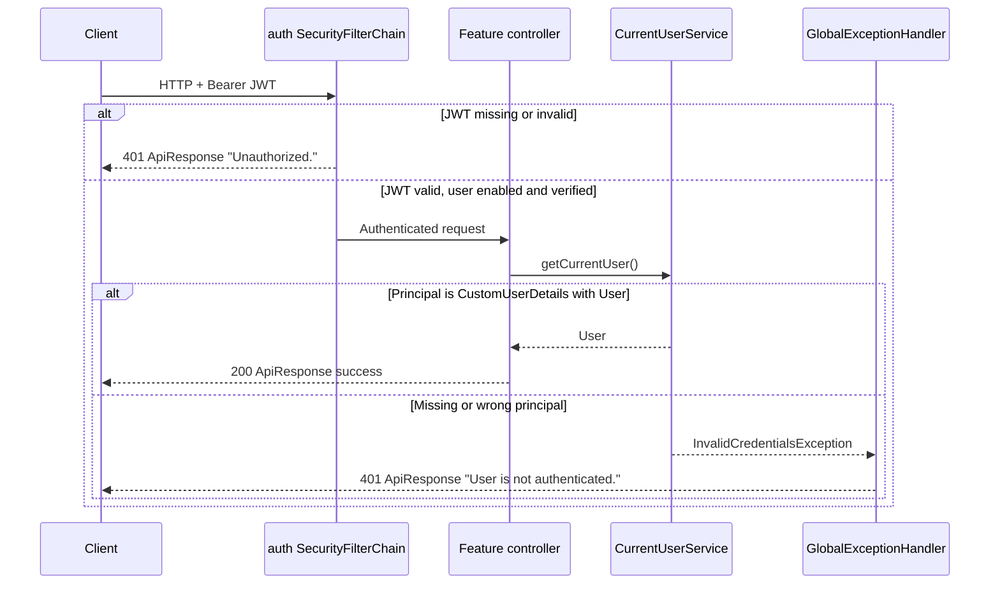
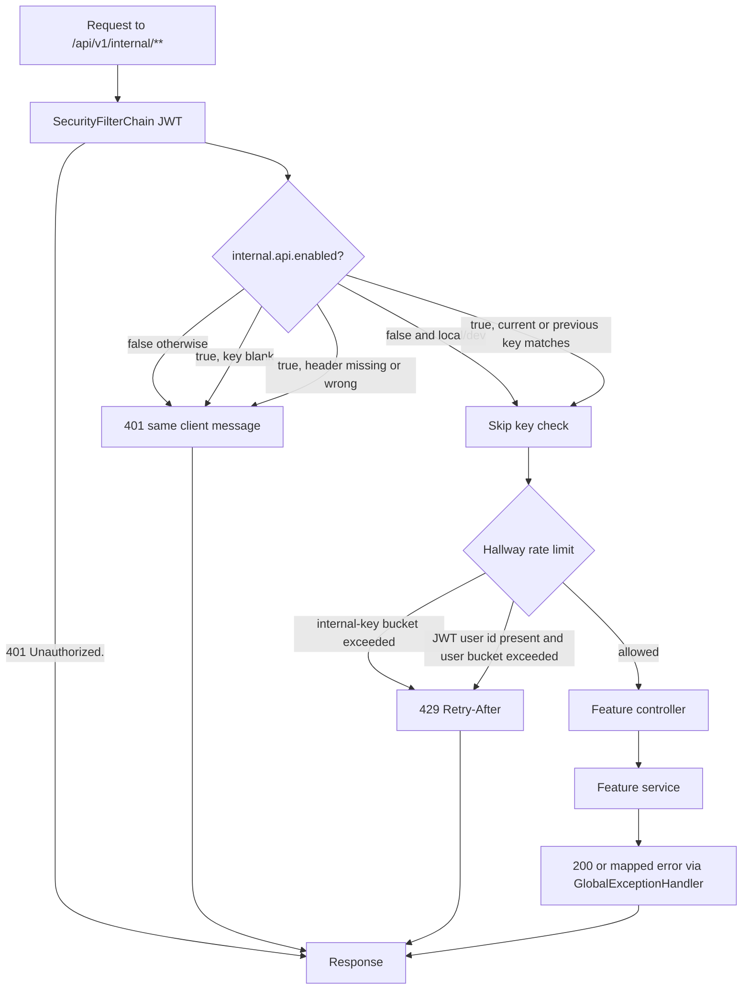
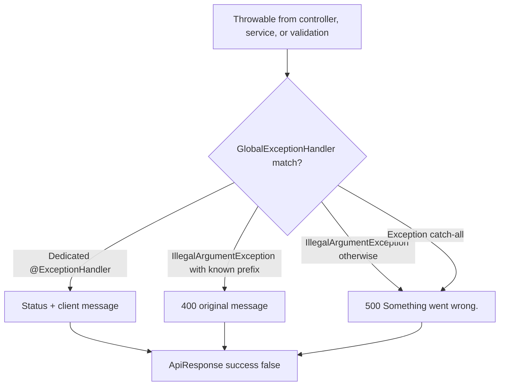
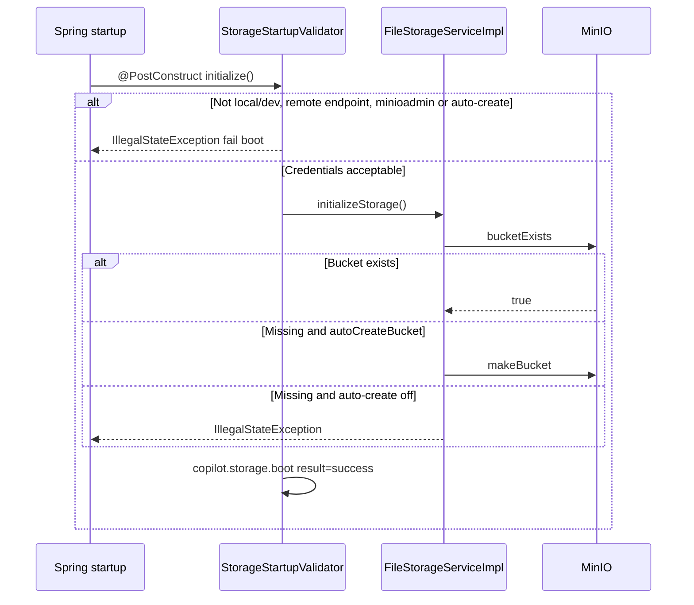
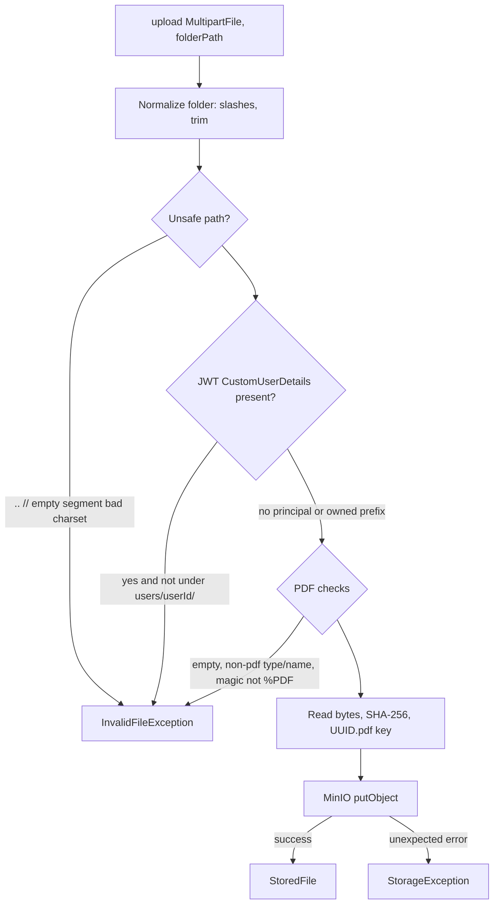
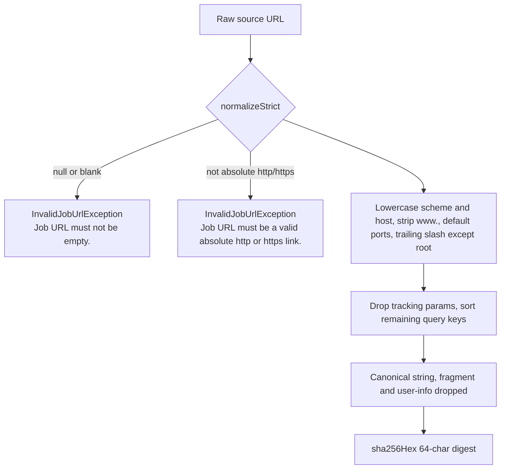
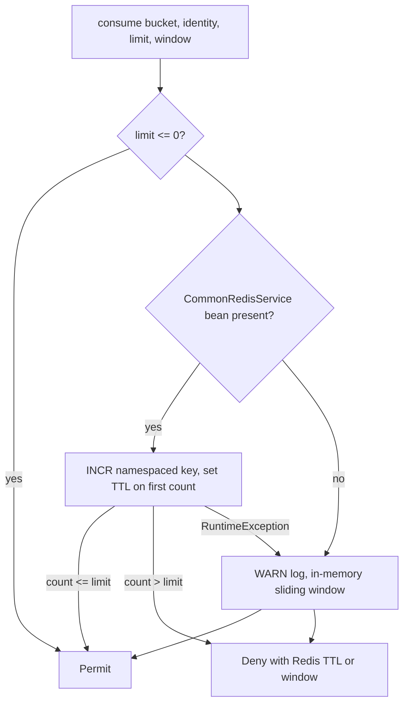

# Flows

This document covers workflows **implemented in common**. Feature-specific create/update flows are documented in those services; they appear here only where they cross the shared kernel.

## 1. Typical authenticated request (no internal prefix)

`JsonAuthenticationEntryPoint` (auth) writes `"Unauthorized."` for security-chain failures. `CurrentUserServiceImpl` throws `InvalidCredentialsException` with `"User is not authenticated."` when a controller asks for the user but the principal is not a loaded `CustomUserDetails`.

## 2. Internal service-to-service request

Applies to every URL under `internal.api.path-prefix` (default `/api/v1/internal`). Today the only controllers on that prefix live in `user` (`InternalResumeController`). Common still runs for any future internal controller on the same prefix.

Every key failure uses the **same** client body: `"Invalid or missing internal service key."` Reasons (`disabled`, `unconfigured`, `missing`, `invalid`) are only tagged on the Micrometer counter `copilot.internal.auth.failure`.

Key comparison is `MessageDigest.isEqual` on UTF-8 bytes (constant-time). `internal.api.previous-key` is accepted during rotation.

Hallway limits (see [INTERNAL-API.md](COMMON-SERVICE-SPECIFIC-DOCS/INTERNAL-API.md)):

1. Bucket `internal-key`, identity `"service"`, limit `app.common.internal-key-per-minute` (default 60), window 60 seconds.
2. If the JWT principal has a user id: bucket `internal-user`, identity that id, limit `app.common.internal-user-per-minute` (default 30).

A limit of `0` disables that bucket. Non-internal paths are not limited by this filter (even if the filter instance were invoked).

## 3. Exception to HTTP response

Filters that already wrote the body (internal key, hallway 429) never reach this handler.

Chat assistant additionally has a controller-scoped advice (`ChatAssistantExceptionHandler`) with highest precedence for a subset of exceptions on that controller only. Auth also has `RateLimitExceptionHandler` for auth’s own `RateLimitExceededException`; `GlobalExceptionHandler` maps the same type as well.

Full status table: [ERROR-HANDLING.md](ERROR-HANDLING.md).

## 4. Object storage at startup

Laptop profiles (`local`, `dev`) skip the remote-credential rules. Loopback endpoints (`localhost`, `127.0.0.1`, `[::1]`) may still use `minioadmin` even without those profiles.

## 5. PDF upload

Download, delete, and exists run the same path/key validation (and ownership when a JWT user is on the thread) before talking to MinIO. A missing object on download is `StorageObjectNotFoundException` (HTTP 404 `"File not found."`), not a storage outage.

## 6. Job URL canonicalization

Used by `jobs` and `jobextraction` on create/extract (`normalizeStrict` + `sha256Hex`). `normalizeLenient` is implemented and tested but has no production caller today.

Unsafe schemes (`javascript`, `data`, `file`, `vbscript`) are rejected even on the lenient path so they are never stored. Exception messages do not echo the input URL.

## 7. Redis-backed hallway counter (when enabled)

Redis keys look like `common:rl-internal-key:service` and `common:rl-internal-user:7` with the default prefix. Colons inside identity (for example IPv6) are replaced with underscores so they cannot shift the key structure.

## 8. Application startup checks owned by common

| Check | Failure |
|---|---|
| `InternalApiStartupValidator` | Disabled internal API, or weak/placeholder key, outside `local`/`dev` → `IllegalStateException`, process does not start. |
| `StorageStartupValidator` | Remote default MinIO admin or `auto-create-bucket=true` outside laptop profiles; or bucket missing with auto-create off; or MinIO unreachable → `IllegalStateException`. |
| `StorageConfig.validateProvider` | `storage.provider` set to anything other than `minio` or `s3` (blank is allowed). |
