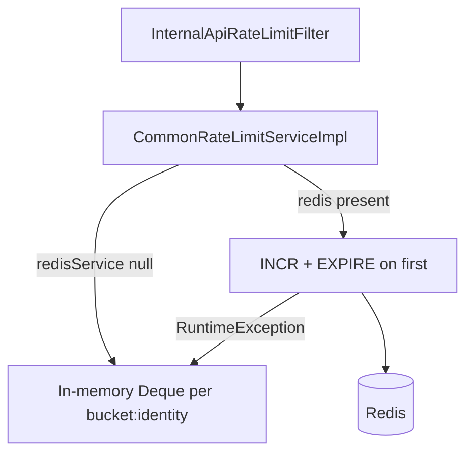

# Redis infrastructure

Common uses Redis for **one job**: distributed counters for the `/api/v1/internal/**` hallway rate limiter. It does not cache API responses, sessions, or file metadata.

Redis is **off by default**. Local runs and tests rate-limit in memory.

## Why Redis exists here

`InternalApiRateLimitFilter` must work on a single JVM without Redis, and on multiple instances (for example ECS) without each node having its own 60-request budget. When `app.common.redis.enabled=true`, increments go to Redis so the budget is shared.

This Redis client is **not** the auth Redis (`app.auth.redis.*`) or job-extraction Redis (`app.jobextraction.redis.*`). Spring Boot’s Data Redis auto-configuration is excluded in `CopilotApplication`, so enabling one package’s Redis does not auto-connect the others.

## When beans are created

`CommonRedisConfig.Enabled` is `@ConditionalOnProperty(prefix = "app.common.redis", name = "enabled", havingValue = "true")`.

Then the context gets:

- `CommonRedisKeyBuilder` (prefix from `app.common.redis.key-prefix`, default `common`)
- `LettuceConnectionFactory` (`commonRedisConnectionFactory`) — standalone host/port/database, optional password, command timeout from `timeout-ms` (default 2000)
- `StringRedisTemplate`
- `CommonRedisRepository`
- `CommonRedisService` / `CommonRedisServiceImpl`

`CommonRateLimitServiceImpl` receives `CommonRedisService` through `ObjectProvider.getIfAvailable()`. If the bean is absent, every `consume` uses memory only.

## What is stored

String keys holding integer counters. No JSON payloads.

| Use | Namespace passed to Redis service | Identity | TTL |
|---|---|---|---|
| All internal calls | `rl-internal-key` | `service` | window seconds (filter uses 60) |
| Internal calls per user | `rl-internal-user` | user id string | same |

Full key: `{keyPrefix}:{sanitizedNamespace}:{sanitizedIdentity}`.

Sanitize: trim, lowercase, replace `:` with `_`. Blank identity becomes `unknown`.

Examples with defaults:

```
common:rl-internal-key:service
common:rl-internal-user:7
```

## Increment and expiration

`CommonRedisRepository.increment`:

1. `INCR key`
2. If the new value is `1` and TTL is positive, `EXPIRE` that key for the window

`ttlSeconds` reads Redis TTL for `Retry-After` when the count exceeds the limit. If TTL is missing or negative, the limiter uses the configured window instead.

This is a **fixed window** on Redis (counter + expire on first hit), not a sliding window. The in-memory path *is* a sliding window of timestamps.



## Failure behavior

If Redis throws at runtime, the implementation logs a WARN (`Common Redis rate-limit failed; using in-memory fallback`) and uses the in-memory window for that call. The request is **not** failed open without a limit; it is limited on that JVM only until Redis works again.

Connection validation on the Lettuce factory is set to `false` (`setValidateConnection(false)`).

`limit <= 0` always permits and does not touch Redis.

## In-memory store

`ConcurrentHashMap<String, Deque<Long>>` keyed by `bucket + ":" + identity`. Each consume drops timestamps older than the window, then either denies (retry-after from the oldest hit) or appends `now`.

This map is not capped or expired beyond sliding the deque. It is intended for single-instance and tests.

## Configuration

Prefix `app.common.redis` (`CommonRedisProperties`). These keys are **not** listed in `application.properties.example` today; defaults apply until you add them.

| Property | Default | Purpose |
|---|---|---|
| `app.common.redis.enabled` | `false` | Create Redis beans and use them for hallway limits |
| `app.common.redis.host` | `localhost` | Standalone host |
| `app.common.redis.port` | `6379` | Port |
| `app.common.redis.password` | empty | Set only if the server requires AUTH |
| `app.common.redis.database` | `0` | Logical DB index |
| `app.common.redis.timeout-ms` | `2000` | Lettuce command timeout |
| `app.common.redis.key-prefix` | `common` | First segment of every key |

Rate-limit **thresholds** are `app.common.internal-key-per-minute` and `app.common.internal-user-per-minute` (not under the `.redis` prefix). See [CONFIGURATION.md](CONFIGURATION.md).

## What common Redis does not do

- No pub/sub, no hashes, no preview cache, no mail cooldown (those are other packages if present).
- No TLS/SSL options on `LettuceClientConfiguration` in this config (plain command timeout only).
- No cluster or sentinel configuration; standalone only.
