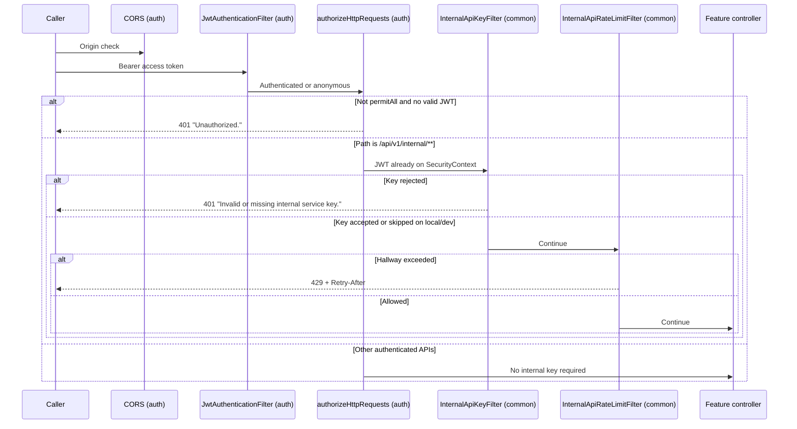

# Security

Common adds a **second authentication layer** for service-to-service URLs, storage path ownership, fail-closed startup checks, and client-safe error bodies. It does not replace `auth` JWT security.

## Request path through security

`InternalApiKeyFilter` is **not** a Spring Security filter and is **not** a `@Component`. It is constructed and registered only through `InternalApiSecurityConfig`, scoped to the internal prefix so public routes never see it.

## Authentication vs authorization

| Layer | What it proves | Owned by |
|---|---|---|
| JWT (`CustomUserDetails`) | The **user** whose data may be read or written | `auth` |
| `X-Internal-Api-Key` | The **calling service** is allowed to hit internal URLs | `common` |
| Resource queries in feature services | The row belongs to that user | feature packages |
| Storage `users/{userId}/` prefix | Object key is under the JWT user when a principal is present | `common` `FileStorageServiceImpl` |

The internal key **does not** replace the JWT and **does not** change ownership. Swagger text: ownership is still the JWT user.

`CurrentUserService.getCurrentUser()` is the shared way for services to load that user. Failures throw `InvalidCredentialsException` → HTTP 401 with message `"User is not authenticated."`

## Internal API key rules

Properties: `internal.api.*`. Defaults: enabled `true`, header `X-Internal-Api-Key`, prefix `/api/v1/internal`.

### Runtime (`InternalApiKeyFilter`)

- Enabled + non-blank configured key + header matches current or previous secret → continue.
- Enabled + blank `internal.api.key` → 401 fail closed.
- Disabled on `local`/`dev` → skip check.
- Disabled on any other profile (including default, `staging`, `prod`) → 401 fail closed.
- `Environment` null and disabled → 401 (no NPE).

Comparison uses `MessageDigest.isEqual` (constant-time). Custom header names are supported via `internal.api.header-name`.

### Startup (`InternalApiStartupValidator`)

Runs as `ApplicationRunner` **after** the context is up.

Outside laptop profiles (`local`/`dev`):

- `internal.api.enabled` must be `true`.
- `internal.api.key` must be non-blank, **at least 32 characters** (after trim), and must not contain placeholder tokens.
- If `internal.api.previous-key` is set, it must pass the same strength rules.

Placeholder detection lowercases the value, strips non-alphanumeric characters, then looks for substrings: `changeme`, `placeholder`, `yoursecretkey`, `yourinternalapikey`, `internalapikey`, `example`, `generatealongrandomkey`. The sample value in `application.properties.example` is rejected by this check.

Laptop profiles may disable the internal API or use a short key.

## Rate limiting (abuse prevention)

Common’s limiter applies **only** to the internal prefix. Feature limiters (login, jobs, AI, chat, user uploads) are separate.

| Bucket | Identity actually used | Default |
|---|---|---|
| `internal-key` | Constant `"service"` (not the raw secret) | 60 / 60s |
| `internal-user` | Numeric user id from `CustomUserDetails`, skipped if absent | 30 / 60s |

See [REDIS-INFRASTRUCTURE.md](REDIS-INFRASTRUCTURE.md) for Redis vs memory and failure fallback.

429 bodies use `"Too many requests. Please try again later."` and `Retry-After`. CORS in `auth` exposes `Retry-After` to browsers.

## Request origin controls

CORS is configured in `auth` `SecurityConfig`, not in common. Common does not implement CSRF (the app is stateless JWT; CSRF is disabled in auth).

## Credential and secret handling

- Internal keys and previous keys are never written into 401 bodies or `InvalidJobUrlException` messages.
- Storage access/secret keys are configuration; `StorageException` client message is generic (`"A file storage error occurred. Please try again later."`).
- `DataIntegrityViolationException` client message does not include SQL or constraint names.
- `EmailDeliveryException` client message does not include SMTP details.
- URL normalizer strips `token`, `access_token`, and `auth` query params from canonical job URLs and does not echo rejected URLs in exception messages.
- `CopilotMetrics` and logs may record **reason codes** (for example `invalid`) but not the secret value.

## Storage security

Before every MinIO call:

- Reject empty folder/key, `..`, `//`, `.` segments, and characters other than letters, digits, `-`, `_`, `.`.
- Backslashes become slashes; leading/trailing slashes on folders are stripped.
- If a JWT `CustomUserDetails` with a user id is on the thread, the path must equal `users/{id}` or start with `users/{id}/`.

Uploads must be PDFs: non-empty, content type containing `pdf` when present, filename ending `.pdf` when present, first bytes `%PDF`. Stored content type is always `application/pdf`. Object names are `{folder}/{uuid}.pdf`.

Background parse workers without a JWT skip the ownership prefix check (character checks still apply). Callers must still not pass client-supplied raw paths.

Startup: outside laptop profiles, a **remote** endpoint must not use access/secret `minioadmin`, and `storage.auto-create-bucket` must be `false` (pre-create a private bucket). Loopback endpoints are exempt from that credential rule.

`storage.provider` must be `minio` or `s3` when set; both use `MinioClient`. There is no second storage implementation.

## Unauthorized and forbidden behavior

| Situation | Status | Message source |
|---|---|---|
| Missing/invalid JWT | 401 | auth `"Unauthorized."` |
| `CurrentUserService` cannot resolve user | 401 | `"User is not authenticated."` |
| Internal key failure | 401 | `"Invalid or missing internal service key."` |
| Job extraction email not verified | 403 | `EmailNotVerifiedException` message via global handler |
| Hallway or feature rate limit | 429 | limiter message + `Retry-After` |

Common does not implement role-based `@PreAuthorize` rules.

## Sensitive information in OpenAPI

Swagger is off on `prod`/`production`. The generated description warns that seeing Swagger on a public hostname means the profile is wrong. Internal APIs are documented as not for the SPA.

## Production considerations supported by code

- Fail closed if internal API is disabled or weakly keyed outside `local`/`dev`.
- Fail closed if remote MinIO still uses `minioadmin` or auto-creates buckets.
- Constant-time key compare; identical client 401s for all key failures.
- Dual-key rotation via `previous-key`.
- PDF magic-byte check, not extension alone.
- Metrics increment never throws.

What is **not** implemented in common: IP allowlists, mTLS, request signing, vault integration, encryption of objects at rest beyond whatever MinIO/S3 is configured for outside this app.
