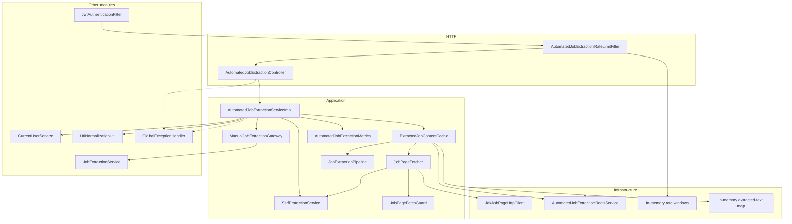
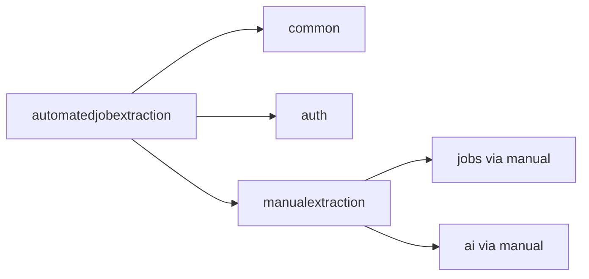

# Architecture

How the `automatedjobextraction` module is layered, which components exist, and which way dependencies point. Class-level detail is limited to what a new developer needs to navigate the package.

## Architectural role

This module is a **stateless URL-ingest API**. It sits between the client and:

- `auth` / `common.security` — who is calling
- the public internet — the job posting page (after SSRF)
- `manualextraction` — duplicate check, AI structured extract, preview DTO

There is no `automatedjobextraction` persistence layer. The only durable data it causes to be **read** is `jobs.source_url_hash` for the current user, and that read happens inside `JobExtractionService`, not in this package.

Outbound fetch and AI are **not** wrapped in `@Transactional`. Holding a JDBC connection across HTTP to a career site or a model timeout is intentionally avoided.

## Package map

```
automatedjobextraction/
├── controller/          HTTP entry
├── dto/request          URL-only request body
├── service/             Orchestration
├── security/            SSRF + hostname resolver
├── fetch/               HTTP client, redirects, Workday CXS, fetch guard
├── extract/             Pipeline, strategies, merge, quality, formatter
├── cache/               Extracted-text cache (Redis or memory)
├── integration/         Gateway to JobExtractionService
├── metrics/             Log-line counters
├── util/                Size, timeout, and guard constants
├── exception/           Invalid URL / fetch / unavailable
├── ratelimit/           Filter, properties, Redis or memory counters
├── redis/               Keys, repository, service (beans only if Redis enabled)
└── config/              HTTP client, OpenAPI group, Redis beans
```

The preview response type is `manualextraction.dto.response.JobExtractionResultResponse`. This module does not define a second preview DTO.

## Layers



Request direction is always **inward**: controller → service → collaborators. Other modules do not depend on `automatedjobextraction` types except `GlobalExceptionHandler`, which maps this module's exceptions.

## Component groups

### HTTP and DTOs

`AutomatedJobExtractionController` exposes a single POST. It wraps the service result in the shared `ApiResponse` envelope (`success`, `message`, `data`, `timestamp`).

`AutomatedJobExtractionRequest` is the inbound body: `sourceUrl` only. URL **format** is not a Bean Validation `@Pattern`; malformed schemes such as `javascript:` pass `@NotBlank`/`@Size` and fail later in `UrlNormalizationUtil`. Private hosts fail later in `SsrfProtectionService` with a different exception.

There is no response DTO in this package. `data` is the same `JobExtractionResultResponse` as manual parse.

### Orchestration

`AutomatedJobExtractionService` / `AutomatedJobExtractionServiceImpl`:

1. `CurrentUserService.getCurrentUser()`
2. Email verified (`Boolean.TRUE`)
3. `normalizeStrict`
4. `ssrfProtectionService.validate`
5. `sha256Hex`
6. `extractedJobContentCache.computeIfAbsent` → `jobPageFetcher.fetch` → `jobExtractionPipeline.extractJobText`
7. `manualJobExtractionGateway.parseExtractedContent(canonicalUrl, extractedText)`

A cache hit skips fetch and the pipeline. The gateway still runs, so duplicate check and AI preview cache still apply.

### SSRF

`SsrfProtectionService` allows only `http`/`https` URLs with a hostname that is not a literal IP, not a blocked name/suffix, and whose **every** resolved address is public. `HostnameResolver` is a seam so tests never perform real DNS. Production uses `InetAddressHostnameResolver` (`InetAddress.getAllByName`).

See [SSRF-AND-PAGE-FETCH.md](AUTOMATEDJOBEXTRACTION-SERVICE-SPECIFIC-DOCS/SSRF-AND-PAGE-FETCH.md).

### Fetch

`AutomatedJobExtractionHttpConfig` builds a JDK `HttpClient` with **redirects never followed** at the client layer. `JobPageFetcher` follows 301/302/303/307/308 itself after SSRF on each hop.

`JobPageFetchGuard` is in-process (no Resilience4j):

- Bulkhead: semaphore of **8**
- Circuit: **3** consecutive `AutomatedJobPageFetchException` (or unexpected) failures → open for **30** seconds
- Open circuit or failed `tryAcquire` → `AutomatedJobExtractionUnavailableException` (`503`)
- `InvalidAutomatedJobUrlException` does **not** count toward the circuit

### Extraction pipeline

`JobExtractionPipeline` parses HTML with Jsoup, strips chrome (`HtmlNoiseStripper`), runs `JobExtractionStrategy` beans in `order()` sequence, merges with `FieldMerger` (earlier strategies win on scalar conflicts), formats labeled text (`ExtractedJobTextFormatter`), then `JobContentQualityValidator` accepts or throws `InvalidAutomatedJobUrlException`.

JSON responses (`application/json` or a `{`/`[` body that looks like JobPosting / `jobPostingInfo`) are wrapped as a JSON-LD script so the same pipeline can run.

See [EXTRACTION-PIPELINE.md](AUTOMATEDJOBEXTRACTION-SERVICE-SPECIFIC-DOCS/EXTRACTION-PIPELINE.md).

### Gateway to manual extraction

`ManualJobExtractionGateway` builds a `JobExtractionRequest` with the **canonical URL** and the **formatted extracted text** (not raw HTML) and calls `JobExtractionService.extractJobInfo`. That service owns duplicate detection, AI guard, preview cache, and mapping. This module does not call `AiService` directly.

### Cache

`ExtractedJobContentCache` is keyed by `userId + "_" + urlHash` (not by page HTML). TTL is 3 minutes. If Redis is missing or throws, it uses a `ConcurrentHashMap`. Concurrent callers for the same key share one in-flight `CompletableFuture` so two tabs do not start two fetches.

Failed loads are not cached.

### Rate limiting

`AutomatedJobExtractionRateLimitFilter` is registered on `/api/v1/automated-job-extraction` and `/api/v1/automated-job-extraction/*` at order `-80` (after `springSecurityFilterChain` at `-100`). It is **not** inside the security chain, so a request is not counted twice.

Only **POST** under that prefix is limited. Limit `<= 0` disables the filter. Identity: client IP (`X-Forwarded-For` first hop, else `remoteAddr`) and, when a `CustomUserDetails` principal exists, user id.

This filter does **not** count `POST /api/v1/job-extraction/**`. Manual parse has its own filter and Redis prefix.

### Redis

Beans are created only when `app.automatedjobextraction.redis.enabled=true`. Boot's Data Redis auto-configuration is excluded on the application class; this module builds its own Lettuce factory. See [REDIS-INFRASTRUCTURE.md](REDIS-INFRASTRUCTURE.md).

### Metrics and OpenAPI

`AutomatedJobExtractionMetrics` increments in-memory counters and logs a line (`automatedjobextraction metric=...`). There is no Actuator meter for these.

`AutomatedJobExtractionOpenApiConfig` registers the `automated-job-extraction` Springdoc group only when the active profile is not `prod` or `production`.

### Exceptions

This module defines `InvalidAutomatedJobUrlException`, `AutomatedJobPageFetchException`, `AutomatedJobExtractionUnavailableException`, and `ratelimit.exception.RateLimitExceededException`. It also throws `InvalidJobUrlException` (common) and rethrows exceptions from the gateway (`EmailNotVerifiedException`, `DuplicateJobException`, `AiServiceException`, `JobExtractionAiUnavailableException`). Mapping lives in `GlobalExceptionHandler`. The rate-limit filter usually writes `429` itself.

## Dependency direction



`automatedjobextraction` may import:

- `common` — `ApiResponse`, `CurrentUserService`, `UrlNormalizationUtil`, `InvalidJobUrlException`, `GlobalExceptionHandler`
- `auth` — `User`, `CustomUserDetails` (rate-limit principal)
- `manualextraction` — `JobExtractionService`, `JobExtractionRequest` / `JobExtractionResultResponse`, `EmailNotVerifiedException`, `JobExtractionLimits` (via `AutomatedJobExtractionLimits`)

It does **not** import `AiService` or `JobRepository` directly.

Other services should not depend on `automatedjobextraction` for business logic.

## Important boundaries

| Boundary | Rule in this implementation |
| --- | --- |
| Persistence | No writes. Duplicate check is read-only inside manual extraction. |
| AI | Only through `JobExtractionService`. Prompts and ChatClient live in `ai`. |
| Cache isolation | Extracted text is never shared across users. Same URL, different user → two fetches. |
| Cache identity | `urlHash` only — a second parse of the same URL within TTL skips fetch even if the live page changed. |
| Fetch vs AI guards | Separate in-process circuits. Fetch `503` and AI `503` have different messages. |
| Security | Filter chain authenticates; this module does not parse JWTs. |
