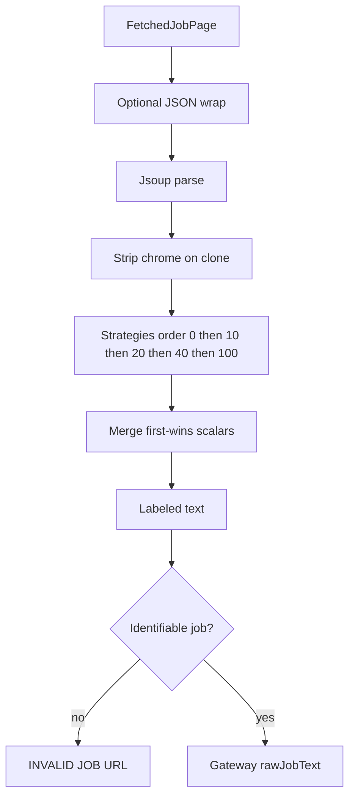

# Extraction pipeline

How a fetched page becomes labeled plain text for `JobExtractionService`. The pipeline never calls the AI model. It only decides whether the page contains **one identifiable job** and gathers fields that were actually present.

## Pipeline steps

`JobExtractionPipeline.extractJobText(canonicalUrl, page)`:

1. Reject blank body.
2. If the payload is JSON (`application/json`, `application/ld+json`, or a `{`/`[` body containing `jobposting` / `jobPostingInfo`), wrap it as `<script type="application/ld+json">` HTML (`</` escaped).
3. Parse with Jsoup using the canonical URL as the base.
4. Clone and run `HtmlNoiseStripper` (nav, cookies, related jobs, …). **Original** document is kept for JSON-LD / microdata / ATS that need `<script>` or itemprop.
5. Sort `JobExtractionStrategy` beans by `order()` (lower runs first).
6. For each strategy that `supports(...)`, `extract` and `FieldMerger.merge` into an accumulator. Runtime errors skip that strategy (`debug` log).
7. `ExtractedJobTextFormatter.format` — only non-blank fields, then clip to 50,000 characters.
8. `JobContentQualityValidator.isIdentifiableJob` — false → `INVALID JOB URL`.

Blank/null fields mean “not found.” The pipeline does not infer industry or platform from the company name.

## Field merger

`FieldMerger.merge(primary, extra)`:

- Scalar strings: fill only if primary is blank.
- Lists: union, `LinkedHashSet` order (primary first), trim, drop blanks.
- `fromStructuredData`: sticky true if any source set it.

JSON-LD (order 0) therefore wins over an H1 title from a later strategy. Tests lock “From JSON-LD” vs “From H1”.

## Strategies

Spring injects every `JobExtractionStrategy` `@Component`. `order()` is what the pipeline sorts on.

| Order | Strategy | When it runs | What it takes |
| --- | --- | --- | --- |
| 0 | `JsonLdJobExtractionStrategy` | `script[type=application/ld+json]` present | schema.org `JobPosting` (including `@graph` / arrays). Multiple postings: prefer `url` or `identifier` matching the request URL, else first. Sets `fromStructuredData`. |
| 10 | `MicrodataJobExtractionStrategy` | `[itemtype*=JobPosting]` | itemprop title/name, description, employmentType, dates, org, location, salary. Sets `fromStructuredData`. |
| 20 | ATS / boards | Host or markup | Greenhouse (`greenhouse.io` or `#app_body` / `.app-title`), Lever (`lever.co`), Ashby (`ashbyhq.com`), SmartRecruiters, Workday (host or `jobPostingInfo` in HTML), LinkedIn, Indeed. Workday prefers `jobPostingInfo` JSON and also reads `data-automation-id=*`. |
| 30 | `OpenGraphJobExtractionStrategy` | `og:*` or meta description | Title/company/url **gaps only**. Description metadata is **not** used as job body (may fill title if title missing). Does not set `fromStructuredData`. |
| 40 | `SemanticHtmlJobExtractionStrategy` | `main` / `article` / job-description selectors | H1/H2 title, main text, lists under responsibilities/requirements/benefits headings. Uses the **cleaned** document. |
| 100 | `GenericMainContentStrategy` | Always | H1 or `document.title`, cleaned body text. Last resort so unknown sites still produce a candidate the quality gate can reject. |

ATS strategies that share order 20 are merged in Spring list order after the numeric sort (stable for equal keys).

`ExtractionSupport` is shared: CSS first/joined text, list items, HTML→text via Jsoup `Safelist.none()`, whitespace collapse, host fragment checks.

## Noise stripping

`HtmlNoiseStripper` removes `script`, `style`, `nav`, `header`, `footer`, forms, cookie/consent/ad/related-job selectors, `aria-hidden=true`, and heading+sibling blocks titled “similar jobs”, “related jobs”, and similar. Used for generic/semantic extraction, not as the JSON-LD source.

## Formatter

Labeled lines (`Job Title:`, `Company:`, …) and bullet lists (`Responsibilities:`, `Skills:`, …). `Job Description:` is a block. Missing fields are omitted (no `null`, no empty `Salary:`). Tests assert that.

This string becomes `originalDescription` after the AI mapper echoes `rawJobText`.

## Quality gate

`JobContentQualityValidator.isIdentifiableJob`:

1. Formatted text must be non-blank and at least **120** characters.
2. If `fromStructuredData` and title **or** company present → **accept**.
3. If the original looks like a **listing** (see below) → **reject**.
4. Title + description of at least 120 characters → **accept**.
5. Title + at least two job **markers** in the formatted text → **accept**.
6. URL path matches job/career/position/… **and** marker score ≥ 2 **and** text ≥ 240 characters → **accept**.
7. Otherwise **reject**.

Markers include `responsibilities`, `requirements`, `qualifications`, `job description`, `about the role`, `what you will do`, `who you are`, `apply now`, `employment type`, `full-time` / `full time`, `part-time`, `experience`.

Listing heuristic: count distinct job-like `a[href]` (path keywords, query stripped). ≥ 8 such links without single-job description markers → listing. Or page text contains `search jobs` and ≥ 5 job links. Structured data **with both title and description** skips the listing reject.

Open Graph alone does not pass the structured-data shortcut (`fromStructuredData` stays false). A metadata-only page still needs title/description/markers like any generic extract.

## Adding a site family

Implement `JobExtractionStrategy` with a new `order()` (typically 20 for ATS). Keep `supports` cheap (host or a distinctive selector). Return only fields found in the markup. Add a fixture test next to `AtsJobExtractionStrategyTest`. Do not teach the strategy to guess missing company/industry.

If the site is Workday-like SPA JSON, prefer extending `WorkdayCxsUrls` / fetch enrichment so the pipeline receives `jobPostingInfo` rather than scraping the widget shell.
