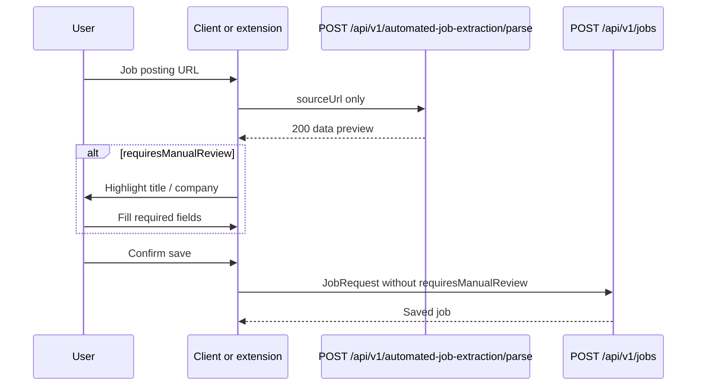

# Preview then save

The product is **two HTTP calls**. `automatedjobextraction` only implements the first (URL ingest). Persistence stays in `POST /api/v1/jobs`.

## Why two steps

Fetching and extracting is probabilistic (empty title, truncated company, leftover page noise, sites that hide the body behind JavaScript). The service therefore returns a preview the user can edit. `POST /api/v1/jobs` already enforces uniqueness, `@NotBlank` title/company, and URL rules.

Parse **never** writes rows. A `200` is not a saved job.

## Sequence

If parse returns `409`, skip extraction UI: this user already has that canonical URL.

If parse returns `400` `INVALID JOB URL`, the URL was not a usable public job posting (listing, login wall, SSRF, 404, quality fail). The client should not retry blindly with the same URL.

## How this differs from manual parse

| | Automated | Manual (`POST /api/v1/job-extraction/parse`) |
| --- | --- | --- |
| Client sends | `sourceUrl` | `sourceUrl` + `rawJobText` |
| Server fetch | Yes, after SSRF | No |
| `originalDescription` | Labeled extracted text | User paste |
| Duplicate check | After fetch (on cache miss) | Before AI, no fetch |
| Default HTTP rate limit | 5/min | 8/min |

Both return the same `JobExtractionResultResponse` shape so the review form can stay shared.

## Field map

`JobExtractionResultResponse` is aligned with `JobRequest` so the client can bind the preview into the same form.

| Preview `data.*` | Save as `JobRequest.*` | Notes |
| --- | --- | --- |
| `sourceUrl` | `sourceUrl` | Canonical. Do not resubmit the raw request URL. |
| `originalDescription` | `originalDescription` | Labeled extract from the pipeline, not HTML. |
| `description` | `description` | Optional on save (`@Size` only). |
| `title` | `title` | Required on save (`@NotBlank`). |
| `company` | `company` | Required on save. |
| `location` | `location` | |
| `employmentType` | `employmentType` | |
| `workMode` | `workMode` | |
| `experience` | `experience` | |
| `salary` | `salary` | |
| `education` | `education` | |
| `department` | `department` | |
| `industry` | `industry` | |
| `sourcePlatform` | `sourcePlatform` | |
| `skills` | `skills` | Always an array on preview. |
| `requiresManualReview` | **omit** | Not a `JobRequest` field. |

Lengths after mapping match `JobExtractionLimits` / `JobRequest` `@Size` (title 255, workMode 50, description 50000, skills 50×255, URL 2000, …).

## `requiresManualReview`

Computed in `JobExtractionMapper`, not by the model and not by the HTML pipeline:

- title blank or company blank (null or whitespace), or
- title or company **truncated** to 255 characters

Empty location, salary, skills, and so on do **not** set the flag. A 200 with the flag true is still a successful preview.

## Gateway contract

`ManualJobExtractionGateway.parseExtractedContent(canonicalUrl, extractedText)`:

- `sourceUrl` = already-canonical URL from this module
- `rawJobText` = formatter output (`Job Title: …`, `Job Description:` …)

The model therefore sees labeled facts plus description text, not a raw career-site DOM. Manual extraction still canonicalizes the URL again (idempotent for a URL this module already normalized) and hashes it for the duplicate check.

## Client pitfalls this code assumes you avoid

- Saving the **raw** request URL instead of `data.sourceUrl` (tracking params, `www.`, unsorted query).
- Sending `requiresManualReview` as if jobs validated it.
- Treating parse `200` as “already in the notebook.”
- Expecting the server to execute JavaScript or solve CAPTCHAs. Challenge pages without job markers are `INVALID JOB URL`.
- Calling this endpoint with an extension JWT and then `POST /api/v1/jobs` with the **same** extension JWT. Jobs is web-frontend-only; the extension must use a web token (or a backend that holds one) to save.

## Related 409s

Parse 409: exists-check in the gateway before AI. Jobs create 409: same unique key if two saves race. Message on parse is `This post was already added to your records.`
