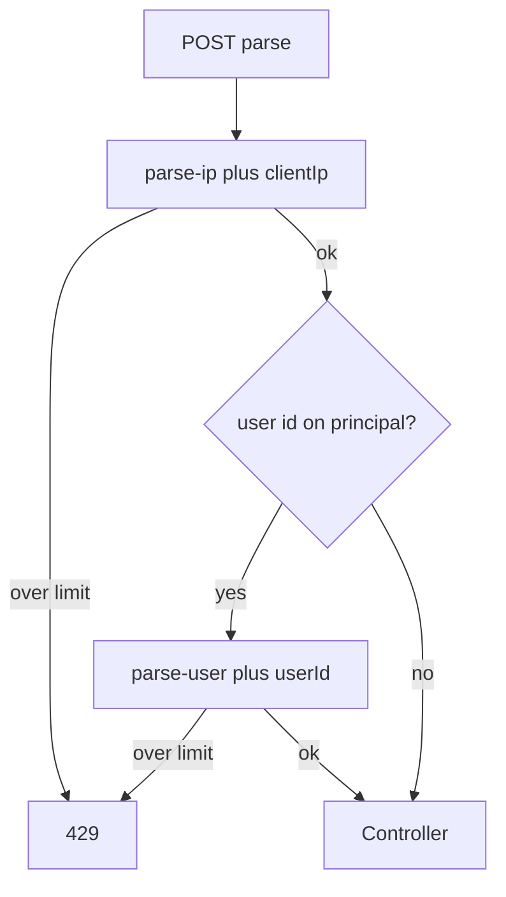

# Parse rate limiting

`automatedjobextraction` limits **POST** requests under `/api/v1/automated-job-extraction` so outbound fetches and the paid model cannot be flooded. The default is stricter than manual parse (`5` vs `8` per minute).

## Where it runs

`AutomatedJobExtractionRateLimitFilter` is registered for `/api/v1/automated-job-extraction` and `/api/v1/automated-job-extraction/*`, order **`-80`**, after Spring Security (`-100`). JWT has already populated `SecurityContext` when the user is authenticated.

It is **not** part of `SecurityFilterChain` (avoids double-counting).

Only POST is limited. GET and other prefixes (`/api/v1/job-extraction`, `/api/v1/jobs`) pass through **this** filter. Manual parse has a separate filter and Redis prefix.

## Identities

Every limited POST consumes the **IP** bucket. If the principal is `CustomUserDetails` with a non-null user id, it also consumes the **user** bucket.

Unauthenticated requests are normally stopped with **401** in the security chain **before** this filter. If the filter ran without a principal, only IP would count.

### Client IP

1. `X-Forwarded-For` if non-blank — substring before the first comma, trimmed
2. Else `request.getRemoteAddr()`, or `unknown`

IPv6 colons are sanitized in Redis keys (`:` → `_`).

### User id

`String.valueOf(details.getUser().getId())`. Stolen JWTs share one user bucket even when the attacker rotates IPs (covered by `AutomatedJobExtractionRateLimitFilterTest`).

## Limit and window

| Setting | Value |
| --- | --- |
| Property | `app.automatedjobextraction.parse-per-minute` |
| Default | **5** |
| Window | **60 seconds** (hardcoded in the filter) |
| Disable | `parse-per-minute <= 0` |

Both IP and user buckets use the **same** numeric limit.

## Storage

`AutomatedJobExtractionRateLimitServiceImpl.consume(bucket, identity, limit, windowSeconds)`:

- Redis when `AutomatedJobExtractionRedisService` is present: namespace `rl-{bucket}` (`rl-parse-ip`, `rl-parse-user`), `INCR` + `EXPIRE` on first increment (**fixed window**).
- On Redis exception: in-memory **sliding** window of timestamps.
- Redis disabled: in-memory only (per instance).

`limit <= 0` in `consume` always permits (in addition to the filter skip).

## Client response

Always generic (does not disclose which bucket):

- HTTP **429**
- Header `Retry-After`: seconds (`>= 1`)
- Body message: `Too many requests. Please try again later.`

The filter writes this with its own `ObjectMapper` (JavaTimeModule). `GlobalExceptionHandler` maps `automatedjobextraction.ratelimit.exception.RateLimitExceededException` the same way if `consumeOrThrow` is used.

## Multi-instance

Without Redis, each instance has its own 5/min. Enable `app.automatedjobextraction.redis.enabled=true` so INCR is shared.

## Interaction with fetch and AI guards

Rate limit is **HTTP** budget. `JobPageFetchGuard` is a separate **in-process** concurrency/circuit limit (8 concurrent, 3 failures / 30s). `JobExtractionAiGuard` is another (5 concurrent, 3 failures / 30s). A caller can pass rate limit and still get `503` from either guard.
