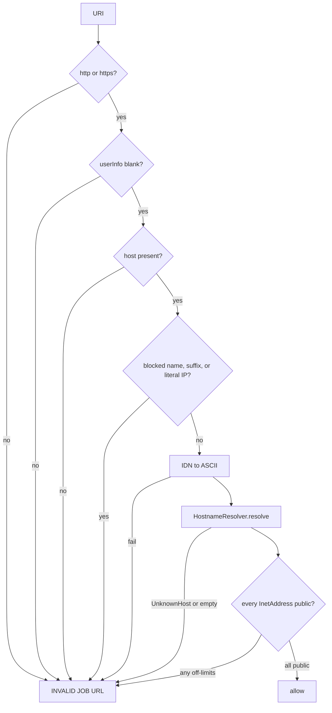

# SSRF and page fetch

How `automatedjobextraction` retrieves a user-supplied job URL without becoming an open proxy, and how technical fetch failures are distinguished from “not a job.”

## Why this exists

Manual parse never contacts the career site. Automated parse **must**, so every hop is treated as untrusted. The client message for a blocked or unusable target is always `INVALID JOB URL`. Technical retrieval problems (timeout, 5xx, oversized body) are a generic `502`.

## SSRF validation

`SsrfProtectionService.validate(URI)` is called:

1. In `AutomatedJobExtractionServiceImpl` on the **canonical** URL (before cache/fetch).
2. At the start of `JobPageFetcher.fetch` and `follow` (including every redirect).
3. Before a Workday CXS GET.

`IllegalArgumentException` from URI handling in the service is converted to `InvalidAutomatedJobUrlException` so it does not leak as `500`.

### Host and suffix denylist

Exact hosts include `localhost`, `metadata.google.internal`, `metadata.goog`, `metadata.internal`, `instance-data`, `kubernetes`, `ip6-localhost`, `ip6-loopback`.

Suffixes include `.localhost`, `.local`, `.internal`, `.intranet`, `.corp`, `.home`, `.lan`, `.private`, `.onion`.

### Literal IPs

Bracketed IPv6 hosts, any host containing `:`, dotted IPv4, 8–10 digit decimal IPv4, and numeric-dot hosts are rejected **before** DNS.

### Resolved address policy

An address is off-limits if it is any-local, loopback, link-local, site-local (RFC1918), or multicast, or:

- IPv4 `0.0.0.0/8`, CGNAT `100.64.0.0/10`, `192.0.0.0/16`, benchmarking `198.18.0.0/15`, `169.254.0.0/16`
- IPv6 unique-local `fc00::/7`
- IPv4-mapped / IPv4-compatible IPv6 whose embedded v4 is off-limits

If **any** A/AAAA record is off-limits, the whole host is rejected (tests cover mixed `8.8.8.8` + `127.0.0.1`).

Production resolver: `InetAddress.getAllByName`. Tests inject `HostnameResolver`.

## HTTP client

`AutomatedJobExtractionHttpConfig` builds JDK `HttpClient` with:

- `followRedirects(NEVER)`
- connect timeout from `app.automatedjobextraction.http.connect-timeout-ms`

Each GET sets `User-Agent` (property or `CopilotJobExtraction/1.0`), `Accept` (`text/html,application/xhtml+xml,application/ld+json;q=0.8,*/*;q=0.1` by default), `Accept-Language: en-US,en;q=0.8`, and a request timeout.

The body is read through `readLimited`: exceeding `maxResponseBytes` throws `AutomatedJobPageFetchException`. Interrupted I/O restores the interrupt flag and becomes the same exception.

## Redirects

Statuses 301, 302, 303, 307, 308 are followed in `JobPageFetcher`:

- `Location` missing/blank or unresolvable → `INVALID JOB URL`
- Next URI scheme not http(s) → `INVALID JOB URL`
- `depth >= maxRedirects` → `INVALID JOB URL`
- Next hop SSRF-validated before GET

`FetchedJobPage.finalUrl` is the last hop’s URI string (used as page identity for the record; extraction still uses the **canonical request URL** passed into the pipeline).

## Status mapping

| HTTP status | Result |
| --- | --- |
| 2xx | Decode body; optional Workday CXS; challenge check |
| 401, 403, 404, 407, 410, 451 | `INVALID JOB URL` |
| Other 4xx | `INVALID JOB URL` |
| Other non-2xx (including 5xx) | `AutomatedJobPageFetchException` |

## Access challenges

If the body is blank or contains `captcha`, `recaptcha`, `hcaptcha`, `cf-challenge`, `verify you are human`, `access denied`, `please enable javascript`, or `just a moment` (case-insensitive), and it does **not** also look like a job (`jobposting`, `job description`, `responsibilities`, `requirements`, `qualifications`), the fetch is `INVALID JOB URL`.

A job page that mentions captcha **and** job markers is not rejected by this check.

## Workday CXS enrichment

When the host contains `myworkdayjobs.com`, `workdayjobs.com`, or `myworkdaysite.com`, and the body looks like an SPA widget redirect (`"externalSpa"` or `"widget":"redirect"`) **without** already containing `jobPostingInfo` / JobPosting, `WorkdayCxsUrls.toCxsJobUri` maps:

- `/{locale}/{site}/job/...` or `/{site}/job/...` → `/wday/cxs/{tenant}/{site}/job/...`
- `.../details/{job}` → `/wday/cxs/{tenant}/{site}/job/{job}`
- Listing URLs without `job`/`details` → no extra GET
- Tenant is the first DNS label (not `www` or `wdN`)

The extra GET uses `Accept: application/json`, same SSRF, same size/timeout. Only HTTP 200 with `jobPostingInfo` replaces the body. Failures are swallowed (debug log); the original page is kept.

## Fetch guard

`JobPageFetchGuard` (in-process):

| Setting | Value |
| --- | --- |
| Bulkhead | 8 concurrent |
| Open after | 3 consecutive fetch/unexpected failures |
| Open duration | 30 seconds |
| On open / no permit | `503` `The job page could not be retrieved. Please try again shortly.` |

`InvalidAutomatedJobUrlException` does not increment the failure counter. A success resets it.

This guard is independent of `JobExtractionAiGuard`.

## What is not implemented

- No headless browser or JS runtime
- No cookie jar / logged-in session to private boards
- No allowlist of career-site hosts (any public hostname may be fetched)
- Circuit is per JVM, not cluster-wide
