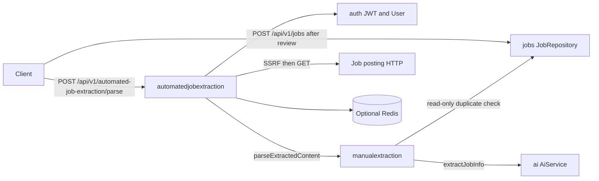

# Automated Job Extraction Service

This is the starting point for the `automatedjobextraction` module. Read it first, then follow the links at the bottom for APIs, security, data, and workflows.

## What this service is

`automatedjobextraction` is the **URL-only preview step** before a job posting is saved. A signed-in, email-verified user (web frontend **or** browser-extension JWT) submits a job posting URL. This service:

1. Canonicalizes the URL (absolute `http`/`https` only; tracking query parameters stripped).
2. Rejects private, loopback, metadata, and other non-public targets (SSRF guard).
3. Fetches the page over HTTP, following a small number of redirects with the same SSRF checks on every hop.
4. Identifies **that specific job** on the page, strips unrelated chrome, and formats labeled plain text.
5. Hands that text to the existing **manual** job-extraction feature (`JobExtractionService`), which runs the duplicate check, AI structured extract, and preview mapping.
6. Returns clipped, review-ready fields that match `POST /api/v1/jobs`.

It never inserts or updates a row. Persistence belongs to the `jobs` module. A `200` response is a preview, not a saved job.

## Why it exists

Manual parse requires the client to paste page text. This service fetches the posting so a browser extension or a “paste URL only” UI can still produce the same preview JSON. HTML noise, listing pages, and login walls are rejected as `INVALID JOB URL` before the paid model is called with unusable content.

## Responsibilities

- Authenticate the caller through the shared JWT filter (this module does not issue tokens).
- Allow both web-frontend and browser-extension JWTs on `/api/v1/automated-job-extraction/**`.
- Require a verified email at the service layer (`403` if that check is reached).
- Validate and canonicalize the source URL before any outbound GET.
- Block SSRF (literal IPs, private DNS answers, credentials in the URL, unsafe host suffixes).
- Fetch the job page with timeouts, a body-size cap, redirect limits, and an in-process fetch circuit/bulkhead.
- Extract job-specific fields via a strategy pipeline (JSON-LD, ATS markup, semantic HTML, and a last-resort body).
- Cache extracted **text** briefly per user and URL hash so a double-submit does not fetch twice.
- Reuse `POST /api/v1/job-extraction/parse` behavior for duplicate pre-check, AI extraction, and response mapping.
- Rate-limit `POST /api/v1/automated-job-extraction/**` per IP and per user (default **5** per minute).

## What this service does not do

- It does not write to MySQL.
- It does not own an `automatedjobextraction` table.
- It does not reimplement AI parsing, clipping, or `requiresManualReview`. Those live in `manualextraction`.
- It does not replace `POST /api/v1/jobs`. Saving is a separate, explicit step.
- It does not treat a careers listing, CAPTCHA wall, or 404 as a successful extract. Those are `400` with a fixed message.

## Major capabilities

| Capability | Behavior |
| --- | --- |
| Parse from URL | `POST /api/v1/automated-job-extraction/parse` with `sourceUrl` only |
| URL canonicalization | Shared `UrlNormalizationUtil.normalizeStrict` — tracking params stripped, host lowercased, `www.` dropped, query keys sorted |
| SSRF protection | Public `http`/`https` hostnames only; DNS answers must all be public |
| Page fetch | JDK `HttpClient`, redirects followed in-process after SSRF, default 1.5 MB body cap |
| Workday CXS | Career SPA widgets may be enriched with same-host `/wday/cxs/...` job JSON |
| Job identification | Strategy pipeline + quality validator (listing pages and empty extracts rejected) |
| Duplicate pre-check | Via manual extraction: `JobRepository.existsByUserIdAndSourceUrlHash` |
| AI structured extract | Via `ManualJobExtractionGateway` → `JobExtractionService.extractJobInfo` |
| Extracted-text cache | 3-minute TTL, keyed by `userId + urlHash`. Redis when enabled; otherwise in-memory |
| Fetch guard | At most 8 concurrent fetches; 3 consecutive **fetch** failures open the circuit for 30 seconds |
| Rate limits | Default 5 parse requests per minute per IP and per authenticated user |

## Service boundaries

`automatedjobextraction` depends on `auth` (current user), `common` (URL util, `CurrentUserService`, `ApiResponse`, global exception handling), `manualextraction` (preview/AI/duplicate check), and optional Redis. It does not implement those other services.

## Main components

- **Controller** — `AutomatedJobExtractionController` at `/api/v1/automated-job-extraction`.
- **Service** — `AutomatedJobExtractionServiceImpl` orchestrates user, URL, SSRF, cache, fetch, pipeline, and the manual gateway.
- **SSRF** — `SsrfProtectionService` + `HostnameResolver`.
- **Fetch** — `JobPageFetcher`, `JdkJobPageHttpClient`, `JobPageFetchGuard`.
- **Pipeline** — `JobExtractionPipeline` and `JobExtractionStrategy` implementations.
- **Cache** — `ExtractedJobContentCache` (extracted labeled text, not the final AI JSON).
- **Gateway** — `ManualJobExtractionGateway` calls `JobExtractionService`.
- **Rate limiting** — `AutomatedJobExtractionRateLimitFilter` after the Spring Security chain.
- **Redis** — optional, owned by this module when `app.automatedjobextraction.redis.enabled=true`.

## Important request flow (summary)

1. CORS, JWT, and `authenticated()` (web or extension JWT).
2. Parse rate limit (POST only).
3. Bean Validation on `sourceUrl`.
4. Load current user; reject unverified email.
5. Strict URL normalize; SSRF validate; SHA-256 hash.
6. Cache lookup or fetch + extract labeled text.
7. Manual parse: duplicate check, AI extract, mapper.
8. `200` with `ApiResponse<JobExtractionResultResponse>`.

See [FLOW.md](FLOW.md) for diagrams.

## Security responsibilities

The parse endpoint is not public. A valid Bearer JWT is required. Disabled or unverified accounts are not authenticated by `JwtAuthenticationFilter` (`401 Unauthorized.`). If an authenticated principal with `emailVerified != true` reached the service, it would return `403`. Browser-extension JWTs **are** allowed on this prefix. OpenAPI for this group is not registered on `prod` / `production` profiles.

User-supplied URLs are never fetched until SSRF validation succeeds, and every redirect hop is validated again. Unusable or internal targets return the fixed client message `INVALID JOB URL` so internals are not disclosed.

Details: [SECURITY.md](SECURITY.md).

## Infrastructure

- **MySQL** — no schema in this package. Duplicate check is a read-only query on `jobs` inside manual extraction.
- **Redis** — optional distributed rate-limit counters and extracted-text cache. Off by default; in-memory fallback for a single instance.
- **Outbound HTTP** — JDK client to the job URL (and optionally Workday CXS on the same host).
- **AI provider** — through `manualextraction` → `ai` (`app.ai.*` / `spring.ai.openai.*`).

## Documentation index

| Document | Contents |
| --- | --- |
| [ARCHITECTURE.md](ARCHITECTURE.md) | Layers, components, and dependency direction |
| [FLOW.md](FLOW.md) | Parse, SSRF, fetch, cache, pipeline, and gateway workflows |
| [ENDPOINTS.md](ENDPOINTS.md) | `POST /api/v1/automated-job-extraction/parse` |
| [SECURITY.md](SECURITY.md) | JWT, extension access, SSRF, rate limits |
| [DATABASE.md](DATABASE.md) | No owned schema; read-only `jobs` via the gateway |
| [REDIS-INFRASTRUCTURE.md](REDIS-INFRASTRUCTURE.md) | Redis keys, TTL, in-memory fallback |
| [ERROR-HANDLING.md](ERROR-HANDLING.md) | Exceptions and HTTP mappings |
| [VALIDATION.md](VALIDATION.md) | Input, URL, SSRF, quality, and business rules |
| [CONFIGURATION.md](CONFIGURATION.md) | `app.automatedjobextraction.*` and related properties |
| [TESTING.md](TESTING.md) | Test layout and what to extend |
| [DEPENDENCIES.md](DEPENDENCIES.md) | Internal and library dependencies |

Service-specific:

| Document | Contents |
| --- | --- |
| [PREVIEW-AND-SAVE.md](AUTOMATEDJOBEXTRACTION-SERVICE-SPECIFIC-DOCS/PREVIEW-AND-SAVE.md) | Two-step product: URL parse then `POST /api/v1/jobs` |
| [SSRF-AND-PAGE-FETCH.md](AUTOMATEDJOBEXTRACTION-SERVICE-SPECIFIC-DOCS/SSRF-AND-PAGE-FETCH.md) | SSRF, redirects, fetch guard, Workday CXS |
| [EXTRACTION-PIPELINE.md](AUTOMATEDJOBEXTRACTION-SERVICE-SPECIFIC-DOCS/EXTRACTION-PIPELINE.md) | Strategies, merge, quality gate, labeled text |
| [RATE-LIMITING.md](AUTOMATEDJOBEXTRACTION-SERVICE-SPECIFIC-DOCS/RATE-LIMITING.md) | Per-IP and per-user parse budget |
